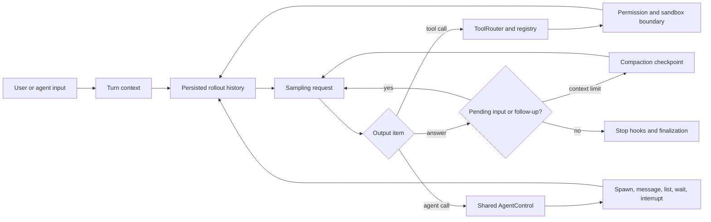

# OpenAI Codex: lineage and containment as control-plane primitives

Mode: `TECHNICAL DEEP DIVE`.

**EVIDENCE — snapshot.** This profile now uses [CODEX-REPO] at commit
`1e85ca099e4265bf89f4016772d299816e231bb3` in
`evidence/implementations/codex-rsi/snapshot/`. Its lineage and containment reading remains
bounded to the paths named below. [[codex_state_continuity_and_compaction]]
owns the newer ARC result, typed history, world-state, compaction, replay, and
cross-thread memory analysis.

**INFERENCE — claim ceiling.** Codex is most relevant to RSI as a control-plane example: persisted rollouts, thread lineage, context compaction, routed capabilities, shared multi-agent state, permissions, and host sandbox selection. The inspected source does not implement autonomous Codex-version search or promotion.

## Architecture at a glance

**EVIDENCE — observed control flow from [CODEX-REPO], `codex-rs/core/src/session/turn.rs:149-520`, `codex-rs/core/src/tools/router.rs:31-289`, and `codex-rs/core/src/agent/control.rs:90-188`.**

**INFERENCE — architectural reading.** Codex treats tool execution and multi-agent coordination as capabilities routed through shared infrastructure rather than ad hoc prompt conventions. That is valuable when candidate harnesses may be untrusted or concurrent.

## Component map

| Label | Component | Observed responsibility | Control boundary | RSI tuple role |
|---|---|---|---|---|
| EVIDENCE | `run_turn()` | Captures turn state, injects selected resources, samples from persisted history, handles mailbox input, compacts, runs hooks, and decides continuation. | Session and turn context. | Core execution in `Hₜ`. |
| EVIDENCE | rollout history | Records session metadata and response/compaction items used for resume, fork, and model context. | Append/persist pipeline and thread store. | Execution lineage in `Aₜ`; active projection in `Dₜ`. |
| EVIDENCE | `ToolRouter` | Separates model-visible tool specifications from registered runtimes and dispatches function, custom, search, and collaboration calls. | Registry identity, source, exposure, parallelism, cancellation. | Capability layer in `Hₜ`. |
| EVIDENCE | `AgentControl` | Shares one session-scoped registry, execution limiter, residency state, and rollout budget across a root and its descendants. | Root-thread tree rather than global process scope. | Multi-agent search/control state in `Hₜ` and `Aₜ`. |
| EVIDENCE | thread fork/spawn | Flushes parent rollout, copies full or recent history, sanitizes inherited items, records parent/child lineage, and submits child input. | Explicit source and parent thread identifiers. | Candidate lineage substrate in `Aₜ`. |
| EVIDENCE | permission/sandbox path | Resolves approval and permission profile, then selects and constructs platform-specific isolation. | Policy and host-enforced execution boundary. | External constraint around candidate action. |

## The turn loop is a persisted state machine

1. **EVIDENCE — turn setup.** `run_turn()` captures skills, plugins, tools, configuration, environment, and history into turn-scoped state before repeated sampling ([CODEX-REPO], `codex-rs/core/src/session/turn.rs:149-328`).
2. **EVIDENCE — continuation.** After each sampling request, the loop distinguishes model-requested follow-up, pending mailbox input, context pressure, stop-hook continuation, and terminal completion (`turn.rs:329-511`).
3. **EVIDENCE — compaction.** When follow-up is required and the active window crosses the configured boundary, Codex records an automatic compaction checkpoint and resumes the same logical turn (`turn.rs:418-457`).
4. **EVIDENCE — hook boundary.** Stop hooks can request a continuation with an injected prompt fragment or terminate processing, while legacy after-agent hooks remain a separate compatibility path (`turn.rs:460-509`).

**INFERENCE — archive consequence.** The state machine preserves enough event structure to analyze where a candidate failed—sampling, tool execution, context pressure, mailbox coordination, or hook policy—without collapsing everything into final-answer text.

## Tool routing separates visibility from authority

**EVIDENCE — [CODEX-REPO], `codex-rs/core/src/tools/router.rs:31-149`.** A `ToolCall` carries a structured name, call ID, payload, and source information. `ToolRouter` owns both model-visible specifications and a runtime registry, including per-tool parallelism and cancellation behavior.

**EVIDENCE — [CODEX-REPO], `codex-rs/core/src/tools/router.rs:152-289`.** Function calls, client-executed tool searches, and custom tools normalize into one invocation shape before registry dispatch with session, turn, cancellation, and diff-tracking context.

**INFERENCE — mutation boundary.** A harness candidate can change which specifications are visible without automatically gaining a corresponding runtime capability. For RSI experiments, that distinction helps prevent a candidate from promoting itself by merely advertising an evaluator-owned or privileged tool.

## Multi-agent state has explicit scope and lineage

**EVIDENCE — [CODEX-REPO], `codex-rs/core/src/agent/control.rs:90-140`.** One `AgentControl` is shared across the root-thread tree and owns a tree-scoped registry, execution limiter, residency manager, and rollout budget rather than using one global agent registry.

**EVIDENCE — [CODEX-REPO], `codex-rs/core/src/agent/control.rs:142-255` and `:276-453`.** The control plane sends input or inter-agent messages, interrupts agents, resolves references, subscribes to status, and lists live agents with their state.

**EVIDENCE — [CODEX-REPO], `codex-rs/core/src/agent/control/spawn.rs:365-567`.** Spawning reserves capacity, inherits environment and execution policy, creates a new or forked thread, commits registry metadata, persists the spawn edge, submits initial input, and returns the child's current status.

**EVIDENCE — [CODEX-REPO], `codex-rs/core/src/agent/control/spawn.rs:570-720`.** A fork first materializes and flushes parent rollout history, supports full-history or last-N-turn selection, and sanitizes inherited messages and developer-instruction fragments before constructing child history.

**INFERENCE — search value.** These mechanisms support parallel candidate generation with auditable ancestry and bounded shared resources. They do not decide what counts as a better candidate.

## Permissions and sandboxing remain outside model preference

**EVIDENCE — [CODEX-REPO], `codex-rs/core/src/agent/control/spawn.rs:287-321`.** Resuming a role-configured subagent reapplies the role while restoring runtime approval policy, reviewer, working directory, and permission profile from the current session boundary.

**EVIDENCE — [CODEX-REPO], `codex-rs/sandboxing/src/manager.rs:34-74` and `:264-380`.** The sandbox manager decides whether a command requires isolation and transforms it into a host-specific request for macOS, Linux, or Windows according to the active permission profile.

**INFERENCE — evaluator integrity.** Codex illustrates the separation an RSI experiment needs: candidate prompts and tools may propose actions, while permission and sandbox policy can remain evaluator-owned and non-editable.

## Mapping Codex onto the candidate/envelope split

**INFERENCE — notation.** [[system_state_and_notation]] owns the canonical split: Codex supplies candidate and containment mechanisms plus lineage inputs; evaluator `E`, root budget `B`, permission policy `P`, official archive `Aₜ`, and promotion authority remain external experiment responsibilities.

| Label | State | Concrete Codex surface | Present in inspected source? | Missing for an RSI experiment |
|---|---|---|---|---|
| EVIDENCE | `Wₜ` | Configured model/provider and reasoning effort. | Yes as runtime selection. | A weight-update mechanism with training provenance. |
| EVIDENCE | `Hₜ` | Turn loop, instructions, skills, plugins, tool specifications, runtimes, hooks, compaction, multi-agent policy. | Yes; broad but policy-controlled. | A versioned candidate-harness package and autonomous proposer. |
| EVIDENCE | `Dₜ` | Rollout items, active history, compacted replacements, queued input, skill/plugin context. | Yes; persisted and projected. | Controlled experience selection and contamination tracking. |
| MISSING | `E` | Approvals, permissions, hooks, and tests enforce behavior but do not constitute one held-out improvement evaluator. | No complete evaluator/selector loop. | Fixed tasks, scores, matched resource accounting, adversarial checks, and promotion thresholds. |
| EVIDENCE | `Aₜ` | Rollouts, thread store, parent/child edges, agent registry, statuses, compaction checkpoints. | Yes; strongest inspected lineage control plane. | Candidate fitness, rejection rationale, artifact digests, and promotion receipts. |

## Smallest credible Codex-based experiment

**INFERENCE — proposed boundary.** Freeze core binaries, tool runtimes, permission profiles, sandbox policy, evaluator, task split, and rollout store. Allow candidates to change only a declared bundle of developer instructions, skill/plugin selection, tool visibility, hook configuration, and compaction policy.

**INFERENCE — proposed loop.** Spawn candidates from the same flushed parent rollout, assign each a separate worktree and matched rollout budget, persist lineage and failures, evaluate through a capability unavailable to candidates, and promote by an external controller. Repeat the comparison on the candidates' ability to generate the next accepted harness change.

**MISSING.** The inspected Codex revision provides the execution and control-plane substrate but not this autonomous propose → evaluate → select → persist → improve-the-next-improvement protocol.

## Continue with state continuity

[[codex_state_continuity_and_compaction]] extends this control-plane reading
with the ARC-AGI-3 harness comparison, opaque reasoning continuity, canonical
typed history, world-state diffs, local and remote compaction, replacement
checkpoints, rollout replay, cross-thread memories, a practical performance
model, and the matched 2×2 causal ablation.
