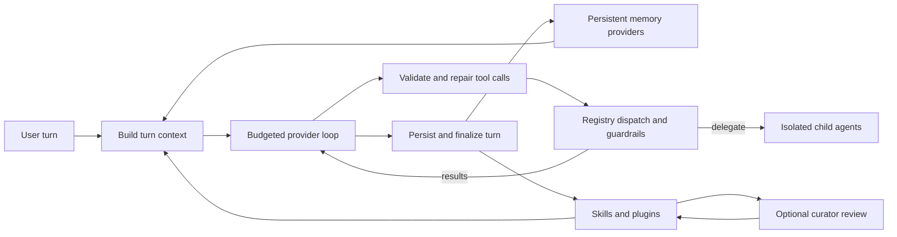

# Hermes Agent: persistent adaptation with guarded maintenance

Mode: `TECHNICAL DEEP DIVE`.

**EVIDENCE — snapshot.** This profile inspects [HERMES-AGENT] at commit `e444d165807f489b5c1ab8e4a612c8d09c2e67a2` in `evidence/implementations/hermes/snapshot/`.

**INFERENCE — claim ceiling.** Hermes is the richest of the three inspected harnesses in explicit cross-session adaptation: memory, agent-created skills, usage tracking, curation, delegation, and trajectories are named product surfaces. The source supports that mechanism claim; it does not independently establish that those mutations improve later improvement ability.

## Architecture at a glance

**EVIDENCE — observed control flow from [HERMES-AGENT], `agent/conversation_loop.py:1084-1325`, `:5700-6165`, `agent/memory_manager.py:364-735`, and `tools/delegate_tool.py:2778-2985`.**

**INFERENCE — architectural reading.** Hermes combines an online agent loop with slower artifact-maintenance paths. Memory synchronization and skill curation sit beside the turn loop rather than becoming unconstrained self-modification inside every model step.

## Component map

| Label | Component | Observed responsibility | Durability | RSI tuple role |
|---|---|---|---|---|
| EVIDENCE | `run_conversation()` | Builds turn context, enforces interrupt and iteration budgets, samples, repairs tool calls, executes tools, compresses context, and finalizes the result. | Turn state plus persisted session messages. | Core execution in `Hₜ`. |
| EVIDENCE | tool registry/dispatcher | Scopes toolsets, validates deferred tool access, invokes pre/post hooks and guardrails, and routes the real tool name. | Registry/config state; tool effects vary. | Action surface inside `Hₜ`. |
| EVIDENCE | `MemoryManager` | Combines built-in and at most one external provider, prefetches recall, routes memory tools, and serializes post-turn background writes. | Cross-session provider state. | Persistent `Dₜ`; memory policy in `Hₜ`. |
| EVIDENCE | skills | Supply reusable instructions and packaged resources; agent-created skills are distinguishable from bundled, hub, and external skills. | Files under the Hermes skill store. | Editable artifacts spanning `Hₜ` and `Dₜ`. |
| EVIDENCE | curator | Applies usage-based lifecycle transitions and can optionally run an LLM pass to consolidate agent-created skills, with snapshots, archives, reports, pins, and dry-run support. | Cross-run skill library and curator state. | Artifact maintenance inside `Aₜ`. |
| EVIDENCE | `delegate_task` | Builds isolated children, supports single/batch and foreground/background modes, applies concurrency/depth/role/iteration limits, and aggregates results. | Child sessions and live logs; background execution is process-local. | Parallel proposal/search surface in `Hₜ`. |

## The online loop is bounded and persistence-aware

1. **EVIDENCE — prologue.** `build_turn_context()` owns once-per-turn setup, including prompt restore, message sanitation, preflight compression, plugin hooks, external-memory prefetch, and crash-resilience persistence ([HERMES-AGENT], `agent/conversation_loop.py:1138-1185`).
2. **EVIDENCE — resource budget.** The outer loop stops on both per-turn API-call count and an `IterationBudget`; each parent and child agent owns a separate budget (`conversation_loop.py:1194-1293`; `agent/iteration_budget.py:1-59`).
3. **EVIDENCE — tool repair and pairing.** Before execution, Hermes uniquifies call IDs, attempts name repair, rejects invalid names or JSON with bounded recovery, caps delegation calls, and preserves assistant-call/result pairing (`conversation_loop.py:5710-5944`).
4. **EVIDENCE — persist before effects.** The assistant tool-call turn is appended to `SessionDB` before side-effecting tools run; execution halts if that canonical append fails (`conversation_loop.py:6058-6104`).
5. **EVIDENCE — guardrail halt.** A tool guardrail can terminate the turn with an explicit controlled response after execution dispatch (`conversation_loop.py:6106-6136`).

**INFERENCE — integrity value.** Persist-before-effects gives an external evaluator a stronger causal record than a transcript written only after tools finish, although it still does not prove that every external side effect is fully replayable.

## Memory is a provider boundary, not one monolithic store

**EVIDENCE — [HERMES-AGENT], `agent/memory_manager.py:364-455`.** `MemoryManager` always permits the built-in provider and at most one external provider, prevents external memory tools from shadowing reserved core tools, and keeps routing explicit.

**EVIDENCE — [HERMES-AGENT], `agent/memory_manager.py:486-622`.** Providers may contribute system-prompt blocks and prefetched recall. Skill invocation scaffolding is stripped before a query reaches memory, and external prefetch is time-bounded so a stuck provider is skipped.

**EVIDENCE — [HERMES-AGENT], `agent/memory_manager.py:638-735`.** Completed turns sync through a single background worker so writes preserve turn order without keeping the visible turn open; queued work is tracked by durability class for shutdown handling.

**INFERENCE — adaptation boundary.** Hermes can change later behavior by changing remembered context without changing weights or loop code. Whether a memory write is beneficial remains an evaluator question; persistence alone is not improvement.

## Skills and curator form a reversible artifact loop

**EVIDENCE — [HERMES-AGENT], `agent/curator.py:1-18` and `:1496-1583`.** The curator is inactivity-triggered, operates on curator-managed skills, protects pinned and externally owned artifacts, takes a pre-run snapshot, records state before the optional LLM pass, supports dry-run, and defaults to deterministic lifecycle maintenance when consolidation is off.

**EVIDENCE — [HERMES-AGENT], `agent/curator.py:1585-1735`.** When consolidation is enabled, the curator renders candidates, runs a separate review agent, records tool calls and model metadata, diffs the before/after skill sets, writes a report, and preserves rename information.

**EVIDENCE — [HERMES-AGENT], `AGENTS.md:1018-1048`.** Automatic removal is archival rather than deletion; backup, restore, and pinning are documented operator controls.

**CLAIM — [HERMES-AGENT], `README.md:19-30`.** Hermes describes memory, skill creation and editing, session search, delegation, scheduling, and trajectory generation as a closed learning loop.

**INFERENCE — strongest honest reading.** The curator is a real self-maintenance loop over agent-created artifacts, but its acceptance signal is usage/lifecycle policy plus an optional review-agent judgment. The inspected paths do not apply an immutable held-out task evaluator before promoting the modified skill library.

## Delegation is isolated and explicitly bounded

**EVIDENCE — [HERMES-AGENT], `tools/delegate_tool.py:2778-2897`.** Delegation accepts one task or a bounded batch, supports leaf and orchestrator roles, rejects spawning beyond configured depth, ignores model-supplied iteration budgets in favor of operator configuration, and applies a global pause switch.

**EVIDENCE — [HERMES-AGENT], `tools/delegate_tool.py:2902-2985`.** Child agents are built with isolated task context, inherited toolsets, explicit role and credential resolution, per-child live transcripts, and a shared aggregation path for synchronous and background batches.

**INFERENCE — search value.** These controls make delegation a plausible parallel proposal mechanism for harness experiments. They do not define diversity objectives, candidate fitness, or promotion criteria.

## Mapping Hermes onto the candidate/envelope split

**INFERENCE — notation.** [[system_state_and_notation]] owns the canonical split: Hermes supplies candidate components and archive inputs; evaluator `E`, budget `B`, permissions `P`, official archive `Aₜ`, and promotion authority must remain external to candidate-controlled memory and curation.

| Label | State | Concrete Hermes surface | Present in inspected source? | Missing for an RSI experiment |
|---|---|---|---|---|
| EVIDENCE | `Wₜ` | Configured provider/model and optional fallback routing. | Yes as runtime selection. | A controlled weight-update and provenance path. |
| EVIDENCE | `Hₜ` | Conversation loop, prompts, registry, toolsets, plugins, skills, memory policy, delegation, compression. | Yes; several parts are runtime-configurable or file-backed. | A versioned candidate boundary separating evaluator-owned from candidate-owned code. |
| EVIDENCE | `Dₜ` | Session history, recalled memories, skill bodies, trajectories, tool results. | Yes and partly cross-session. | Dataset curation criteria and contamination accounting. |
| MISSING | `E` | Guardrails and curator policy evaluate admissibility or maintenance, not held-out task improvement. | No complete immutable evaluator/selector. | Fixed tasks, scoring, budget parity, adversarial evaluation, and acceptance thresholds. |
| EVIDENCE | `Aₜ` | Session database, memory stores, skill usage state, archives, snapshots, reports, child logs. | Yes; richer than a flat transcript. | Unified candidate lineage, fitness records, artifact digests, and promotion receipts. |

## Smallest credible Hermes-based experiment

**INFERENCE — proposed boundary.** Freeze the provider model, evaluator, core tools, guardrails, task split, and resource limits. Permit candidates to modify only agent-created skills and a declared memory-retrieval policy; retain curator snapshots as rollback points but prevent the curator model from reading held-out labels.

**INFERENCE — proposed loop.** Generate skill-library candidates through isolated children; score them on development tasks; promote through an evaluator-owned process; then compare parent and promoted libraries on both held-out task quality and the quality of their next proposed skill revisions.

**MISSING.** The inspected Hermes revision does not report this matched, multi-generation experiment, so its “self-improving” framing remains a product claim with concrete adaptation mechanisms but without RSI-level validation.
