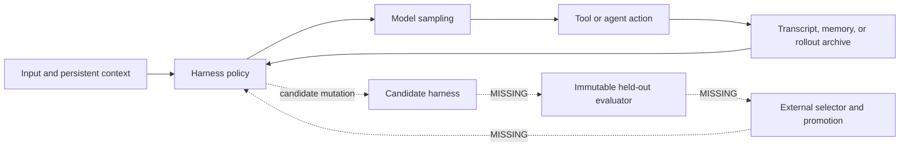

# Implementation harnesses: three adaptation surfaces

Mode: `DOMAIN ORIENTATION`.

> Canonical harness mechanics live in [Harness engineering](chapters/harness-engineering.md).
> This page remains the Pi, Hermes, and Codex comparison; the three deep dives
> retain exact pinned code paths.

**INFERENCE — scope.** Pi, Hermes Agent, and OpenAI Codex are implementation overlays, not members of the bounded citation closure rooted at [WENG-HARNESS]. They make `Hₜ`, `Dₜ`, and `Aₜ` concrete without supplying evidence that any harness improves its own future improvement ability.

**INFERENCE — reader guidance.** Use this page for comparison; use [[pi_harness_deep_dive]], [[hermes_harness_deep_dive]], and [[codex_harness_deep_dive]] for code paths, mutation boundaries, state mapping, and experiment seams.

## The shared skeleton—and where it stops

**INFERENCE — synthesis from [PI-MONO], [HERMES-AGENT], and [CODEX-REPO].** All three implement the left side of the following diagram. None of the inspected revisions implements the complete evaluator-owned loop on the right.

**INFERENCE — decisive boundary.** Reusing context, remembering facts, curating skills, forking a session, or spawning agents can change future behavior. RSI additionally requires an accepted persistent change to improve later improvement work under a protected evaluator and comparable budget.

## Snapshot contract

| Label | Harness | Inspected revision | Local evidence | Claim ceiling |
|---|---|---|---|---|
| EVIDENCE | Pi | `4488ad55c18f07ae89a489096c90de8667b3adfb` | `evidence/implementations/pi/snapshot/` | Present-day source behavior; no harness-evolution efficacy claim. |
| EVIDENCE | Hermes Agent | `e444d165807f489b5c1ab8e4a612c8d09c2e67a2` | `evidence/implementations/hermes/snapshot/` | Present-day source and maintainer-contract behavior; “self-improving” remains a project claim. |
| EVIDENCE | OpenAI Codex | `1e85ca099e4265bf89f4016772d299816e231bb3` | `evidence/implementations/codex-rsi/snapshot/` | Present-day source behavior, including the state-continuity stack; no autonomous self-evolution claim. |

**EVIDENCE — local provenance.** Pi, Hermes, and Codex are tracked as narrow public-source snapshots in `evidence/implementations/manifest.tsv`; `harp sources verify` checks their bytes and `harp sources materialize` checks them against clean public checkouts.

## One-line architectural identities

| Label | Harness | Best short description | Most visible adaptation surface | Strongest inspected control |
|---|---|---|---|---|
| INFERENCE | [[pi_harness_deep_dive|Pi]] | Small composable loop over a branchable session tree. | Hooks, prompt construction, tool selection, context transforms, extensions. | Small core, explicit tool hooks, project-resource trust. |
| INFERENCE | [[hermes_harness_deep_dive|Hermes]] | Persistent agent runtime with memory, skills, curation, and bounded delegation. | Memory writes and agent-created skill packages. | Iteration/concurrency/depth limits, guardrails, reversible curator archives. |
| INFERENCE | [[codex_harness_deep_dive|Codex]] | Rollout-backed execution and multi-agent control plane with routed capabilities. | Instructions, skills/plugins, tool visibility, hooks, compaction, thread forks. | Permission profiles, platform sandboxing, lineage, shared rollout budgets. |

Use [[codex_state_continuity_and_compaction]] for the ARC-AGI-3 state-continuity
result, encrypted reasoning, typed history, world-state diffs, compaction
checkpoints, replay, and cross-thread memories.

## Cross-harness comparison

| Label | Axis | Pi | Hermes Agent | OpenAI Codex |
|---|---|---|---|---|
| EVIDENCE | Core loop | Nested sampling/tool loop with steering and follow-up queues; tool batches can be sequential or parallel. | Synchronous provider/tool loop with interrupts, repair/retry paths, and explicit iteration budgets. | Persisted turn state machine with sampling, mailbox input, tools, hooks, and compaction-driven continuation. |
| EVIDENCE | Tool authority | Active tools are turn-scoped; pre/post hooks can block or transform calls. | Registry and toolsets scope discovery and dispatch; bridge calls are rechecked against session grants. | Model-visible specs are separate from registered runtimes; all calls normalize through `ToolRouter`. |
| EVIDENCE | Context model | Active branch projection with explicit transforms, compaction entries, and retained tail. | Cache-stable prompt prefix, memory prefetch, session history, and several bounded compression paths. | Rollout-derived prompt history with automatic compaction checkpoints and queued input. |
| EVIDENCE | Persistence | Parent-linked session entries preserve branches and configuration changes. | Session database, memory providers, skill store, curator state, reports, and child logs. | Rollouts, thread store, agent registry, spawn edges, statuses, and compaction records. |
| EVIDENCE | Delegation | Optional example extension launches isolated child processes. | Core tool builds isolated leaf/orchestrator children in bounded batches. | Shared `AgentControl` spawns, forks, messages, lists, waits for, and interrupts thread-backed agents. |
| EVIDENCE | Durable adaptation | Reusable extensions, resources, branches, and summaries. | Cross-session memory plus reversible maintenance of agent-created skills. | Reusable instructions, skills/plugins, thread history, and rollout lineage. |
| EVIDENCE | Safety boundary | Trust decision for project-controlled resources and hook-level tool rejection. | Guardrails, configured resource limits, role restrictions, archives, pins, and operator pause. | Approval/permission policy, runtime capability registry, host sandbox, lineage, and shared budgets. |
| MISSING | Held-out evaluator | No core evaluator/selector for harness variants. | No immutable evaluator gates memory/skill promotion on later task improvement. | No evaluator/selector promotes Codex harness variants. |
| MISSING | Recursive measurement | No test of whether accepted Pi changes improve later Pi changes. | No matched test of whether curated artifacts improve later curation or harness work. | No matched test of whether an accepted configuration improves later Codex improvement work. |

## State ownership across candidate and envelope

**INFERENCE — notation.** [[system_state_and_notation]] separates editable candidate state from externally owned signals, evaluator, budget, permissions, protected archive, and promotion authority. The local histories below are archive *substrates*; they become official `Aₜ` only when an external controller seals their lineage and receipts.

| Label | State | Pi | Hermes Agent | OpenAI Codex | Required external owner |
|---|---|---|---|---|---|
| EVIDENCE | `Wₜ` | Provider model and thinking level. | Provider/model and fallback routing. | Provider/model and reasoning effort. | Training provenance if weights become editable. |
| EVIDENCE | `Hₜ` | Loop config, hooks, tools, prompt, extensions, compaction. | Loop, prompts, tools, plugins, skills, memory/delegation policy. | Turn loop, instructions, tools, skills/plugins, hooks, compaction, agent policy. | Candidate-package schema and mutation allowlist. |
| EVIDENCE | `Dₜ` | Branch messages, resources, tool results, summaries. | Sessions, memory, skills, trajectories, tool results. | Rollout items, active history, compacted replacements, queued input. | Split policy, contamination checks, retention policy. |
| MISSING | `E` | No complete held-out evaluator. | No complete held-out evaluator. | No complete held-out evaluator. | Tasks, scoring, judge diversity, integrity checks, budget normalization. |
| EVIDENCE | `Aₜ` | Session tree and state-change entries. | Session/memory/skill archives and reports. | Rollouts, thread lineage, registry, statuses. | Candidate fitness, rejection reasons, digests, promotion receipts. |

## Design lessons that transfer

1. **INFERENCE — immutable turn state.** Pi's turn snapshot and Codex's turn context show why candidate-visible state should be explicit: experiments need to know which model, tools, prompt, and resources produced an action.
2. **INFERENCE — persist before or with effects.** Pi's append pipeline, Hermes's persist-before-tool-execution rule, and Codex's rollout flushing make causal audits stronger than end-of-run transcript dumps.
3. **INFERENCE — context is a projection.** All three distinguish durable history from model-visible context. An RSI archive should preserve the full lineage even when a candidate compacts or summarizes what the model sees.
4. **INFERENCE — visibility is not authority.** Pi hooks, Hermes session-scoped toolsets, and Codex's specification/runtime split all support an evaluator-owned capability boundary.
5. **INFERENCE — delegation needs shared budgets.** Isolated contexts alone do not make comparisons fair; candidate trees require a root-scoped accounting rule for tokens, wall time, subprocesses, and external calls.
6. **INFERENCE — reversible adaptation is still unevaluated adaptation.** Hermes's curator demonstrates snapshots, pins, reports, and archives, but reversibility does not replace held-out acceptance testing.

## Choosing a substrate for an experiment

| Label | Research question | Best starting substrate | Reason | Caution |
|---|---|---|---|---|
| INFERENCE | Can a model improve a small harness policy across generations? | Pi | The editable surface is compact and the session tree naturally preserves branches. | The evaluator and promotion controller must be added externally. |
| INFERENCE | Can persistent memory or skills improve later improvement work? | Hermes | Memory and agent-created skills already cross session boundaries and curator changes are reversible. | Usage and curator judgment are not held-out task fitness. |
| INFERENCE | Can untrusted candidate harnesses be evaluated with strong lineage and containment? | Codex | Rollouts, thread ancestry, routed capabilities, permissions, and sandboxing are first-class. | The larger state space makes attribution and reproducibility harder. |
| INFERENCE | Which harness is “best”? | None | The inspected evidence is architectural, not a matched benchmark. | Do not turn design differences into a performance ranking. |

## What the external RSI controller must add

**INFERENCE — synthesis from [PI-MONO], [HERMES-AGENT], [CODEX-REPO], [SELF-HARNESS], and [AHE].** A credible controller must freeze evaluator `E`, declare editable paths, create isolated candidate revisions, assign matched root-tree budget `B`, run development and held-out tasks, seal complete lineage and failures in `Aₜ`, promote outside candidate authority, and then measure whether the promoted harness generates better later harness changes.

**MISSING.** No matched benchmark run compares the three inspected revisions, and no inspected source demonstrates the complete propose → evaluate → select → persist → improve-the-next-improvement cycle under a shared evaluator.
