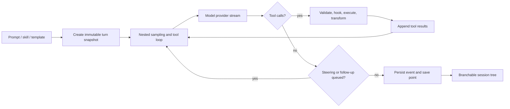

# Pi: a small, forkable harness substrate

Mode: `TECHNICAL DEEP DIVE`.

**EVIDENCE — snapshot.** This profile inspects [PI-MONO] at commit `4488ad55c18f07ae89a489096c90de8667b3adfb` in `evidence/implementations/pi/snapshot/`.

**INFERENCE — claim ceiling.** Pi is useful here because it exposes the mechanics of `Hₜ` in a compact form. The inspected source supports claims about loop structure, mutable tools, hooks, session lineage, compaction, and an example delegation extension; it does not show an autonomous optimizer that improves Pi across accepted generations.

## Architecture at a glance

**EVIDENCE — observed control flow from [PI-MONO], `packages/agent/src/harness/agent-harness.ts:395-539`, `:623-689`, and `packages/agent/src/agent-loop.ts:152-275`.**

**INFERENCE — architectural reading.** Pi separates a reusable loop from a higher-level harness that snapshots model, prompt, resources, tools, and context at turn start. That separation makes candidate harness variants comparatively easy to construct without changing the model provider layer.

## Component map

| Label | Component | Observed responsibility | Mutable surface | RSI tuple role |
|---|---|---|---|---|
| EVIDENCE | `AgentHarness` | Builds turn state, owns lifecycle phase, queues steering/follow-up input, binds tool context, emits hooks, and persists events. | Model, thinking level, tools, active-tool set, prompt builder, stream options, hooks. | Primarily `Hₜ`; some `Aₜ` coordination. |
| EVIDENCE | `runAgentLoop` | Alternates sampling and tool execution until there are no tool calls or queued follow-ups. | Context transform, stream function, before/after-tool hooks, tool parallelism. | Execution kernel inside `Hₜ`. |
| EVIDENCE | `Session` | Exposes append-only messages and state-change entries, current leaf, branch reconstruction, compaction entries, labels, and tree navigation. | Current leaf and appended entries; prior entries remain addressable. | `Aₜ` plus the model-visible projection of `Dₜ`. |
| EVIDENCE | compaction | Replaces old model-visible context with a summary and retained tail while keeping the session record needed to reconstruct lineage. | Summary, first retained entry, retained tail, hook-supplied result. | Context policy in `Hₜ`; derived experience in `Dₜ`. |
| EVIDENCE | extension system | Adds or replaces tools, commands, providers, prompts, UI, and lifecycle behavior. | Executable TypeScript extensions and event handlers. | Main practical edit surface for `Hₜ`. |
| EVIDENCE | subagent example | Spawns isolated Pi processes for single, parallel, or chained tasks with bounded output and abort propagation. | Agent definitions, prompts, model choice, concurrency, orchestration mode. | Optional search/orchestration mechanism inside `Hₜ`. |

**EVIDENCE — locators.** The harness behavior is in [PI-MONO] `packages/agent/src/harness/agent-harness.ts:395-1055`; session projection and append operations are in `packages/agent/src/harness/session/session.ts:61-149` and `:214-515`; the loop and tool pipeline are in `packages/agent/src/agent-loop.ts:152-371` and `:408-753`.

## Turn and mutation semantics

1. **EVIDENCE — turn snapshot.** `createTurnState()` resolves the branch context, resources, session metadata, tool context, system prompt, model, and active tools into one turn-scoped object before execution ([PI-MONO], `agent-harness.ts:395-429`).
2. **EVIDENCE — hookable loop.** `createLoopConfig()` exposes context transformation, pre-tool blocking, post-tool result transformation, next-turn state refresh, and queue draining without embedding those policies in the sampling loop (`agent-harness.ts:484-539`).
3. **EVIDENCE — durable event boundary.** Completed messages append to the session; turn completion flushes pending mutations and emits a save point (`agent-harness.ts:554-607`).
4. **EVIDENCE — live intervention.** `steer()`, `followUp()`, and `nextTurn()` feed distinct queues, so intervention during a run is explicit state rather than an implicit transcript rewrite (`agent-harness.ts:748-766`).
5. **EVIDENCE — recorded configuration changes.** Model, thinking-level, and active-tool changes are appended to the session before or alongside their in-memory update (`agent-harness.ts:946-1055`).

**INFERENCE — experimental consequence.** A Pi experiment can treat prompt construction, tool selection, context transformation, compaction policy, and hooks as independently mutable genes while leaving the core loop and provider adapter fixed.

## Branching memory rather than one flat transcript

**EVIDENCE — [PI-MONO], `packages/agent/src/harness/session/session.ts:61-149` and `:333-515`.** Session entries form a parent-linked tree. Context is built from the active branch; the most recent compaction controls which prior entries re-enter the model context; model changes, thinking-level changes, tool-set changes, labels, compactions, and leaf moves are explicit entry types.

**EVIDENCE — [PI-MONO], `packages/agent/src/harness/agent-harness.ts:783-939`.** `compact()` is an idle-only phase that can be replaced or cancelled by a hook, while `navigateTree()` finds the common ancestor, optionally summarizes the abandoned branch, moves the leaf, and emits the resulting branch event.

**INFERENCE — archive value.** This tree is a useful `Aₜ` substrate for counterfactual harness trials: multiple candidate trajectories can share a prefix without erasing unsuccessful branches. It is not itself a quality-diversity archive because no inspected policy assigns behavioral descriptors, evaluates variants, or selects survivors.

## Delegation and trust boundary

**EVIDENCE — [PI-MONO], `packages/coding-agent/examples/extensions/subagent/README.md:1-12` and `:91-175`.** Subagents are an example extension, not a mandatory core abstraction. The extension runs children in separate processes and contexts, supports single, parallel, and chained execution, caps concurrency and returned text, and propagates cancellation.

**EVIDENCE — [PI-MONO], `packages/coding-agent/examples/extensions/subagent/README.md:55-65`.** Project-local agent definitions are treated as executable-context inputs and require a trust decision before use.

**INFERENCE — safety reading.** Pi keeps the trusted computing base small enough to inspect, but extension power means an RSI controller must freeze the evaluator and promotion authority outside candidate-controlled extension code.

## Mapping Pi onto the candidate/envelope split

**INFERENCE — notation.** [[system_state_and_notation]] owns the canonical split: Pi supplies candidate components and an archive substrate; evaluator `E`, budget `B`, permissions `P`, official archive `Aₜ`, and promotion authority must be externally protected for an RSI experiment.

| Label | State | Concrete Pi surface | Present in inspected source? | Missing for an RSI experiment |
|---|---|---|---|---|
| EVIDENCE | `Wₜ` | Selected provider model and thinking level. | Yes; selectable and session-recorded. | A weight-update mechanism and attribution protocol. |
| EVIDENCE | `Hₜ` | Agent loop, system-prompt builder, tools, active-tool set, hooks, extensions, compaction policy. | Yes; unusually explicit and modular. | A candidate generator and versioned harness package boundary. |
| EVIDENCE | `Dₜ` | Active branch messages, summaries, tool results, resources, skills, and templates. | Yes; projected from session plus resource loading. | A controlled training/experience-selection policy. |
| MISSING | `E` | No first-class held-out evaluator appears in the inspected core. | No complete evaluator/selector loop. | Immutable tasks, scoring, budget accounting, adversarial checks, and acceptance thresholds. |
| EVIDENCE | `Aₜ` | Parent-linked session entries, labels, branch summaries, compaction records, model/tool state changes. | Yes for execution lineage. | Candidate fitness, rejection reasons, artifact digests, and promotion receipts. |

## Smallest credible Pi-based experiment

**INFERENCE — proposed boundary.** Freeze the model, provider adapter, tool runtimes, evaluator, task split, resource budget, and session-store schema. Allow a proposer to edit only a versioned bundle containing the system-prompt builder, active-tool policy, context transform, and compaction instructions.

**INFERENCE — proposed loop.** Fork a common session prefix for each candidate; run matched tasks; store score, cost, diff, and failure reason as external archive metadata; promote only on held-out improvement; then test whether the promoted bundle proposes better next-generation bundles than the parent under the same budget.

**MISSING.** The inspected Pi revision does not ship this controller, immutable evaluator, candidate selector, or multi-generation meta-improvement measurement.
