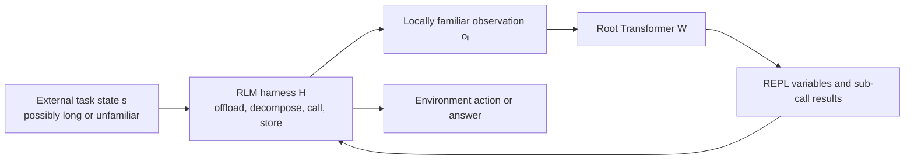

# Recursive Language Models: harness-induced compositional generalization

Mode: `TECHNICAL DEEP DIVE`.

**EVIDENCE — anchor identity.** The RLM research lineage is a first-class mechanism anchor for this RSI topic: Zhang, Kraska, and Khattab introduce Recursive Language Models [RLM-PAPER]; the pinned official repository represents the implementation [RLM-REPO]; and Alex L. Zhang and Omar Khattab's July 2026 blog, *Language model harnesses are compositional generalizers* [A1ZHANG-HARNESS-BLOG], studies post-training and transfer through that harness. The seed clipping by `@a1zhang` [A1ZHANG-X-POST] announces the blog but is not the substantive authority.

**INFERENCE — naming correction.** “Recursive Transformer” is a useful memory cue but an inaccurate mechanism name here. The Transformer itself does not acquire recursive layers or recurrent weight application. An RLM is a system-level harness that externalizes input context, lets a root LM write programs against that context, and permits model calls—including recursive calls—from a REPL.

## The argument in one sentence

**CLAIM — [A1ZHANG-HARNESS-BLOG], opening and “The capacity for compositional generalization can live in the harness.”** A harness can supply a higher-level inductive bias by transforming globally unfamiliar tasks into sequences of model calls that are individually familiar, allowing a learned decomposition strategy to transfer across task lengths and domains.

**INFERENCE — mechanism summary.** The loop above moves task-specific bulk into external state while keeping the root model's visible trajectory closer to a reusable decomposition program. Recursion belongs to the `H → W → R → H` call structure; learning belongs to the separate RL update of the root model's weights.

## What the harness changes

| Label | Mechanism | Model-visible effect | Proposed generalization role |
|---|---|---|---|
| CLAIM | Context offloading | The long input is bound to a symbolic variable instead of being serialized into the root prompt. | Tasks with different payloads can begin with similar root contexts. |
| CLAIM | Programmatic sub-agent calling | Tool and sub-call results can remain in REPL variables and be selectively passed to later calls. | Domain-specific information need not accumulate in the root history. |
| CLAIM | Recursive calls | A sub-call can itself be treated as an RLM with its own main context. | The same decomposition interface can repeat at multiple levels. |
| INFERENCE | Trajectory normalization | The harness maps many surface forms toward a smaller family of root-model traces. | Learning can attach to the decomposition pattern rather than every task's raw tokens. |

**CLAIM — [A1ZHANG-HARNESS-BLOG], “Equivalence classes over trajectories induced by the RLM harness.”** The authors describe this normalization as a harness-induced equivalence relation `∼ₕ` over task trajectories, producing a quotient space `T/∼ₕ` in which structurally similar tasks can appear nearly isomorphic to the root LM.

**INFERENCE — mathematical claim ceiling.** “Quotient space” is best read as a design objective, not a demonstrated theorem. A true equivalence relation must be reflexive, symmetric, and transitive; ordinary “distance below ε” neighborhoods are not generally transitive. The blog explicitly says that “isomorphic” is used loosely and that a more rigorous treatment is needed.

**MISSING.** No learned or hand-specified relation in the capture is proven to partition the full task space into stable equivalence classes. The observed object is similarity among selected root-model trajectories under several proxy distances.

## What was actually tested

**EVIDENCE — [A1ZHANG-HARNESS-BLOG], Figure 6 and length-generalization section.** The authors train Qwen3-30B-A3B-Instruct-2507 as an RLM, an RLM with a decomposition hint, and a base Transformer with YaRN. Six environments vary input length, output length, or instruction count. Training uses only short splits for 150 steps with batch size 64, four rollouts per sample, `prime-rl` with decoupled PPO, GRPO-like advantages, and KL loss; long held-out splits are evaluated every ten steps.

**EVIDENCE — [A1ZHANG-HARNESS-BLOG], Figures 1 and 6.** The held-out tasks are reported as 8–32× longer. The blog reports that RLM evaluation lift on the longer tasks tracks or exceeds short-task training lift, while the directly trained Transformer often improves on training reward without comparable long-task improvement. The opening summarizes this as roughly 10× the evaluation lift for the same training lift.

**EVIDENCE — [A1ZHANG-HARNESS-BLOG], Figure 7 and strategy-generalization section.** Three paired train/evaluation settings share an intended decomposition while changing surface domain: OOLONG TREC questions to spam questions, OBLIQ analogue retrieval from writing to mathematics, and OBLIQ descriptive retrieval from Twitter stance to WildChat errors. The blog reports clearer cross-domain evaluation gains for the RLM than for direct Transformer training.

**EVIDENCE — [A1ZHANG-HARNESS-BLOG], “On the cost of training harnesses like RLMs.”** On similarly sized tasks, RLM training is reported to take 1.5–3× the runtime of the base-Transformer counterpart because each sample entails multiple steps and waits for sub-calls.

**EVIDENCE — [A1ZHANG-HARNESS-BLOG], Figure 8 and Appendix.** The trajectory analysis compares each evaluation trace with its nearest earlier training trace using token edit similarity, 3-gram containment, 3-gram Jaccard, weighted Jaccard, and length ratio. The authors report that RLM evaluation trajectories are closer to prior training trajectories than base-Transformer trajectories under these proxies.

## Claim versus demonstrated result

| Label | Proposition | Current support |
|---|---|---|
| CLAIM | A good harness should keep each model call locally in-distribution (LID). | A design criterion proposed by the authors. |
| EVIDENCE | RLM training transfers better than the selected direct-Transformer baseline on the reported length and domain pairs. | Author-reported curves for one 30B model family and training setup. |
| INFERENCE | Context offloading acts like canonicalization: it removes payload differences from the root trace while preserving operations over the payload. | Consistent with the mechanism and trajectory examples, but not isolated as a causal estimate. |
| MISSING | Direct evidence that any individual prompt is actually in the unknown model-training distribution. | Benchmark success and trace similarity are proxies, not training-data membership tests. |
| MISSING | A matched comparison at equal total tokens, FLOPs, model calls, wall-clock time, and dollar cost. | The blog reports a 1.5–3× RLM runtime premium on similarly sized tasks. |
| MISSING | Transfer to task pairs not chosen because they share an anticipated decomposition. | The reported domain pairs are constructed around aggregation, retrieval, filtering, or analogous strategies. |
| MISSING | Independent reproduction of the July 2026 RL experiments. | The capture includes the author blog, predecessor paper, and official repository metadata only. |

## Internal actions versus external signals

**INFERENCE — applying the RSI packet's distinction.** This work makes the internal/external boundary unusually clear:

| Boundary | In this RLM experiment |
|---|---|
| Internal harness actions | Decompose the task, inspect externalized context, write REPL code, choose sub-calls, store intermediate results, and decide what returns to the root context. |
| External learning signals | Environment reward on the training tasks, held-out task scores, KL regularization, and the experimenter's checkpoint/evaluation schedule. |
| Persistent learned change | RL updates the root model weights `W`; the reported harness design `H` remains the surrounding protocol. |
| Not demonstrated | The system proposing, evaluating, accepting, and persisting a better `H`, then using that successor harness to improve the next improvement cycle. |

**INFERENCE — RSI boundary within an RSI anchor.** An anchor need not itself demonstrate the strongest RSI claim; it can establish a causal substrate that the field must explain. RLM recursion is recursion in inference and task decomposition, not recursive self-improvement, but the lineage anchors the claim that `Hₜ` can materially change the capabilities, reachable task distribution, and learning efficiency of candidate `Cₜ`, using the split defined in [[system_state_and_notation]]. The captured experiments do not yet show `Hₜ → Hₜ₊₁` or that generation `t+1` becomes better at producing generation `t+2`.

**INFERENCE — relationship between anchors.** Weng's anchor treats the harness as an editable capability surface around a base model [WENG-HARNESS]. The RLM anchor contributes a concrete mechanism and candidate objective for that surface: minimize irrelevant variation in model-visible trajectories while preserving the task operations needed for success. They are parallel, complementary anchors; this is a conceptual relationship, not a citation-lineage claim.

## Design implications for harness engineering

**INFERENCE.** Context management should be evaluated not only by token savings or immediate task completion but by whether it exposes a stable, reusable operational trace to the model.

**INFERENCE.** A sub-agent boundary is useful when it hides task-specific payload from the root while returning a compact result sufficient for the next general operation. Delegation that dumps the full sub-agent transcript back into the parent defeats this proposed benefit.

**INFERENCE.** The harness may move complexity rather than eliminate it. A clean root trajectory can coexist with a complicated REPL program, large external state, expensive sub-call tree, or brittle decomposition policy; system evaluation must measure both the model-visible normal form and the machinery that constructs it.

## Questions for the reader

- **SPECULATION.** What observable criterion could distinguish “locally in-distribution” from merely “the model happened to solve this prompt” without access to the pretraining corpus or output-distribution geometry?
- **SPECULATION.** Which invariants must a harness preserve when normalizing two tasks so that it removes irrelevant payload variation without erasing information required for correctness?
- **SPECULATION.** If two root trajectories are syntactically close but their sub-call trees differ radically in cost, reliability, or security exposure, should they belong to the same operational equivalence class?
- **SPECULATION.** How should an evaluator balance immediate correctness against the maintainability of the REPL program, the complexity of the sub-call tree, and the future cost of extending the harness?
- **SPECULATION.** Would a harness optimizer discover reusable decomposition strategies under a multi-target evaluator, or learn benchmark-specific normal forms that only appear compositional?
- **SPECULATION.** What experiment would show the genuinely recursive step: an accepted RLM-harness change improving the system's ability to propose and validate its next harness change?

## Organic references

**EVIDENCE — local capture.** The complete source bundle is `evidence/rlm/`. Its `manifest.tsv`, `artifact_inventory.tsv`, `sources.tsv`, and `run-receipt.tsv` record source identity, version, license boundary, bytes, SHA-256, and capture tools. The eight figures remain first-party evidence; they are not redrawn or numerically reverse-engineered here.

- [A1ZHANG-X-POST] `knowledge/capture/clippings/Post by @a1zhang on X.md`
- [A1ZHANG-HARNESS-BLOG] `evidence/rlm/artifacts/html/language-model-harnesses-are-compositional-generalizers.html`
- [RLM-PAPER] `evidence/rlm/artifacts/pdf/recursive-language-models-2512.24601v3.pdf`
- [RLM-REPO] `evidence/rlm/artifacts/git/README.md`
