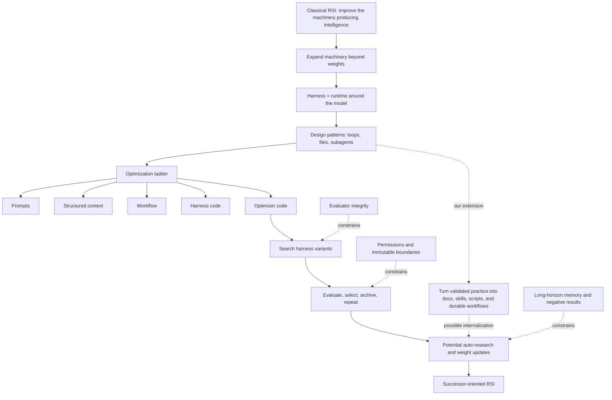

# RSI harness by Lil'Log, deconstructed

Mode: `DOMAIN ORIENTATION`.

> **Compatibility entry point.** The Weng-first reader now owns its guided
> explanations in nine canonical companions. Use this sequence when reading
> the original article:
>
> 1. [[weng/01-system-being-improved|What system is being improved?]]
> 2. [[weng/02-harness-design-patterns|Harness design patterns]]
> 3. [[weng/03-harness-layer-vs-core-intelligence|Harness layer versus core intelligence]]
> 4. [[weng/04-context-engineering|Context engineering]]
> 5. [[weng/05-workflow-design-and-search|Workflow design and search]]
> 6. [[weng/06-self-improving-harnesses|Self-improving harnesses]]
> 7. [[weng/07-evolutionary-search|Evolutionary search]]
> 8. [[weng/08-joint-harness-weight-optimization|Joint harness and weight optimization]]
> 9. [[weng/09-future-challenges|Future challenges as acceptance criteria]]
>
> The material below is retained as the extended historical deconstruction for
> incoming links and prior discussion checkpoints. New guided-reader prose
> belongs in the section companions above.

**EVIDENCE — source snapshot.** The anchor is Lilian Weng's [*Harness Engineering for Self-Improvement*](https://lilianweng.github.io/posts/2026-07-04-harness/), published on Lil'Log on 2026-07-04. The original page was fetched again on 2026-07-31 PT; the 133,975-byte live response exactly matched the registered capture at `sha256:45bc3793c36e42f79749f84af510761798b85960ad18d3123d86f3a403e247ac`.

**INFERENCE — purpose.** This is a deconstruction, not a compressed retelling. It reconstructs Weng's argument, exposes the assumptions connecting each step, separates illustrative systems from RSI evidence, and gives us checkpoints where we can disagree or go deeper.

**INFERENCE — claim ceiling.** [WENG-HARNESS](https://lilianweng.github.io/posts/2026-07-04-harness/) owns the article's synthesis and bibliography topology. Primary papers own mechanism and result claims; a system appearing in the article does not by itself validate its reported performance or establish RSI.

## The article in one sentence

**CLAIM — Weng, introduction through “Harness Layer vs Core Intelligence?”** Near-term recursive self-improvement is more likely to begin by optimizing the deployment machinery around models—context, workflows, tools, memory, permissions, evaluation, and optimizer code—than by having a model directly rewrite its own weights. [Original article](https://lilianweng.github.io/posts/2026-07-04-harness/#harness-layer-vs-core-intelligence)

**INFERENCE — the load-bearing move.** Weng expands the relevant cognitive system from a model to a deployed composite. Once that move is accepted, improvements to the harness can count as improvements to the AI system even when `Wₜ`, the model weights, stay frozen.

**INFERENCE — the unresolved move.** Improving a deployed composite is not automatically recursive. Recursion requires evidence that the changed composite is better at producing, evaluating, selecting, or retaining the next improvement—not merely better at solving the current task.

## Argument map

**INFERENCE — reconstruction of [WENG-HARNESS](https://lilianweng.github.io/posts/2026-07-04-harness/).**



**INFERENCE — reading key.** The solid chain is the article's conceptual progression. The dotted constraints are what determine whether the progression produces genuine improvement or merely optimizes a proxy.

## Deconstruction matrix

| Label | Article move | What it contributes | Hidden assumption | Evidence status | Our reading |
|---|---|---|---|---|---|
| CLAIM · [Weng](https://lilianweng.github.io/posts/2026-07-04-harness/#harness-layer-vs-core-intelligence) | Expand RSI from weight rewriting to training and deployment systems. | Makes current harness research relevant to RSI. | The deployed composite is the correct unit of intelligence. | Conceptual framing. | Useful and operationally realistic. |
| CLAIM · [Weng](https://lilianweng.github.io/posts/2026-07-04-harness/#harness-layer-vs-core-intelligence) | Expect some harness improvements to become internalized while external interfaces remain. | Makes the boundary between learned behavior and external procedure dynamic. | Internalization can be distinguished from general model improvement and benchmark memorization. | Prediction supported by a prompt-engineering analogy, not a demonstrated RSI transition. | Add an external procedure layer and test it by running the model with and without each procedure. |
| CLAIM · [Weng](https://lilianweng.github.io/posts/2026-07-04-harness/#harness-design-patterns) | Treat the harness as runtime/software-system design. | Adds workflow, evaluation, permissions, and persistent state to the agent abstraction. | These layers can be changed without losing attribution or safety. | Illustrated by coding-agent practice. | Strong systems framing; causality still needs experiments. |
| CLAIM · [Weng](https://lilianweng.github.io/posts/2026-07-04-harness/#harness-optimization) | Move from prompts toward optimizer code. | Organizes research by increasingly general editable objects. | Later objects are genuinely more general rather than simply higher-risk. | Taxonomy, not measured law. | A productive ladder, not a maturity theorem. |
| CLAIM · [Weng](https://lilianweng.github.io/posts/2026-07-04-harness/#self-improving-harness) | Use code as a broad harness representation. | Unifies prompts, tools, control flow, subagents, and memory in one search space. | Candidate code remains testable, attributable, and containable. | Supported by bounded program-search examples. | Expressive, but “universal” also means dangerous and hard to search. |
| CLAIM · [Weng](https://lilianweng.github.io/posts/2026-07-04-harness/#evolutionary-search) | Use evolutionary search when candidates are easy to evaluate but hard to differentiate. | Supplies population, mutation, selection, and archive machinery. | Fitness is aligned and resistant to gaming. | Strongest in executable domains. | Evaluator quality, not mutation, is the bottleneck. |
| CLAIM · [Weng](https://lilianweng.github.io/posts/2026-07-04-harness/#joint-optimization-with-model-weights) | Jointly improve harnesses and weights. | Connects deployment adaptation to successor-model development. | Contributions of `Hₜ`, `Dₜ`, and `Wₜ` can be separated. | Provisional preprint evidence. | Closest to full-stack RSI, but hardest to attribute. |
| CLAIM · [Weng](https://lilianweng.github.io/posts/2026-07-04-harness/#future-challenges) | Keep evaluation and permissions outside the editable loop. | Introduces an external integrity boundary. | The boundary is technically enforceable under optimization pressure. | Design recommendation; adversarial proof is missing. | The most important safety claim in the article. |

## 1. What is the system being improved?

**CLAIM — Weng, introduction.** A harness surrounds a base model and decides how it plans, calls tools, acts, perceives and manages context, stores artifacts, and evaluates results. [Original article](https://lilianweng.github.io/posts/2026-07-04-harness/)

**INFERENCE — system identity.** [[system_state_and_notation]] gives the full plain-language key. The editable candidate is `Cₜ = (Wₜ, Hₜ, Dₜ, Rₜ)`: model weights, harness, data or experience, and internal retrospective skills or actions. `Xₜ` denotes signals produced outside the candidate, such as held-out tests, trace audits, environment outcomes, and human feedback; external evaluator `E` interprets those signals and alone decides promotion. Archive `Aₜ` may be readable by the candidate, but accepted lineage and promotion records must remain protected. Resource budget `B` and permission policy `P` also remain outside candidate authority. Weng's article mostly studies changes to `Hₜ`, with later sections reaching toward joint changes in `Hₜ` and `Wₜ`.

**INFERENCE — why the expansion matters.** Two deployments with identical weights can have materially different capabilities because their observation, action, memory, verification, and recovery policies differ. Treating only weights as the system would discard those causal mechanisms.

**INFERENCE — why the expansion is risky.** If every surrounding software improvement is called RSI, ordinary engineering, online adaptation, automated search, and recursive improvement collapse into one category. We therefore need a stricter recursion test than “the system changed itself and got a higher score.”

**INFERENCE — discussion checkpoint A.** The first choice is ontological: is the AI the model, the model-plus-harness, or the entire socio-technical deployment including human approval and evaluation?

### Training pipeline and deployment system

**CLAIM — Weng, introduction.** Modern RSI need not mean that a model directly rewrites its weights: a model may instead improve the *training pipeline* and the *deployment system*, which then enable a better successor model. [Original article, opening definition](https://lilianweng.github.io/posts/2026-07-04-harness/)

**CLAIM — Weng, introduction and “Joint Optimization with Model Weights.”** Weng describes the deployment harness as the system around a base model that controls planning, tools, context, artifacts, and evaluation; she later says that weight updates can come from improvements to the model-training pipeline or from continual learning at test time. [Original article, introduction](https://lilianweng.github.io/posts/2026-07-04-harness/) · [“Joint Optimization with Model Weights”](https://lilianweng.github.io/posts/2026-07-04-harness/#joint-optimization-with-model-weights)

**INFERENCE — plain-language distinction.** The two systems have different immediate products:

| System | Starts with | Typical mechanisms | Immediate product |
|---|---|---|---|
| Training pipeline | Data, objectives or rewards, model architecture, training code, compute, and evaluation criteria | Pretraining, post-training, reinforcement learning, distillation, synthetic-data generation, optimizer or kernel changes, checkpoint selection | New or updated model weights: `Wₜ → Wₜ₊₁` |
| Deployment system | A model checkpoint, task, live context, tools, permissions, memory, and runtime policy | Prompt and context construction, agent loops, tool calls, retrieval, subagents, persistent files, verification, recovery, and user interaction | Actions, answers, code, experiment artifacts, and execution traces produced by `Wₜ` inside harness `Hₜ` |

**INFERENCE — coding-agent example.** Training a coding model on repository tasks, choosing its data mixture and reward, and selecting a checkpoint belong to the training pipeline. Giving that checkpoint a repository browser, shell, patch tool, test loop, context-compaction policy, subagents, and sandbox belongs to the deployment system. Identical weights can therefore behave very differently under different deployment systems, while identical harness code can behave differently after a weight update.

```text
data · objectives · trainer ───────────────→ model weights Wₜ
                                                   │
task · context · tools · permissions ─→ harness Hₜ(Wₜ) ─→ actions · artifacts · traces
                                                   │
                              evaluation and experience ─→ future data or pipeline changes
```

**INFERENCE — coupled-loop boundary.** The distinction is functional rather than physical. If a deployed coding agent edits a data-curation script and launches fine-tuning, the *editing and launch* are actions of the deployment system, while the changed script and training run alter the pipeline that produces `Wₜ₊₁`. In Weng's RSI framing, the important object is the coupled loop: deployment experience can improve training, a better model can improve harness engineering or auto-research, and both may contribute to a successor. This coupling does not by itself prove recursion; the successor must still improve a later improvement cycle.

**INFERENCE — our understanding · PROVISIONAL.** “Training pipeline” and “deployment system” should not be collapsed into one undifferentiated harness. The first changes how future model intelligence is encoded in weights; the second changes how current model intelligence is elicited, extended, constrained, and observed. Their interface—traces, failures, synthetic data, evaluations, and proposed code changes—is where practical RSI may cross from better use of a fixed model to building a better successor.

**Audience thought exercise.** If a deployed coding agent changes the data-curation script and launches fine-tuning, where would you draw the boundary: is that a deployment-system improvement, a training-pipeline improvement, or a deployment action that produces a training-pipeline change—and which persistent artifact would make the resulting model a successor rather than merely another run?

#### When the harness outruns its model

**INFERENCE — user commentary.** The model and deployment system are coupled, so an improving deployment system may carry the model into a context distribution unlike the one it previously handled, or may create tools whose semantics and operating procedure the current model does not know how to use reliably. A harness can therefore become more capable in principle while making the coupled system worse in practice.

**CLAIM — Weng, “Self-Improving Harness.”** Harness-updating capability and harness-benefit capability are different: making a useful harness artifact does not imply that the consuming model will invoke it correctly, at the right time, or sustain its instructions over a long trajectory. [Original article](https://lilianweng.github.io/posts/2026-07-04-harness/#self-improving-harness)

**EVIDENCE — [HARNESS-DISENTANGLE], §4 and Tables 2–3.** The primary study reports separate activation and adherence failures: a model may never load the relevant skill, or may load it and then stop following it during execution. [Primary paper](https://arxiv.org/abs/2605.30621)

**INFERENCE — proposed action policy.** Treat this as a model–harness compatibility break, not as an invitation to keep optimizing the same scalar task score:

1. **Hold promotion and preserve the last compatible pair.** Stop the candidate before it becomes the active deployment. Keep the last accepted `(Wₜ, Hₜ)` bundle and its rollback path available; do not ask the novel harness to certify its own compatibility.
2. **Localize the break with crossed evaluations.** Run the old and new models against the old and new harnesses—`W_old × H_old`, `W_old × H_new`, `W_new × H_old`, and `W_new × H_new` when a new model exists—under the same external tasks and root-tree budget. Separately measure whether the model discovers the new context or tool, invokes it, follows its protocol throughout the trajectory, and obtains a better outcome.
3. **Stabilize the interface before changing intelligence.** For a context shift, preserve the raw archive but translate model-visible state into a bounded, familiar schema with provenance, summaries, examples, and explicit retrieval rules. For a new tool, expose a narrow typed interface, a capability manifest, worked examples, observable effects, actionable errors, and a simulator or dry-run mode. An adapter is preferable when it can express the new capability without hiding important semantics.
4. **Add runtime capability negotiation.** The deployment controller should detect unfamiliar context or low-confidence tool use, constrain the action space, request a demonstration or stronger model, fall back to the compatible interface, or stop for external review. Model self-assessment may be a signal, but it cannot be the only enforcement mechanism.
5. **Train the consumer when adaptation cannot be reduced to an interface.** If the new context or tool is load-bearing and cannot be normalized safely, collect supervised trajectories and failure cases, then use curriculum learning, distillation, post-training, or reinforcement learning to teach activation, correct use, error recovery, and long-horizon adherence. Keep the target harness fixed during this step so the training signal has a stable meaning.
6. **Alternate before jointly optimizing.** First freeze `W` while testing or adapting `H`; then freeze `H` while adapting `W`. Move to joint updates only after the crossed evaluation can attribute each contribution. Promote the co-versioned composite—not a model or harness in isolation—only after held-out outcome, integrity, authority, regression, and compatibility gates pass.
7. **Retain compatibility as a first-class result.** Archive the model version, harness version, context schema, tool protocol, evaluator, budget, and failure traces together. Later improvement should be judged on whether the accepted pair can produce and use further changes without repeatedly breaking its own interface.

**INFERENCE — practical default.** Our first response would be containment and interface repair, because they are reversible and preserve attribution. We would escalate to model training when the capability cannot be faithfully translated into a model-familiar interface, and to joint optimization only when alternating updates have exposed a genuine coupled dependency.

#### DAgger as the classical precedent

**CLAIM — Weng, “Joint Optimization with Model Weights.”** Weng points to *Continual Harness* as a long-horizon example that updates the harness while co-learning a policy model: low-reward trajectories receive labels from a stronger teacher and feed a model update. [Original article](https://lilianweng.github.io/posts/2026-07-04-harness/#joint-optimization-with-model-weights)

**INFERENCE — user commentary.** This has essentially the same motivating failure mode as DAgger: a sequential policy acts outside the distribution covered well by its training data; its early errors change the later states it visits; performance can then degrade rapidly; and the states encountered under the learner are collected, labeled, added to training, and used to improve the policy.

**CLAIM — Ross, Gordon, and Bagnell, abstract and Algorithm 3.1.** Standard supervised imitation learning is mismatched to sequential deployment because future observations depend on the learner's earlier actions. DAgger responds by repeatedly executing the current policy, asking the expert for the action it would take at the visited states, aggregating those state–expert-action pairs, and retraining on the growing dataset. Its target is therefore good performance under the distribution of observations induced by the learned policy itself. [Original DAgger paper, PMLR 15](https://proceedings.mlr.press/v15/ross11a.html)

**INFERENCE — explanatory mapping.** “Feature set” is close, but *learner-induced state distribution* is more precise: the representation may be unchanged while the sequence of actions carries the learner into rare combinations of context and environment state.

| DAgger | Model–harness system |
|---|---|
| Visited state `s` | Model-visible context plus external and tool state |
| Learner policy `π` | Model `W` acting through harness `H` |
| Expert action `π*(s)` | Human or stronger-model label for the desired next action |
| Aggregated dataset `D` | Retained failure, recovery, and low-reward trajectory shards |
| Retrained policy | Updated model weights tested against the versioned harness |

**EVIDENCE — [CONTINUAL-HARNESS], Figure 2, §4.5, and §D.4.** The paper makes this bridge explicit. Each iteration runs the student policy through a live-refining harness, scores the resulting trajectory with a process reward model, has a stronger teacher relabel low-reward windows, and applies a soft supervised update before continuing from persistent emulator state. The authors call this a DAgger-style teacher-relabel step composed with process-reward scoring and reset-free state propagation. [Primary paper](https://arxiv.org/abs/2605.09998)

**INFERENCE — agreement and boundary.** The shared premise is on-policy repair of sequential distribution shift. But DAgger is not simply reinforcement learning: it is an online imitation-learning reduction with an expert action oracle, whereas RL can learn from rewards or returns without knowing the correct action at each visited state and must handle credit assignment and exploration. Many current agent-training recipes are hybrids—roll out on-policy, select failures with a reward or process model, obtain teacher demonstrations, use supervised or distillation updates, and sometimes add an RL objective.

The larger break in the analogy is that classical DAgger normally treats the environment and the meanings of observations and actions as fixed while the learner changes. In our coupled RSI case, `H` can invent a tool, alter the context schema, or change the reachable state distribution while `W` is being trained. Dataset aggregation alone then does not guarantee a coherent target: old labels may refer to retired tool semantics, and the teacher may itself be unfamiliar with the new interface. That is why the earlier action policy freezes and versions `H` during a model-update phase, records the tool protocol with every trajectory, and crosses old/new model–harness evaluations before promoting the pair.

**Audience thought exercise.** When an evolving harness changes the observation or action interface, what evidence would let you treat the next adaptation cycle as ordinary DAgger-style coverage expansion, and what evidence would show that the task itself has changed enough that old trajectories and expert labels are no longer valid training targets?

## 2. Harness design patterns are preconditions, not RSI

### Workflow automation

**CLAIM — Weng, “Pattern 1: Workflow Automation.”** A goal-oriented harness repeatedly plans, executes, observes or tests, and improves until the goal is reached. [Original article](https://lilianweng.github.io/posts/2026-07-04-harness/#pattern-1-workflow-automation)

**INFERENCE — boundary.** This loop improves a task trajectory. It becomes persistent adaptation only if something learned changes later runs, and recursive improvement only if that retained change improves the later improvement operator.

#### Autoresearch and durable execution

**CLAIM — Weng, “Pattern 1: Workflow Automation.”** Weng presents Karpathy's *autoresearch* as a clean example of constructing a workflow in which a model can operate, test, and iterate, with proactive user clarification available before autonomous execution. [Original article](https://lilianweng.github.io/posts/2026-07-04-harness/#pattern-1-workflow-automation)

**EVIDENCE — [KARPATHY-AUTORESEARCH], `README.md:L7–17` and `program.md:L21–112`, commit `228791fb499afffb54b46200aca536f79142f117`.** The repository narrows the editable surface to `train.py`, fixes each training run to five minutes, evaluates one primary metric, and instructs an agent to commit a candidate, run it, extract the result, append a `keep`/`discard`/`crash` record to `results.tsv`, retain improvements, revert regressions, and continue until interrupted. [`README.md`](https://github.com/karpathy/autoresearch/blob/228791fb499afffb54b46200aca536f79142f117/README.md#L7-L17) · [`program.md`](https://github.com/karpathy/autoresearch/blob/228791fb499afffb54b46200aca536f79142f117/program.md#L21-L112)

**INFERENCE — what the pattern contains.** The loop has four distinct parts:

1. **How the next experiment is chosen:** the agent proposes a code change using the current source, prior results, and its own reasoning.
2. **Fixed experimental rules:** one editable file, fixed evaluation code, a fixed wall-clock training budget, and no new dependencies.
3. **The keep-or-discard rule:** lower validation bits per byte normally advances the branch, with an additional informal preference for simpler code.
4. **Memory:** Git lineage, `run.log`, and the append-only-looking `results.tsv` carry observations into later proposals.

**INFERENCE — user commentary.** This is another instance of the external procedure layer described below: the place where a system stores useful ways of working outside the model's weights. The research recipe appears partly as instructions in `program.md`, partly as executable behavior in `train.py` and shell commands, and partly as saved evidence in Git and result files. The comparison asks how much of that recipe remains prose the model must interpret, and how much ordinary code checks and enforces.

**INFERENCE — terminology.** *Durable execution across time* means that the
system remembers what finished, what may still be running, which effects may
already have happened, and who may take the next action after a crash, retry,
long wait, or process replacement. The captured sources do not establish one
complete durable research runner; the contract below is Harp synthesis.

| Public evidence | What persists | What it establishes | What remains missing |
|---|---|---|---|
| **Autoresearch** — pinned `README.md` and `program.md` | Git lineage, `run.log`, and `results.tsv` carry candidate and result information into later proposals. | A bounded edit, train, measure, keep-or-discard loop with a fixed time budget and metric. | Crash reconciliation, single-writer ownership, and exactly-once external effects are not specified. |
| **Pi** — pinned session store and compaction paths | Parent-linked entries, active-tool changes, compaction entries, and branch summaries can survive beyond one model call when the configured store persists them. | A concrete split between canonical session history and a selected model-visible projection. | The cited paths do not establish a universal physical-durability or effect-reconciliation contract. |
| **Hermes** — pinned session flush and delegation paths | A configured session database can receive the assistant tool-call turn before tool execution; child work has bounded admission and parent-facing results. | One persist-before-effect gate and explicit delegation limits. | Persistence can be disabled, and the cited code does not prove exactly-once tools or unknown-outcome recovery. |
| **Codex** — pinned rollout, compaction, and agent-control paths | Rollout history, replacement-history checkpoints, parent/child identity, and root-tree control state are explicit. | Recoverable logical context and bounded tree coordination at the named revision. | Logical replay does not by itself reconcile arbitrary external side effects. |

**INFERENCE — central comparison.** Autoresearch leaves idea selection and
failure interpretation flexible. The public harnesses show that ordinary code
can separately own session history, context projection, delegation admission,
and lineage. A durable research system would need to combine those mechanisms
with action identities, reconciliation, evaluator-owned results, and promotion
authority without turning the research policy itself into a rigid workflow.

**MISSING — complete execution.** None of the captured public implementations
demonstrates the complete `change code → train → measure → keep or discard →
propose again` cycle with crash injection at every persistence/effect boundary.
The table is an architecture synthesis, not a claim that the systems share one
runtime or durability guarantee.

**INFERENCE — how they can fit together.** An autoresearch-like agent can still choose research ideas while ordinary code records the experiment identity, launches it, enforces the timeout, saves the final result, resumes after interruption, and records which candidate followed which parent. In the external procedure layer, `program.md` describes how to conduct research; the resume file or state machine makes a small set of safety and reproducibility rules impossible to skip.

**Audience thought exercise.** In an autoresearch-style loop, which decisions should remain judgments made by the research agent, and which should become fixed steps enforced by ordinary code?

### Filesystem as persistent memory

**CLAIM — Weng, “Pattern 2: File System as Persistent Memory.”** Long-horizon artifacts should live in durable files rather than being continuously appended to model context. [Original article](https://lilianweng.github.io/posts/2026-07-04-harness/#pattern-2-file-system-as-persistent-memory)

**INFERENCE — archive/context split.** The durable archive `Aₜ` and the model-visible context derived from it are different objects. A good harness can compress context without destroying rejected experiments, causal traces, or lineage.

### Subagents and backend jobs

**CLAIM — Weng, “Pattern 3: Sub-agent and Backend Jobs.”** Subagents enable parallel hypothesis search and isolated work, while files, logs, and status records keep their results explicit and recoverable. [Original article](https://lilianweng.github.io/posts/2026-07-04-harness/#pattern-3-sub-agent-and-backend-jobs)

**INFERENCE — search/budget split.** Delegation expands the proposal distribution but also expands resource consumption. A fair evaluator must account at the root tree, not per child, or a candidate can appear better by silently spending more.

**INFERENCE — discussion checkpoint B.** Weng treats workflow, persistent memory, and subagents as generic foundations. We should ask which of them changes intelligence and which merely changes throughput, reliability, or bookkeeping.

## 3. Harness layer, external procedures, and core intelligence

**CLAIM — Weng, “Harness Layer vs Core Intelligence?”** Weng predicts that near-term RSI will optimize the machinery for producing better answers rather than begin with direct weight rewriting. Mature harnesses may enable model-improvement research, smarter models may keep harnesses from becoming overengineered, and some harness improvements may eventually be internalized into model behavior. She nevertheless expects interfaces for goals, constraints, external context, tools, and evaluation to remain necessary. [Original article](https://lilianweng.github.io/posts/2026-07-04-harness/#harness-layer-vs-core-intelligence)

**INFERENCE — explanation.** “Internalized” does not mean that the whole harness disappears. It means that behavior which previously required an external procedure becomes reliably available from the model itself. Weng's prompt-engineering analogy is partial: instruction tuning can absorb recurring response patterns, while the deployment still has to supply the current goal, local facts, limits on what the model may do, tools, and success criteria.

**INFERENCE — user commentary.** Between raw experience and model weights, we should recognize an *external procedure layer*: useful ways of working that are stored outside the model so an agent can reuse them. Once repeated successful trials provide evidence for a practice, the system can encode it as a context-bearing document, a reusable skill, a deterministic script, or a workflow that remembers its state across interruptions. Later model training can try to internalize the practice, and tests with and without the external procedure can measure what moved into the model.

**INFERENCE — ways to store a practice.** These forms are not cleanly separated physical layers. Each form gives ordinary code more control and leaves the model fewer choices:

| Representation | What is retained | What the model still decides |
|---|---|---|
| Successful and failed trajectories | Concrete evidence about what happened | Extract the lesson and judge whether it transfers |
| Context-bearing document or playbook | Written guidance, constraints, and examples | Retrieve, interpret, adapt, and remember to follow it |
| Skill | A named procedure with activation conditions and ordered actions | Invoke it and handle underspecified branches |
| Script | Operations that produce the same result from the same inputs | Select inputs, invoke it, and interpret its result |
| Durable execution workflow | Sequencing, state, retries, timeouts, checkpoints, and recovery | Set the goal and intervene at declared decision points |
| Model behavior | A learned tendency or capability encoded in `W` | Apply the practice without loading the external recipe |

**INFERENCE — tradeoff.** Moving downward through this table turns a practice learned from trials into steps that ordinary code can enforce. This removes choices from the model and can make repeated runs more consistent, but it may make the system less able to adapt when conditions change. The reverse direction also matters: when a workflow fails, a person should be able to inspect what happened and understand why, rather than have the failure hidden inside a procedure or model update.

**INFERENCE — where each form belongs.** These forms do not require a new top-level part in our model of an RSI system. Trajectories and documents usually belong to `Dₜ`, the stored data and knowledge available at time `t`. A skill combines stored knowledge with rules in `Hₜ`, the harness that selects context, tools, and actions. Scripts and workflows that remember their state also belong mainly to `Hₜ`. Looking back at results and revising the method belongs to `Rₜ`, the improvement process. Training that makes the model perform the practice on its own changes `Wₜ`, the model weights. The protected evaluator and the authority that accepts a change remain outside all of them.

**INFERENCE — four-way test for internalization.** Let `W₀` be the model before training, `W₁` the candidate after training, and `P` the concrete procedure. Evaluate all four combinations on tasks not used for training, with the same tools, resource budget, and scoring rules:

| | Procedure absent | Procedure present |
|---|---|---|
| Before training | `W₀` | `W₀ + P` |
| After training | `W₁` | `W₁ + P` |

Record task success, failures to follow the procedure, recovery quality, cost, and performance when the context or tool interface changes. This separates the procedure's immediate benefit, improvement in the trained model without the procedure, and any further benefit from using the trained model and procedure together. It does not by itself decide when the word *internalized* is warranted.

**Audience thought exercise.** Across `W₀`, `W₀ + P`, `W₁`, and `W₁ + P`, what result pattern—and what transfer beyond the training distribution—would justify saying that the practice was internalized rather than merely memorized, made redundant, or still supplied by the procedure?

## 4. The optimization ladder

**CLAIM — Weng, “Harness Optimization.”** The rough progression is instruction prompts → structured context → workflow → harness code → optimizer code. [Original article](https://lilianweng.github.io/posts/2026-07-04-harness/#harness-optimization)

| Label | Editable object | Example | What persists | What can go wrong |
|---|---|---|---|---|
| INFERENCE | Prompt | Instruction wording or exemplars. | A text artifact. | Prompt overfitting and fragile tricks. |
| INFERENCE | Structured context | Playbook entries, retrieval, filtering, formatting. | Context artifacts and selection policy. | Context collapse, contamination, stale memory. |
| INFERENCE | Workflow | Graph, roles, sequencing, retries, verification. | Control-flow program. | More calls masquerade as better design. |
| INFERENCE | Harness code | Tools, middleware, memory, subagent policy, permissions. | Executable runtime. | Security boundary and attribution failures. |
| INFERENCE | Optimizer code | Candidate proposal, search, selection, archive policy. | The machinery producing future harnesses. | Evaluator capture and self-ratifying changes. |

**INFERENCE — important distinction.** The ladder is ordered by meta-level, not necessarily difficulty. A small change to optimizer code can be more consequential than a large harness rewrite because it changes the distribution of all later candidates.

## 5. Context engineering: artifact adaptation becomes mechanism adaptation

**CLAIM — Weng, “Context Engineering.”** ACE treats context as an evolving playbook updated by generator, reflector, and curator roles; incremental structured entries are intended to avoid collapse from repeatedly rewriting one prompt blob. [Original article](https://lilianweng.github.io/posts/2026-07-04-harness/#context-engineering)

**CLAIM — Weng, “Context Engineering.”** MCE separates the context-management mechanism from the context artifact: an outer loop evolves a skill defining static resources and dynamic context operators, while an inner loop optimizes task context. [Original article](https://lilianweng.github.io/posts/2026-07-04-harness/#context-engineering)

**CLAIM — Weng, “Context Engineering.”** Meta-Harness moves deeper again by optimizing the code that decides what information is stored, retrieved, and presented, retaining qualified harness candidates and their histories. [Original article](https://lilianweng.github.io/posts/2026-07-04-harness/#context-engineering)

**INFERENCE — three levels.** ACE changes the playbook; MCE changes how playbooks are produced; Meta-Harness changes executable harness machinery. Only the latter two directly target the improvement method, although neither label alone proves recursive gain.

**MISSING.** A common evaluator, model, task split, and resource budget comparing ACE, MCE, and Meta-Harness is not supplied by the article.

**INFERENCE — discussion checkpoint C.** The key question is whether a context-management skill is knowledge in `Dₜ`, policy in `Hₜ`, or optimizer state in `Aₜ`. The answer changes what must be frozen during evaluation.

## 6. Workflow search: from handcrafted pipelines to candidate archives

**CLAIM — Weng, “Workflow Design.”** The AI Scientist and ScientistOne illustrate expert-designed research workflows; Autodata organizes challenger, weak solver, strong solver, and verifier roles; ADAS and AFlow make workflow design itself a search problem. [Original article](https://lilianweng.github.io/posts/2026-07-04-harness/#workflow-design)

**INFERENCE — article progression.** The examples move from automating a fixed human methodology to searching the methodology. That transition—from executing a workflow to proposing and selecting workflows—is where harness engineering starts to resemble self-improvement.

**EVIDENCE — [AI-SCIENTIST], inspected article results and limitations.** The AI Scientist automates ideation through review, but the inspected human evaluation does not establish autonomous top-tier scientific discovery; only one of three human-selected papers cleared a workshop threshold and none met the main-conference bar.

**INFERENCE — correction.** Paper production is an artifact-level output. Scientific improvement requires stronger evidence about problem choice, implementation fidelity, negative results, causal inference, and the value of discoveries.

## 7. Self-improving harnesses: the strongest part of the article

### STOP

**CLAIM — Weng, “Self-Improving Harness.”** STOP optimizes an improver rather than directly optimizing the downstream solution, using the improver's average task utility as a meta-objective. [Original article](https://lilianweng.github.io/posts/2026-07-04-harness/#self-improving-harness)

**EVIDENCE — [STOP], abstract.** STOP's authors explicitly distinguish improving external prompts, tools, and workflows from full RSI because the underlying model is fixed.

**INFERENCE — lesson.** Self-reference is not sufficient. The base model, task distribution, utility function, and compute budget still determine whether recursive application helps or degrades.

### Harness updating versus harness benefit

**CLAIM — Weng, “Self-Improving Harness,” discussion of [HARNESS-DISENTANGLE].** Producing a plausible harness edit and benefiting from that edit are separate capabilities. [Original article](https://lilianweng.github.io/posts/2026-07-04-harness/#self-improving-harness)

**EVIDENCE — [HARNESS-DISENTANGLE], §§3.1–3.3.** The primary paper makes the separation operational. For a fixed initial harness and task set, it measures an evolver by the mean downstream gain its final harness produces across anchor agents. It measures a task-solving agent by the best gain it obtains across anchor evolvers. Base task capability is reported separately. This prevents “the stronger model got a higher score” from being mistaken for “the stronger model wrote a more useful update.”

**EVIDENCE — [HARNESS-DISENTANGLE], §4 and Tables 2–3.** In the authors' seven-model, three-benchmark study, the best-to-worst evolver gap was at most 3.1 percentage points on each benchmark, but harness benefit was non-monotonic in base capability. Their SkillsBench diagnosis separates two downstream failures:

- **Activation:** the consumer never gets the relevant artifact into working context. Qwen3-32B loaded a skill in 25.1% of trajectories, versus roughly 96% for the strongest tested models.
- **Adherence:** the artifact enters context but does not govern the trajectory. Judged adherence for Qwen3-32B declined from 0.52 after loading to 0.13 at final validation; Opus 4.6 declined from 0.89 to 0.80.

**INFERENCE — lesson.** An eloquent or structurally sophisticated patch is not evidence of improvement. Evaluation must keep three events visible: the update is useful in principle, the consumer activates and sustains it, and the resulting work improves. Collapsing those events into one task score hides which capability failed.

**MISSING — [HARNESS-DISENTANGLE], §§6–7.** The experiment holds model weights fixed and studies external harness artifacts; it does not cover parametric or hybrid adaptation. Updates are logged and cannot modify the evaluation scripts or weights, but the authors explicitly stop short of claiming open-deployment safety and call out privacy, consent, reversibility, auditability, and human oversight.

### Self-Harness

**CLAIM — Weng, “Self-Improving Harness,” discussion of [SELF-HARNESS].** The loop mines verifier-grounded failures, proposes bounded edits using explicit editable surfaces and past attempts, then accepts candidates only after held-in and held-out regression checks. [Original article](https://lilianweng.github.io/posts/2026-07-04-harness/#self-improving-harness)

**EVIDENCE — [SELF-HARNESS], abstract.** The authors report held-out Terminal-Bench 2.0 gains for three tested models, as recorded in [[claim_evidence_ledger]].

**INFERENCE — strength.** This is a credible persistent harness-improvement protocol because proposal, validation, rejection logging, and active-harness promotion are explicit.

**MISSING.** The reported task gain does not by itself show that the accepted harness is better at generating the next harness improvement.

### Agentic Harness Engineering

**CLAIM — Weng, “Self-Improving Harness,” discussion of [AHE].** AHE makes editable components, experience summaries, and edit predictions observable; evaluator, runs, tracer, and model configuration remain read-only so gains can be attributed to harness changes. [Original article](https://lilianweng.github.io/posts/2026-07-04-harness/#self-improving-harness)

**EVIDENCE — [AHE], abstract and inspected ablation.** AHE reports iterative Terminal-Bench gains and attributes transfer behavior to tools, middleware, and long-term memory rather than prompt changes alone.

**INFERENCE — strength.** Read-only evaluator and budget state is the right shape for an integrity boundary. The next required test is adversarial: incentivize the candidate to cross that boundary and demonstrate that enforcement holds.

**INFERENCE — discussion checkpoint D.** Self-Harness and AHE show harness improvement. The open disagreement is whether multi-generation task-score improvement deserves “recursive,” or whether recursion requires measured improvement in the improvement operator itself.

## 8. Evolutionary search supplies the outer loop

**CLAIM — Weng, “Evolutionary Search.”** Harness search fits evolutionary methods when the candidate space is irregular and non-differentiable but candidate fitness is executable. [Original article](https://lilianweng.github.io/posts/2026-07-04-harness/#evolutionary-search)

**CLAIM — Weng, “Evolutionary Search.”** Promptbreeder and GEPA evolve prompt-like artifacts; AlphaEvolve evolves programs; DGM evolves an editable coding-agent repository and preserves a branching population rather than greedily replacing one incumbent. [Original article](https://lilianweng.github.io/posts/2026-07-04-harness/#evolutionary-search)

**EVIDENCE — [DGM], abstract and §§1–3.** DGM reports benchmark improvements from a branching archive while keeping the foundation model, benchmark, and sandbox external.

**INFERENCE — why archives matter.** A single champion lineage can discard stepping stones. A diverse archive can retain candidates that are currently weaker on scalar fitness but expose mechanisms useful for later recombination or changed tasks.

**INFERENCE — why the evaluator dominates.** Evolution relentlessly amplifies the supplied fitness function. An archive improves exploration but does not correct a misspecified or gameable objective.

## 9. Joint harness and weight updates

**CLAIM — Weng, “Joint Optimization with Model Weights.”** SIA routes experience into either harness updates or weight updates, moving toward a system that chooses how it should improve. [Original article](https://lilianweng.github.io/posts/2026-07-04-harness/#joint-optimization-with-model-weights)

**EVIDENCE — [SIA], abstract.** SIA reports gains in three task domains over selected baselines; the packet keeps this provisional because model choices and baselines confound attribution.

**INFERENCE — full-stack significance.** Joint updates are closer to successor-building because both deployment policy and core model behavior can change. They also make causal attribution harder: an apparent recursive gain may come from more data, a stronger base model, a changed harness, evaluator leakage, or extra compute.

**INFERENCE — discussion checkpoint E.** Before accepting a joint-RSI claim, we need to decide whether improvement is defined over candidate composite `Cₜ` or whether each changed component must receive separate credit.

## 10. Future challenges are actually acceptance criteria

| Label | Weng's challenge | Deconstructed requirement |
|---|---|---|
| CLAIM · [Weng](https://lilianweng.github.io/posts/2026-07-04-harness/#future-challenges) | Weak and fuzzy evaluators | Use executable checks where possible; separate research quality, taste, novelty, and long-term value rather than hiding them in one judge score. |
| CLAIM · [Weng](https://lilianweng.github.io/posts/2026-07-04-harness/#future-challenges) | Context and memory lifecycle | Preserve provenance, forgetting rules, retrieval policy, negative results, and the distinction between archive and active context. |
| CLAIM · [Weng](https://lilianweng.github.io/posts/2026-07-04-harness/#future-challenges) | Negative results | Record rejected hypotheses and failed candidates so search does not repeatedly rediscover dead ends. |
| CLAIM · [Weng](https://lilianweng.github.io/posts/2026-07-04-harness/#future-challenges) | Diversity collapse | Maintain behavioral diversity or novelty alongside fitness rather than keeping score variants of one solution. |
| CLAIM · [Weng](https://lilianweng.github.io/posts/2026-07-04-harness/#future-challenges) | Reward hacking | Keep evaluator, held-out tests, budgets, and permission policy outside candidate authority. |
| CLAIM · [Weng](https://lilianweng.github.io/posts/2026-07-04-harness/#future-challenges) | Long-term success | Evaluate maintainability, migration cost, ownership, compatibility, and future debugging burden—not only immediate task completion. |
| CLAIM · [Weng](https://lilianweng.github.io/posts/2026-07-04-harness/#future-challenges) | Role of humans | Move human judgment to consequential boundaries such as objective choice, evaluator changes, promotion, and deployment. |

**INFERENCE — reframing.** These are not peripheral concerns after RSI succeeds. They define whether an optimization loop is measuring improvement at all.

### Evaluator and permission boundary

**CLAIM — Weng, “Future Challenges,” reward hacking.** The evaluator and permission control should likely sit outside the loop that evolves the harness, with held-out tests, trace audits, and human review at consequential decision points. Weng leaves scalable automation of that oversight as an open research problem. [Original article](https://lilianweng.github.io/posts/2026-07-04-harness/#future-challenges)

**INFERENCE — explanation.** Internal retrospection `Rₜ` may inspect trajectories, diagnose failures, remember lessons, and propose changes. It may consume external signals `Xₜ`, but it cannot rewrite those signals, external evaluator `E`, resource budget `B`, permission policy `P`, or the promotion rule.

**INFERENCE — commentary.** One possible boundary places self-reflection inside the improving candidate and final judgment outside it: the candidate may argue that it improved, but cannot ratify that claim or promote itself.

**INFERENCE — commentary.** “Outside” must be enforced as a capability boundary rather than a read-only label or prompt instruction. A candidate must be unable to change hidden tests, expand its budget, replace its judge, weaken permissions, falsify accepted lineage, or grant itself promotion authority.

**THOUGHT EXERCISE.** Where should the boundary fall between a candidate's internal ability to diagnose and propose improvements and the external authority to accept and promote a successor?

### Promotion signals as independent gates

**CLAIM — Weng, “Future Challenges,” reward hacking.** Weng names held-out tests, trace audits, and human review as safeguards around the external evaluator. [Original article](https://lilianweng.github.io/posts/2026-07-04-harness/#future-challenges)

**INFERENCE — explanation.** Held-out tests assess observable outcomes, trace audits assess process integrity, and human review handles normative or difficult-to-reverse changes. These signals need not collapse into one scalar score.

**INFERENCE — design possibility.** A candidate could face three independent promotion gates: outcome, integrity, and authority. Under this design, exceptional task performance cannot compensate for an integrity violation or an unauthorized boundary change. A weighted design would permit tradeoffs among them.

**THOUGHT EXERCISE.** Should outcome, integrity, and authority remain independent promotion gates, or should an evaluator permit explicit tradeoffs among them?

### Long-term success and intergenerational debt

**CLAIM — Weng, “Future Challenges,” long-term success.** Coding agents already improve daily software-engineering productivity, but their optimization targets remain too short-term. A system may complete the current task without protecting maintainability, ownership boundaries, migration cost, backward compatibility, or future debugging burden in a repository maintained by many people. Standard sandbox-based training rarely captures those costs. [Original article](https://lilianweng.github.io/posts/2026-07-04-harness/#future-challenges)

**INFERENCE — causal chain.** The evaluator rewards an observable result inside a short episode. Some implementation choices increase that result by moving work beyond the episode boundary: a shortcut passes today's test but creates tomorrow's migration, compatibility, or debugging problem. Because the cost appears on another task, owner, or generation, the current candidate receives the benefit while a successor inherits the debt.

**INFERENCE — concrete repository example · CONFIRMED AS EXPLANATION.** The coding target is immediate and legible: implement the requested functionality and pass the tests. One candidate can satisfy that target by adding a local special case, duplicating logic, crossing an ownership boundary, or leaving a partial migration. Another can satisfy the same target through a coherent interface with a smaller long-term change surface. If the evaluator observes only functionality and tests, both look correct and the cheaper shortcut may win even though it increases repository complexity and maintenance cost. This example supports Weng's argument by showing how a valid coding result can still be a poor long-term system improvement.

**INFERENCE — why recursion amplifies the problem.** Ordinary technical debt burdens later developers. In a recursive loop, it also changes the environment in which later improvers operate. A brittle interface, misleading test, or opaque abstraction can make the next candidate worse at diagnosing and improving the system. Selection may then favor lineages that repeatedly hide costs outside the evaluator's horizon, causing debt to compound across generations.

**INFERENCE — compact value model.** Let `V_now` mean value measured on the current task, `C_future` mean expected future maintenance and coordination cost, and `λ` mean how strongly the evaluator values that future cost. The quantity we actually care about is `V_total = V_now − λC_future`. Short sandbox evaluations approximate only `V_now`; setting `λ` implicitly near zero makes apparently successful but debt-producing candidates look optimal.

**MISSING.** Weng identifies the omitted dimensions but does not supply a concrete long-horizon evaluator, measurement horizon, or exchange rate between immediate capability and future repository cost.

**INFERENCE — proposed evaluation design.** Use hard vetoes for explicit invariants such as security, ownership, compatibility, migration completeness, and provenance. Measure softer costs by assigning a separate agent realistic follow-on changes, comparing time-to-diagnosis and change-surface size, running canary generations, retaining rejected regressions, and preserving rollback. This tests whether the modification leaves the system easier—not merely possible—to improve next.

**INFERENCE — user commentary.** The repository-complexity example should support Weng's argument, while the strategy discussion should also consider mechanisms that optimize several targets—especially correctness and code quality—rather than treating follow-on-task evaluation as the only solution.

**INFERENCE — multi-objective mechanisms.** Several selection designs are available:

- **Constrained optimization:** require functionality and tests first, then optimize code quality among correct candidates.
- **Lexicographic ordering:** compare correctness first, invariant compliance second, maintainability third, and cost last.
- **Pareto selection:** retain candidates that are not dominated across correctness, quality, cost, and future burden, without forcing an early exchange rate between them.
- **Weighted utility:** combine targets into one score, which is simple but permits strength on one target to compensate for weakness on another.
- **Independent evaluators:** use executable tests for correctness, structural checks and review for code quality, and follow-on tasks for successor usability.

**INFERENCE — design possibility.** Follow-on tasks are one measurement mechanism inside a broader multi-objective evaluation. A hybrid could keep correctness and explicit boundaries non-tradeable while preserving visible tradeoffs among code quality, future cost, and implementation expense.

**THOUGHT EXERCISE.** How should an evaluator combine correctness, code quality, implementation cost, and successor usability without allowing strength on one target to conceal an unacceptable failure on another?

## What Weng gets especially right

1. **INFERENCE — system boundary.** Effective capability lives in the interaction between weights and runtime, so harness engineering is a first-class research object.
2. **INFERENCE — executable representation.** Code can represent context policy, tools, workflows, memory, delegation, and optimizer behavior in one testable artifact.
3. **INFERENCE — observability.** Rich traces and persistent artifacts are prerequisites for causal diagnosis and evidence-grounded edits.
4. **INFERENCE — external controls.** Evaluator and permission boundaries should not be editable by the system whose performance they judge.
5. **INFERENCE — human role.** The practical goal is better placement of human judgment, not theatrical removal of humans from every loop.

## Where we should push harder

1. **INFERENCE — define recursion.** The article moves fluidly between task iteration, persistent adaptation, harness optimization, and RSI. Our stricter criterion reserves recursion for demonstrated improvement of later improvement work.
2. **INFERENCE — normalize resources.** More agents, longer contexts, extra retries, and larger models must enter the evaluation budget or they can masquerade as architectural improvement.
3. **INFERENCE — protect the evaluator.** “Read-only” must be a capability guarantee, not a prompt instruction or repository convention.
4. **INFERENCE — separate proposal from utilization.** Harness-edit quality and the base model's ability to exploit the edit require distinct metrics.
5. **INFERENCE — measure generations, not rounds.** Repeated candidate search within one fixed optimizer is not the same as improving that optimizer across generations.
6. **INFERENCE — retain counterevidence.** Failed edits, regressions, negative experiments, and evaluator disagreements belong in `Aₜ`, not in a disposable log tail.

## Our proposed RSI test

**INFERENCE — operational criterion.** Let `Improve(Cₜ; E, B, P, Aₜ)` produce accepted candidate `Cₜ₊₁` inside a protected evaluator, budget, permission, and archive envelope. A task-level gain shows `Score(Cₜ₊₁, E) > Score(Cₜ, E)`. A recursive gain requires evidence that, under the same envelope, `Cₜ₊₁` produces better subsequent accepted improvements than `Cₜ`.

**INFERENCE — minimum experiment.** Freeze held-out tasks, scoring, judge configuration, permission policy, compute accounting, and promotion authority. Run parent and accepted child as competing improvers from matched starting candidates. Compare the quality, diversity, cost, and regression rate of the next generation they produce.

**MISSING.** No work inspected in this packet independently demonstrates a general autonomous successor loop that repeatedly passes this test.

## Concrete harness reading

| Label | Harness | Weng pattern made concrete | Best deconstruction |
|---|---|---|---|
| EVIDENCE | Pi | Hookable loop, active-tool policy, branchable session archive, compaction, optional subprocess delegation. | [[pi_harness_deep_dive]] |
| EVIDENCE | Hermes Agent | Persistent memory, agent-created skills, reversible curator maintenance, bounded delegation. | [[hermes_harness_deep_dive]] |
| EVIDENCE | OpenAI Codex | Rollout lineage, routed capabilities, thread-backed agents, permissions, and platform sandboxing. | [[codex_harness_deep_dive]] |

**INFERENCE — synthesis.** Pi is the cleanest small harness-mutation substrate, Hermes exposes the clearest persistent artifact-adaptation loop, and Codex exposes the strongest inspected lineage and containment control plane. This is an architectural comparison, not a benchmark ranking.

## Conversation route

1. **INFERENCE — checkpoint A · PROVISIONAL.** The working model now distinguishes editable candidate `Cₜ` from the protected experiment envelope; the broader philosophical system boundary remains open.
2. **INFERENCE — checkpoint B · PROVISIONAL.** The companion separates task quality, durable adaptation, throughput, reliability, and recursive meta-effect rather than calling all of them intelligence.
3. **INFERENCE — checkpoint B2 · PROVISIONAL.** The user proposes an external procedure layer that turns validated experience into documents, skills, scripts, and workflows that survive interruptions, then tests the model with and without those procedures to measure later internalization into `Wₜ`.
4. **INFERENCE — checkpoint C · PROVISIONAL.** Context skills may contain artifacts in `Dₜ`, policy in `Hₜ`, and retrospective actions in `Rₜ`; the candidate bundle must declare which surfaces are mutable.
5. **INFERENCE — checkpoint D · OPEN.** Choose whether task-gain generations qualify as recursive or require direct meta-improvement measurement.
6. **INFERENCE — checkpoint E · OPEN.** Decide how to attribute joint harness and weight updates.
7. **INFERENCE — checkpoint F · ACTIVE.** Design the external evaluator, budget, archive, permission, and promotion boundary.

**INFERENCE — suggested next move.** Continue checkpoint F by deciding which promotion properties are non-tradeable gates and which remain visible multi-objective tradeoffs. Keep the audience exercise open; record our strategy separately.

## Provenance and companion material

**EVIDENCE — anchor.** [WENG-HARNESS](https://lilianweng.github.io/posts/2026-07-04-harness/) is registered in `sources/source_registry.tsv` with its locator, retrieval digest, date, and secondary-source claim ceiling.

**EVIDENCE — primary claims.** [[claim_evidence_ledger]] records inspected mechanisms, results, corrections, and limitations for STOP, Self-Harness, AHE, DGM, SIA, the AI Scientist, and benchmark sources.

**EVIDENCE — closure.** [[bounded_transitive_closure]] records why the map stops after two citation hops; [[missing_evidence]] prevents registered-only sources or unavailable evaluations from silently becoming facts.
