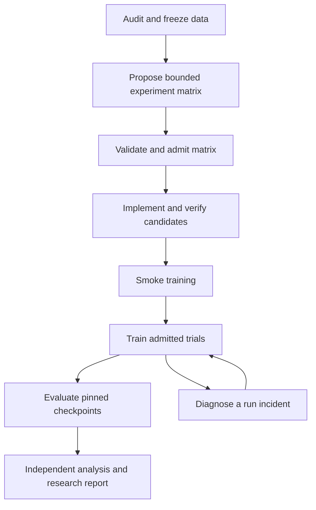

# Supervised model research in a self-contained Ferric fixture

Status: proposed scenario and workload design, 2026-09-07. This extends
[the supervised workflow scenarios](supervised-workflow-scenarios.md) and changes
their priority. No fixture repository, training run or GPU job has been created.

## Workload and environment axes

The [qualification matrix](workload-environment-matrix.md) owns the two axes;
[plan.md](plan.md) owns delivery order and [execution-contracts.md](execution-contracts.md)
owns admission, execution, dataflow and recovery semantics. The research scenarios below describe the workload
axis. Environment preparation, local Xena execution, remote Vaso execution,
Armada host/job integration and disconnection recovery are explicit workflow
stages. Distributed execution remains future work.

## Research question and first complete campaign

Use one small, inspectable research repository for a complete investigation:

> Under a fixed training-token budget, how does reducing the number of KV heads
> affect validation loss, retrieval accuracy, memory use and measured throughput?

This is a workflow-usability experiment with real model computations. Its small
models and generated data do not establish conclusions about frontier-scale
models. A negative or inconclusive research result can be a successful workflow.

The campaign connects data analysis, architecture design, implementation,
training, evaluation and a research report. The main coding agent frames the
question and submits the campaign. Worker agents design bounded experiments,
write analysis or model code, diagnose anomalies and review evidence. Native
activities execute scripts, tests, training and evaluation. The Engine owns
scheduling, result handoff, job reconciliation and ordinary recovery.



The incident edge can resume only the same admitted trial or stop it. A changed
learning rate, model, data mixture or batch configuration becomes a new trial.
The final report may propose another campaign; it cannot launch unlimited work.

## What was inspected

Read-only inspection used `devx_b200_dbg`, repository
`/data02/home/philip.yang/workspace/ferric_continuum`, at commit
`68700d856834db0753038e5a5ff0680e01e16462`. Untracked local issue and context files
were left untouched. Source behavior below is grounded in tracked files; local
context documents were consulted only for vocabulary.

| Inspected source | Useful basis | Limit to preserve |
| --- | --- | --- |
| `ferric_continuum/tnsr/README.md`, `src/debug.rs` | Autograd and structured forward/backward traces | CPU f32 reference with selected optional CUDA forward operations |
| `tnsr/src/qwen3.rs`, `src/bin/qwen3_demo.rs` | Small dense model with GQA, RoPE, RMSNorm and SwiGLU; forward/loss/backward demo | The demo is not a durable optimizer-step training service |
| `tnsr/src/transformer.rs`, `src/scaling/` | Inspectable transformer and analytical cost/memory reports | The simple GELU block and Qwen3 block have different accounting; formulas cannot be exchanged blindly |
| `tnsr/src/checkpoint.rs` | Activation rematerialization policies | This does not serialize training state for process restart |
| `tnsr/src/scaling/distributed/` | Sharding estimates and collective simulations | Not actual distributed training execution |
| `tnsr/tools/compare_logits.py` | Separate tokenization mismatch from model numerical mismatch | Real-weight comparison needs separately supplied model artifacts |
| `ferric_continuum/optimizers/muon/` | Explicit optimizer update and reference checks | A prototype, not evidence of integration with the Rust model training path |
| `ferric_continuum/cuda_kernels/` | GEMM, softmax and attention correctness workloads | GPU performance and training integration need measurement |
| `tools/ferric_run/README.md` | Command, preflight, sandbox-plan, log and result records | Existing rootfs required; CUDA intent does not mount devices or libraries |

## Self-contained fixture contract

Create a standalone Ferric-derived research fixture from a pinned source snapshot,
with a recorded import manifest and the applicable source licenses. Preserve the
Bazel-built Rust/CUDA modules as optional reference and kernel-study targets.
Add a small Python training workload with pinned PyTorch dependencies for the
first complete training campaign. This avoids making GPU autograd development
a prerequisite for testing workflow supervision. The Python implementation and
Rust reference must be compared explicitly on the supported tiny operations;
shared naming is not evidence of numerical equivalence.

This is the recommended middle option. Reusing the live remote checkout would
make experiments depend on unrelated edits and local mounts. Building a full
Rust GPU trainer first would defer the workflow experiment behind substantial
framework work. A pinned standalone fixture with a narrow conventional trainer
keeps real training in scope and the Ferric systems work available.

The fixture owns its code, schemas, test data generators, experiment definitions,
locked dependencies, commands and reports. Harp consumes it through explicit
workspace/artifact inputs. Neither repository imports the other's source tree,
uses an editable sibling dependency, or needs a particular developer home path.
Do not inherit Ferric Run's optional peer mounts. Harp's build and test suite must
remain usable without this checkout or a GPU.

Proposed layout within the new fixture:

```text
research/
  data/             deterministic generator and data-audit commands
  models/           tiny dense decoder and bounded GQA configurations
  train/            optimizer loop, atomic checkpoints, job status
  eval/             fixed validation slices and compatibility checks
  analysis/         metric tables, plots and uncertainty calculations
  experiments/      campaign and trial schemas, declared limits
  workflows/        authored workflow plans and typed worker prompts
  tests/            scientific invariants and recovery fault injection
```

Every command accepts structured config and an output directory and emits a
versioned result manifest. Notebooks may explore results but cannot be the only
executable source of an analysis. CPU smoke and single-GPU profiles are separate.
The GPU profile records actual device, driver, environment and workload identity;
the hostname alone does not establish capacity or available allocation. GPU
sandbox projection must be implemented and tested before using that backend.

Initial data is generated locally using a fixed token vocabulary. Include
short-range transition prediction and delayed key/value retrieval sequences,
with deterministic labels and disjoint generator seeds for train, validation
and final test. Record exact duplicate detection across splits. Put deliberately
corrupted or leaked examples in a separate fault fixture. No downloaded weights,
external dataset or peer checkout is required for the first campaign.

## Exact W0 fixture and scientific controls

The initial implementation uses the following fixed CPU profile. These values
are proposed test specifications, not measurements or a live compute grant.

| Field | W0 definition |
| --- | --- |
| Model | Causal dense decoder, 2 blocks, width 64, 4 query heads, head dimension 16, SwiGLU width 128, RMSNorm, RoPE, no dropout |
| Configurations | KV heads 4, 2, 1; all other architectural fields fixed; tied input/output embeddings |
| Vocabulary | 64 IDs: special/padding IDs 0-7, key IDs 8-23, value IDs 24-55, reserved IDs 56-63 |
| Sequence | 65 stored tokens, shifted into 64 model inputs and 64 next-token targets |
| Clean splits | 1,024 train, 256 validation, 256 final-test sequences; immutable manifests |
| Training | AdamW; learning rate 0.001, betas 0.9/0.999, epsilon 0.00000001, zero weight decay, no scheduler, no accumulation, batch 4, 32 optimizer steps |
| Seeds | 11, 23, 37 for the full campaign; seed 11 for one-trial smoke |
| Numerics | CPU f32, single thread, deterministic operations required; GPU precision/tolerance qualified separately |
| Checkpoint cadence | Every 8 completed optimizer steps and final step; atomic publication |
| Comparison | 8,192 target positions processed per complete trial; report non-padding/supervised counts separately |

A profile pins every model convention, including norm epsilon, RoPE base,
initialization and loss masking, in its versioned config before F1 is accepted.
Loss is mean cross-entropy over all 64 shifted target positions; retrieval answer
accuracy uses only the final answer position. Neither clean task pads sequences.
Use norm epsilon 0.00001, RoPE base 10000, normal weight initialization with
standard deviation 0.02, unit norm scales and no bias on projections. Tie the
embedding/output tensor as one parameter with one optimizer state. Compare
implementations from identical exported weights, not nominally equal random seeds.

Use ID 1 for the transition task marker, ID 2 for retrieval, and ID 3 for the
query marker. A transition record is its marker followed by 64 tokens obtained
by repeating a seeded permutation of all 32 value tokens. A retrieval record is
its marker, 16 distinct key/value pairs in seeded order, 29 seeded nuisance value
tokens, the query marker, the queried key, and its value: exactly 65 tokens.
The queried key is chosen from the first eight pairs for the far slice and the
last eight for the near slice, equally often. Values may repeat; keys do not.
Source manifests record task and slice, and positional masks are computed from
this layout, not supplied by an agent.

The two generated tasks use separate names and masks. Transition prediction
uses deterministic cycles over value tokens. Delayed retrieval uses distinct
key/value pairs followed by a queried key and its answer. The queried pair must
appear before the query; score answer-position accuracy separately from all-token
loss. Never expose a target answer in its own causal input position. Record
retrieval distances and stratify them into near and far slices before training.
Give both tasks equal sequence counts in every clean split.

Derive per-record generator seeds from split, task and record index with a pinned
hash/PRNG algorithm. Record accepted sequence bytes. Exact cross-split duplicates
are rejected and regenerated with a deterministic rejection counter, capped at
1,024 attempts per record; exhaustion fails data generation. Transition families
and retrieval generation must provide enough unique sequences to meet that cap.
The generator schema must make this verifiable rather than assuming disjoint
seed integers imply disjoint data.

Choose the best configuration by mean validation cross-entropy over the three
seeds with equal trial weighting. Report per-slice answer accuracy and per-seed
loss alongside it. A failed/missing seed prevents declaring that configuration
best under this selection contract; retain it in the feasibility table. Ties
within a predeclared 0.000001 loss interval are reported as tied, with no extra
training launched to break the tie. Freeze the final step-32 checkpoint for all
three seeds of every selected or tied configuration. Evaluate exactly that set
on final test, reporting each seed and an equal-weight mean per configuration.
Do not choose a best seed or best intermediate checkpoint. Test results never
break a validation tie and are never input to the selector. The tiny result is workflow and
numerical evidence, not an externally generalizable model-quality benchmark.

Correctness requires loss reduction on a separate deterministic overfit fixture,
finite gradients, causal-mask tests and reference agreement. It does not require
every architecture to improve validation loss. Scientific findings may be null.

Runtime limits are distinct from step limits. P0 fixes bounded bootstrap authority;
F3, after the trainer exists, freezes numeric wall/CPU/GPU, token, retry and storage
ceilings from that bounded smoke calibration. Admission
rejects any missing ceiling; the implementation may not choose an unbounded
fallback or shrink the model silently when a host is slow. Calibration produces
a new profile digest when it changes any scientific field. No live allocation is
requested by the values in this document.

## R1. Data analysis and mixture design

Research task: establish whether the dataset can answer the GQA question, and
whether aggregate metrics hide poor long-range retrieval coverage.

The workflow freezes generator config and shard manifests, runs deterministic
profiles, then gives agents the computed tables and bounded examples. Profiles
include counts, sequence lengths, task proportions, label consistency, exact
duplicates and train/evaluation overlap. Agents produce hypotheses and candidate
mixture changes with cited rows. Scripts compute all reported counts and plots.
A validator checks the proposal; publication produces a new dataset version.
The main agent receives a data-quality and experiment-readiness report.

Useful dynamic behavior: one analysis task per shard or declared slice, followed
by reduction. Bad shards are quarantined with reasons. Their removal changes the
dataset identity and is visible before any training plan is admitted. A worker
must not silently drop inconvenient rows.

Recovery: cache a completed shard analysis by data, analysis-code and config
digests. Retry an interrupted shard only. If code changes, invalidate affected
analyses. A partially written table is never accepted as a result.

Acceptance: known corruption and duplicate leakage in the fault fixture are
reported; interrupted profiling reproduces the same aggregate as an uninterrupted
run. Reports distinguish full enumeration from sampled diagnostics. Choosing a
mixture from validation performance records that use; final test data stays out
of mixture selection.

## R2. Architecture design and executable ablations

Research task: propose a baseline and two GQA alternatives that answer the
question under the declared compute budget.

An agent writes an architecture proposal specifying dimensions, query/KV head
mapping, parameter sharing, equations, predicted tradeoffs and falsification
criteria. A second activity checks shape and causal-visibility constraints,
parameter counts and cost estimates. Coding activities implement the admitted
configurations in isolated workspaces. Deterministic tests check output shapes,
causal masking, finite gradients and supported numerical reference agreement.
An independent reviewer assesses whether the proposed ablation changes only the
intended factor.

The first supplied family fixes depth, width, query heads, head dimension, feed-forward
width, data and token budget, and varies only the KV-head count over three valid
divisors. This changes parameter count and compute; report those differences.
Do not describe this as parameter-matched. A separate parameter-matched study
would require another explicit design. Use a cost report specific to the actual
model, not the simple GELU-block formula for the SwiGLU model.

The initial executable campaign uses the fixed supplied family. The later D1
planner milestone can emit at most three configurations from an admitted schema.
Engine validation admits the resulting child graph once. The
planner cannot introduce arbitrary commands, repositories or model families.
If a required baseline fails validation, stop the comparison; an invalid optional
candidate can be rejected with a persisted reason before GPU allocation.

Recovery: reuse verified immutable code candidates with matching inputs. A
partially edited workspace follows the managed-candidate recovery contract.
An agent transcript is not a model implementation or verification receipt.

Acceptance: at least one deliberately invalid head configuration is rejected
before launch; valid candidates have runnable implementations, measured parameter
counts and referenced verification receipts. A design document alone is not a
completed architecture experiment.

## R3. Launch, monitor and resume real training

Research task: train one admitted candidate to a fixed optimizer-step/token
budget and preserve it through process interruption.

The workflow validates data/model/optimizer/environment identity, runs a short
finite-loss and gradient smoke check, acquires an allowed compute allocation,
submits the training command, and records a stable external job identity.
The training process emits step metrics and publishes atomic checkpoints.
Monitoring reads structured progress. A worker agent is invoked for a classified
incident, not kept alive to narrate every training step.

A checkpoint contains model weights, optimizer and scheduler state, all relevant
RNG states, sampler position and shuffle state, global step, consumed tokens,
precision/scaler state when applicable, and model/data/code/config identities.
Publish only at a complete optimizer-step boundary in the first version. This
avoids pretending an incomplete gradient-accumulation window is recoverable.
The manifest becomes committed only after all referenced bytes are durable.

On interruption, reconcile job identity and ownership first. If it is running,
reattach. If it is confirmed dead, restore the last valid compatible checkpoint.
An uncertain submission response must be reconciled by submission key before
another job can launch. File modification time and PID alone are insufficient.
Missing, corrupt or incompatible checkpoints produce an incident; restarting
from zero is a separately authorized policy, not an implicit resume.

OOM, nonfinite loss and lack of metric progress have distinct reason codes.
Automatically changing batch size or learning rate would change the experiment.
Stop or create an explicitly admitted child trial instead. Infrastructure retries
remain bounded and charge cumulative compute, including lost work.

Acceptance: kill after a checkpoint and during the next checkpoint write. Recover
from the last committed checkpoint, with no duplicate live training job. A
controlled deterministic CPU fixture must match uninterrupted training; the GPU
profile uses a declared numerical tolerance and records nondeterminism. Metrics
identify attempts and logical steps so replayed work cannot silently double-count
training tokens. Activation rematerialization and agent continuation remain
separate from this checkpoint contract.

## R4. Run and analyze a bounded experiment campaign

Research task: compare the three architecture configurations across three seeds,
using nine declared trials with a pre-registered validation metric and cost view.
The tiny CPU profile may use shorter runs but must label itself a smoke campaign.

The workflow creates a persisted trial matrix, admits only trials within cumulative
compute limits, and schedules them against actual resource slots. One available
GPU implies sequential GPU trials even if analysis agents run concurrently.
Each completed trial can start evaluation immediately; other training trials need
not wait at a global barrier. Completed trial artifacts survive supervisor loss.

The initial campaign has a fixed matrix. A later bounded planner may propose one
additional round from validation evidence, with a maximum trial count and reserved
budget validated before expansion. This is real data-dependent workflow planning;
it is not nine manual prompts issued by the supervisor. Harp's current static
IR does not already provide this expansion mechanism.

Report per-seed results, dispersion, failed trials and missing coverage. Three
seeds are a small sample; do not inflate them into strong statistical certainty.
Compare the same token budget and expose parameter, wall-time and memory
changes. Do not select winners from final test scores or silently exclude failed
seeds. OOM is an observed feasibility outcome, not a numeric zero loss.

Acceptance: after two completed trials and one interrupted trial, a new supervisor
receives only the campaign reference. Completed trials are reused, the interrupted
job is reconciled, and remaining trials are scheduled without manual child-task
launches. Over-budget expansion is rejected before consuming compute.

## R5. Investigate memory and kernel performance

Research task: explain a measured attention bottleneck and assess one bounded
optimization while preserving causal GQA semantics.

An agent reads model traces and measured timings, then proposes a small kernel
or activation-rematerialization study. The workflow executes reference tests,
builds the candidate, checks numerical behavior, and benchmarks a pinned shape
matrix. Agents interpret the resulting evidence. Keep kernel optimization and
rematerialization as separate trials so their effects can be attributed.

Record actual dtype, shapes, hardware, warmup, synchronization, repetitions and
concurrent device activity. Separate compilation time, transfer time and kernel
execution. Analytical roofline bounds remain labeled estimates. Report measured
latency distributions and peak memory separately. A forward-only kernel benchmark
cannot establish end-to-end training throughput; an integration study needs
backward correctness and a full training-step benchmark.

Recovery: interrupted build/test/benchmark units publish no partial winner.
Retain completed shape results with full environment identity. Reject comparison
when device or measurement conditions differ materially. A kernel crash requires
job/process reconciliation before another benchmark uses the allocation.

Acceptance: reject a fast but numerically wrong candidate; reproduce a completed
measurement after observer loss; report uncertainty when noise obscures the
speedup. No optimization is required to win for the scenario to pass.

## R6. Evaluate checkpoints and write a defensible research conclusion

Research task: decide what the completed campaign supports and what experiment
should follow.

The workflow evaluates exact checkpoints on fixed validation slices and freezes
the selected configuration set. One final-test stage evaluates the three final
seed checkpoints of each selected or tied configuration under the rule above.
Recovery can resume this same stage; it cannot change the frozen population.
Metrics and tables are computed by commands. An analysis agent explains the
tradeoffs; an independent reviewer checks claims against metrics, missing trials,
data lineage and code/checkpoint identity. The report includes failed hypotheses
and unresolved confounders alongside the selected candidate.

Any numerical-parity study uses identical token IDs and weights and names its
reference implementation. Tokenizer disagreement and model disagreement are
separate failures. Small synthetic retrieval results cannot justify general
language-model capability claims.

Recovery: evaluation reuse keys include checkpoint, data split, evaluator code
and configuration. Interrupted shards resume independently. Publishing the same
report twice is idempotent. If test evaluation informed further tuning, record
the contamination and require a new held-out set for a fresh final claim.

Acceptance: every quantitative claim resolves to a metric artifact and exact
producer lineage. Inject a changed checkpoint behind a familiar filename and
ensure cached evaluation is rejected. A reviewer must be able to distinguish
execution success, numerical correctness and evidence of a research improvement.

## How the earlier four scenarios fit

| Existing scenario | Retain and sharpen | Place in this campaign |
| --- | --- | --- |
| Pinned patch review | Review coverage, source lineage and adjudication are useful; also assess whether an ablation matches its hypothesis | R2 candidate review and R5 optimization review; still a cheap control-plane fixture |
| Verification incident | Distinguish infrastructure, implementation and experimental failures; loss divergence is not a flaky test | R3 incident handling; diagnostic agents cannot silently alter a trial |
| Bounded repair | A fix produces a new immutable code candidate; prior model results retain their original code identity | R2/R5 implementation; fixing training math creates a new trial rather than resuming incompatible state |
| Evidence-claim audit | Link conclusions to artifacts and preserve uncertainty; deterministic numbers come from scripts | R6 research review, with the earlier source-packet audit retained as a separate non-ML regression scenario |

Patch review remains a useful first infrastructure test, but research scenarios
are the product-level acceptance target. Do not finish the next round with only
a review demo and call research supervision complete.

## Durable records and authority

Persist separate identities for campaign, dataset version, model/code candidate,
trial, execution attempt, external job, training checkpoint, evaluation and claim.
A trial pins its scientific configuration. An attempt records delivery/recovery
of that trial. A checkpoint names actual training state. A workflow continuation
names control progress. Keep these meanings distinct in inspect and explain.

A research brief fixes hypothesis, allowed experiment family, input data,
selection metric, stopping rule, maximum trials, resources and authority.
The supervisor manages this contract within human-approved scope. Architecture
proposals outside the allowed family return to the human. Routine retries,
resource waits, checkpoint recovery and admitted trial dispatch need no human
or supervisor intervention.

Budget agent tokens, CPU/GPU allocation time, wall time, storage and trial count
separately. Reserve worst-case trial allocations before submission, reconcile
actual usage, and retain charges across retries. Stop issuing new work when a
limit is reached. Event-driven monitoring should report queueing, training,
checkpointing, evaluation and incidents distinctly, with last progress and next
expected deadline. Supervisor timeout is not proof that training is dead.

Use the existing Engine with activity backends for agents, commands and long jobs.
Keep training-step scheduling in the trainer. Add bounded validated plan expansion
only where R1/R2/R4 need it: persist planner output, validate limits, atomically
admit child identities, and reuse that admission on resume. Do not rerun a planner
and append different children after a crash. A parent budget must cover its
children. Cancellation propagates and reconciles all admitted jobs.

## Workload milestones within the qualification matrix

The implementation plan controls delivery sequencing; the following describe
workload coverage and must not be interpreted as a separate task order.

1. Specify and create the standalone fixture with local generated data, pinned
   dependencies, tiny model, CPU training/evaluation commands and result schemas.
   Verify it in a fresh directory without either original checkout. Resolve
   precise tiny-model dimensions and runtime ceilings through a timed smoke
   calibration before admitting a live campaign; persist the chosen values.
2. Deliver data analysis plus explicit artifact handoff and the fixed supplied
   three-candidate family. Reuse patch review for the agent/result/adjudication
   path. Agent-authored model writing follows managed-candidate qualification;
   it is not a prerequisite for training the supplied models.
3. Deliver R3 on CPU first, including real optimizer steps, atomic training
   checkpoints, durable command/job identities and replacement-supervisor tests.
   This is the minimum complete research execution milestone.
4. Deliver fixed-matrix R4 and R6. Then qualify the same workload on one allocated
   B200 with explicit GPU execution support and measured limits.
5. Add bounded planner expansion and R5 GPU performance studies. Defer real
   multi-node training until a collective restart and allocation contract exists.

For each milestone record three independent verdicts: workflow conformance,
workload correctness, and research outcome. Healthy execution should need zero
supervisor interventions between admission and report. Injected recoverable faults
must not require manual redispatch. Scientific decisions are expected and counted
separately from operational babysitting.

These are proposed milestones, not verified runtime behavior. No remote source
was copied, no dependency was installed, and no training or GPU activity was
launched during this specification pass.
