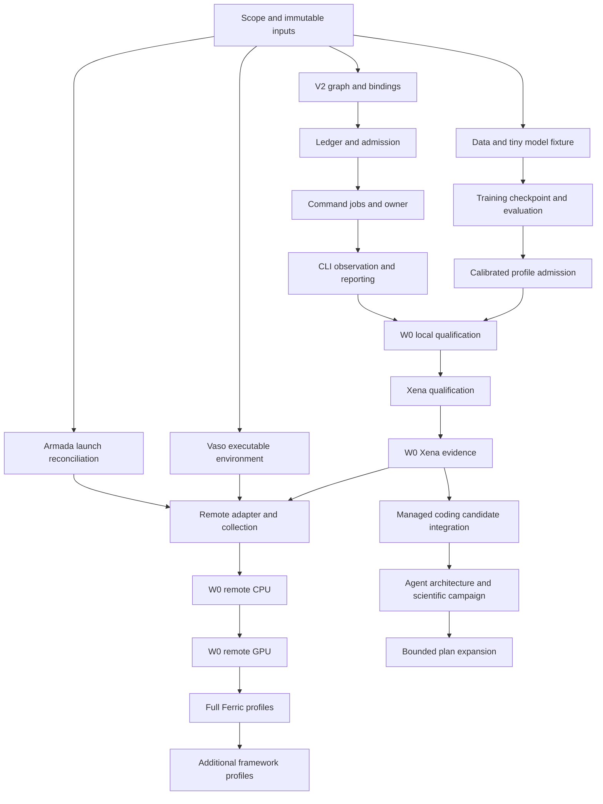

# Supervised research workflow implementation plan

> For agentic workers: execute one bounded work item at a time using the plan or
> executing-plans workflow. This document specifies implementation work; it does
> not authorize compute allocation, external repository changes, merge or release.
> Checklist status is planning status until fresh evidence is attached in Kata.

Goal: a coding agent admits a self-contained research campaign, supervises local
or remote execution through interruption, and reviews a complete evidence chain.

Architecture: extend the existing Harp Engine with typed command jobs, explicit
artifact bindings and backend-qualified recovery. Compose Xena, Vaso and Armada
at declared execution boundaries. The research workload owns model/training math.

Tech stack: Harp Rust/SQLite/artifacts; standalone Ferric-derived workload with
pinned Python/PyTorch and optional Bazel Rust/CUDA targets; macOS Xena; Linux Vaso;
Armada-managed SSH jobs. No sibling source imports.

Implementation update: the owner authorized implementation after approving these
drafts. The existing isolated `codex/workflow-explain` worktree is retained to
preserve the inspection baseline and review context. See [current status](README.md)
for verified increments and the macOS H3 qualification blocker. Unchecked tasks
remain incomplete; the new authoring and state APIs are not an executable v2 CLI.

## Scope, document ownership and execution baseline

This plan is the delivery order. [execution-contracts.md](execution-contracts.md)
owns cross-scenario semantics C1-C8. The [matrix](workload-environment-matrix.md)
owns qualification cells. The [research scenarios](frontier-research-scenarios.md)
own scientific outcomes. [round-2-spec.md](round-2-spec.md) owns only managed
coding candidates; its old sequence is subordinate to this plan. The original
[design.md](design.md) records the implemented inspection increment.

Harp baseline is unmerged `f6feae04` on `codex/workflow-explain`. Before coding,
inspect the chosen base and explicitly include or reconcile that increment.
The current specification drafts are uncommitted. Preserve unrelated changes;
use a new isolated worktree for each implementation concern. No primary-checkout
cleanup, remote service installation or GPU run is part of writing this plan.

Kata issue `zj1e` is the Harp design/adoption record, related to implemented `kggy`.
Work-item IDs below are stable plan references, not invented existing issue IDs.
Search Kata before creating child issues at implementation adoption. External
repositories use their own instructed trackers; link their issues to the Harp
integration item. This document describes their required deliverables without
pretending to grant authority over those repositories.

## First deliverable and stop boundaries

The first release target is W0/E0: one tiny fixed-model CPU training workflow with
real data/analysis/evaluation, agent-written interpretation, native commands and
checkpoint recovery. The same workload then qualifies E1, E2 CPU and E2 GPU.
Agent-authored architecture changes are a later milestone after managed coding.
This avoids requiring the entire workspace-mutation platform to train supplied
model configurations.

A release milestone is complete only with both workload correctness and workflow
recovery evidence. A mock provider can establish scheduling conformance, but not
agentic usefulness; a real provider run is a separate final qualification case.
The CPU fixture does not establish GPU support, and a GPU smoke does not establish
research significance. E3 and uninspected framework profiles are explicitly future
work, with admission prerequisites below.

Do not enable a backend until its required conformance tests pass. Each incremental
commit must keep its repository's existing gates green. Pair tests and their
implementation within one landable slice; unimplemented contracts in this plan
must not become permanently failing tests in the default suite.

## Dependency map



This is dependency information, not a request to start parallel agents or tasks.
Q0 uses fixed three-config definitions and can first qualify a one-trial subplan.
R1 implements the full nine-trial scientific comparison and agent-authored variants.

## File and repository map

Paths below are relative to the named owning repository. They are proposed paths
when marked new. Resolve the actual checkout through the work item's assigned
worktree; no path under another developer's home may be embedded in runtime code.

| Owner | Existing implementation boundaries | Proposed additions |
| --- | --- | --- |
| Harp contracts | `crates/harp-contracts/src/{dynamic_workflow,graph,runtime,result}.rs` | `workflow_v2.rs`, `job.rs`, `environment.rs`, `qualification.rs` |
| Harp state | `crates/harp-state/src/{sqlite,model,store,inspection}.rs`, `src/transitions/` | `0006_workflow_jobs.sql`, transitions `jobs.rs`, `admission.rs`, `reservations.rs` |
| Harp Engine | `crates/harp-engine/src/{execution_plan,validate,projection,scheduler,recovery,cancel,inspection}.rs` | `jobs.rs`, `bindings.rs`, `finalization.rs`, `resources.rs`; later `workspace.rs`, `expansion.rs` |
| Harp runtime | `crates/harp-runtime/src/{contract,conformance}.rs`, `crates/harp-cli-process/src/process.rs` | command job trait and local owner module/binary under `harp-cli-process`; `xena.rs`, `armada.rs` adapters under `harp-runtime` |
| Harp artifacts | `crates/harp-artifacts/src/{store,platform}.rs` | `collection.rs`; later `chunked.rs` |
| Harp CLI | `crates/harp/src/main.rs`, `context_control/workflow.rs` | `crates/harp/src/workflow_execution.rs` for new routes, avoiding further scheduler logic in `main.rs` |
| Standalone Ferric fixture | Imported pinned modules and licenses, existing Bazel metadata if retained | `research/{data,models,train,eval,analysis,experiments,workflows,tests}/`; `research/cli.py`, `research/locks/` |
| Xena | `src/execution/owner/`, `src/python_build_standalone.rs`, `src/receipt.rs`, `src/harness.rs` | `tests/research_execution.rs` for actual boundary qualification |
| Vaso | `src/vaso/{cli,config,bwrap,run_records,paths,doctor}.py` | `environment.py`, `execute.py`, `tests/test_execution.py`, `tests/test_environment.py` |
| Armada | `src/exp/{mod,managed,launch,index,manifest}.rs`, `src/supervisor/` | `tests/launch_reconciliation.rs` and minimal submission-key support if conformance reveals a gap |

Migration number 0006 is available at the inspected baseline; rebase it to the
next unused migration before coding if other work has landed. Do not rewrite
existing migrations. All new wire modules must be exported from their crate's
`lib.rs`, with existing public exports preserved.

## P0. Freeze the fixture and external-input contract

Depends on: design adoption. Owns fixture import manifest, `research/locks/`,
`research/experiments/profile.schema.json`, and qualification input manifests.

- [ ] Resolve the standalone fixture destination as a new independent repository;
  record source commit `68700d856834db0753038e5a5ff0680e01e16462` and the selected
  imported files. Include complete licenses for copied code. Copy no local
  untracked files, caches, credentials or machine-specific mounts.
- [ ] Pin CPU and Linux GPU dependencies separately. Resolve official immutable
  release artifacts for Python, wheels, compiler/Bazel where used and runtime
  prerequisites. Record URL/object identity, digest, architecture and install
  root. Xena uses its attested Python route. These pins must exist before any
  workload command is admitted; no mutable version selectors in executable plans.
- [ ] Define environment authority and resource limits as profile inputs, including
  explicit absence of GPU authority for CPU tests. P0 freezes bootstrap limits,
  not the final campaign profile: at most three CPU calibration probes, one thread
  each, 300 seconds per probe, 900 CPU allocation-seconds total, 1,800 seconds
  wall time and 512 MiB probe output. No agent calls or GPUs are included.
  Dependency preparation has its own bounded admitted recipe and cannot consume
  an unspecified budget. Reject missing limits or pins; preflight does not
  automatically install or repair the host.
- [ ] Verify the source tree contains no sibling-path runtime/build/test imports.
  Verify import extraction and dependency-manifest integrity in a fresh directory.
  Executing the future smoke workload belongs to F3 after F1/F2 exist and is not
  a prerequisite for completing P0.

Acceptance: import and dependency manifests are complete and hash-verifiable;
local paths from the source machine cannot influence execution. Dependency pin
selection is deliverable work, not an unresolved runtime fallback. No universal
PyTorch/CUDA version is asserted by this draft without qualifying its artifacts.

## F1. Reproducible data, model and command outputs

Depends on P0. Owns new `research/data/generate.py`, `research/data/audit.py`,
`research/models/decoder.py`, `research/cli.py`, data/model/result schemas and
`research/tests/test_data.py`, `research/tests/test_model.py`.

- [ ] Implement the exact W0 profile specified in the research draft's fixture
  section, with bounded generator rejection and explicit task/answer masks.
- [ ] Provide commands `python -m research.cli data generate --config FILE --out DIR`
  and `data audit --manifest FILE --out DIR`. `FILE` and `DIR` are command argument
  roles supplied by the admitted task, never hard-coded developer paths.
- [ ] Implement fixed GQA configurations and their invariants before model-editing
  agents. Compare small forward/gradient cases to an independent numerical
  reference; causal masking and grouped head mapping need dedicated cases.
- [ ] Emit versioned artifact manifests; validate outputs in a separate reader.
  Test corrupted shards, wrong shape/dtype, missing output and duplicate keys.

Verification: `python -m pytest research/tests/test_data.py research/tests/test_model.py`.
Expected: deterministic generation/audit, deliberate leak detection, finite and
causally correct model outputs. The test fixture with corruption must be distinct
from the clean data used to train. No GPU is required for this item.

## F2. Actual training, checkpointing and evaluation

Depends on F1. Owns `research/train/{loop,checkpoint,metrics}.py`,
`research/eval/evaluate.py`, `research/analysis/report.py` and
`research/tests/{test_training,test_resume,test_evaluation}.py`.

- [ ] Expose `train --config FILE --out DIR [--resume MANIFEST]` and
  `evaluate --checkpoint MANIFEST --data MANIFEST --out DIR` under the research CLI.
  Validate the complete trial identity before applying a checkpoint.
- [ ] Implement real AdamW updates, complete-step checkpoint publication, explicit
  seeds and state restoration per C6. Use non-executable tensor/metadata formats.
  Reject malformed tensor layouts and incompatible trial identities.
- [ ] Add metrics with logical and physical token accounting and attempt lineage.
  Evaluate exact checkpoint identities; generate metric tables before prose.
- [ ] Write a subprocess test that trains 16 steps uninterrupted and compares it
  with a run killed after committed step 8 and restored to step 16. Compare
  tensor values, optimizer slots, RNG and sampler states, not checkpoint file
  byte order. Exercise a kill during the next checkpoint write separately.
- [ ] Test evaluation cache invalidation when a filename is reused for different
  bytes. Test missing checkpoint, lost metrics, nonfinite loss and final-test
  isolation. Ensure no failed trial becomes a numeric zero in aggregation.

Verification: `python -m pytest research/tests/test_training.py research/tests/test_resume.py research/tests/test_evaluation.py`.
Expected: same-environment deterministic CPU recovery equality and explicit
rejection of partial/incompatible state. All tensors in W0 fit Harp's object cap.

## F3. Calibrate and freeze the executable CPU profile

Depends on F2 and the P0 bootstrap limits. Owns
`research/experiments/local_cpu.json`, calibration receipts and
`research/tests/test_profile_admission.py`.

- [ ] Run at most three 32-step CPU probes, one per supplied KV-head configuration
  with seed 11, under P0's fixed bootstrap ceiling. Enforce timeout independently
  of the observing process. Calibration uses only training/validation fixtures,
  never final-test data. Stop on a exceeded ceiling; do not silently resize W0.
- [ ] Freeze training task timeout as the larger of 60 seconds and four times
  the slowest completed probe, rounded up to whole seconds, with a hard ceiling
  of 1,200 seconds. Include separately declared termination grace in reservation.
- [ ] Assign explicit bounded setup/audit/evaluation/agent task limits and storage
  limits using measured receipts and admitted authority. Sum each task's full
  allowed retry exposure to form the required root reservation. Reject a campaign
  exceeding the caller's available budget; never infer authorization from timing.
- [ ] Publish the immutable final profile only when all limits are present, all
  required prerequisites are verified and the resource arithmetic passes. A
  rejected calibration remains a report, not a usable executable profile.

Verification: `python -m pytest research/tests/test_profile_admission.py`, covering
missing dimensions, over-limit calibration, integer overflow and aggregate retry
exposure. This breaks the P0/F1/F2 cycle: P0 admits bounded bootstrap work; F3
freezes production profile values after the workload exists. GPU calibration is
a separate Q3 admission under an explicit allocated-device budget.

## H1. V2 tasks, native actions and explicit bindings

Depends on P0. Owns contract/Engine paths in the map and new
`crates/harp-engine/tests/workflow_v2.rs`, `tests/bindings.rs`.

- [ ] Define v2 task action as `Agent` or `Command`, separate from role. Command
  admission carries argv, cwd relative to its authority, declared env references,
  backend binding, inputs/outputs, deadlines and retry policy.
- [ ] Preserve v1 semantics while lowering v2 into one internal scheduled plan.
  Do not relax old graph validation globally. V2 permits a single command task
  and explicit report output; enforce the initial 64-node bound.
- [ ] Implement C2 static/output bindings, schema-specific result validation and
  resolved manifests. Pin backend provenance per task. Reject unsafe paths,
  implicit shell execution, unresolved backend requirements and cyclic bindings.
- [ ] Specify strict versus settled outcomes and independent-branch failure policy.
  A failed trial can feed a partial report only through its typed terminal record.

Verification: `cargo test -p harp-engine --test workflow_v2` and
`cargo test -p harp-engine --test bindings`, plus `cargo test -p harp-contracts`.
Cases: single-command graph, mixed providers/backends, wrong producer, stale
output, invalid result schema, oversize graph, failed strict predecessor and
settled failure report. Existing v1 dynamic-workflow tests must still pass.

## H2. Admission, job rows, reservations and CAS transitions

Depends on H1. Owns Harp state map, new
`crates/harp-state/tests/job_transitions.rs` and `admission.rs`.

- [ ] Add migration with typed admission/jobs/environment/reservation/decision
  records, unique submission coordinates and append-only transition events.
- [ ] Implement atomic admission and duplicate-key conflict behavior. Add expected
  revision/epoch guards. Store job connectivity observations separately from state.
- [ ] Implement C3 transition table and C5 checked reservation arithmetic. Ambiguous
  submissions retain their reservation; stale actors cannot refund or relaunch.
- [ ] Test real SQLite close/reopen at each commit boundary, competing writers,
  migration from schema 5, unknown schema and read-only refusal to migrate.

Verification: `cargo test -p harp-state --test job_transitions` and
`cargo test -p harp-state --test admission`, then `cargo test -p harp-state`.
Expected: a repeated admission has one run, duplicate events are not fabricated,
and simultaneous reservations cannot exceed any budget dimension.

## H3. Local command-job execution and durable ownership

Depends on H2. Owns Harp runtime/CLI-process job modules and
`crates/harp-cli-process/tests/jobs.rs`, `crates/harp-engine/tests/jobs.rs`.

The required backend interface, expressed as protocol operations rather than
language-specific trait syntax, is:

```text
submit(key, admitted_job, ownership) -> job_ref | submission_unknown
lookup(key, host_identity) -> present(job_ref) | authoritative_absence | unknown
observe(job_ref, cursor) -> bounded_events + status + next_cursor
cancel(job_ref, decision_key, ownership) -> acknowledged | pending
collect(job_ref, output_manifest, cursor) -> verified_chunks + next_cursor
```

Every response binds the request and backend/host identity. `authoritative_absence`
must exclude delayed creation for that key. Transport errors map to unknown.

- [ ] Implement the local owner and durable spools using existing process machinery
  where its guarantees suffice. Keep the owner out of the observer's terminal
  lifetime. Prove descendant containment and deadline enforcement.
- [ ] Journal submission before spawn and reconcile the spawn/record gap. If a
  guarantee cannot be implemented on a host, expose unsupported capability rather
  than reducing it to a PID heuristic.
- [ ] Route command scheduling through the existing Engine, alongside agent actions.
  Persist exact process receipts and typed outcomes; never ask an agent to pretend
  to be a long-running training-process supervisor.
- [ ] Inject owner crash before spawn, after spawn before handle publication, and
  after exit before acceptance. Count actual child launches and surviving processes.

Verification: `cargo test -p harp-cli-process --test jobs` and
`cargo test -p harp-engine --test jobs`. Expected: ambiguous effects block safely;
qualified recovery never produces two live jobs for one logical submission.
No permanent background service is installed by these tests.

## H4. Supervisor interface, cancellation and review

Depends on H3. Owns CLI/inspection/finalization modules and
`crates/harp/tests/workflow_execution.rs`, `crates/harp-engine/tests/job_inspection.rs`.

- [ ] Add proposed submit/drive/wait/cancel routes with a versioned admission receipt
  and JSON reports; retain existing v1 run/resume/inspect contracts.
- [ ] Implement bounded cursor waiting, stale decision rejection, explicit detach
  semantics and persisted cancellation. Drive/recovery owns effects; read routes
  never launch, migrate or initialize artifact stores.
- [ ] Report setup, job, collection and finalization separately. Engine-generated
  incident reports must work with a failed/unavailable provider. Render causal
  dependencies, preserved outputs and remaining authority without full log dumps.
- [ ] Verify replacement agent operation using only run reference plus repository
  guidance; no shell session ID or original conversation is supplied.

Verification: `cargo test -p harp --test workflow_execution` and
`cargo test -p harp-engine --test job_inspection`, followed by existing inspection
and CLI regression tests. Waiting twice at the same cursor must be read-only and
safe; Ctrl-C of observation must not become a cancellation request.

## Q0. Qualify W0/E0 as the first complete slice

Depends on F3 and H4. Owns fixture `research/workflows/local_cpu.json`,
`research/tests/test_workflow_local.py` and portable evidence schema.

- [ ] Compile data → train → evaluate → analyze/review using the supplied fixed
  configuration. Materialize captured inputs in task-local writable output roots.
- [ ] Run fake-provider conformance first, then a real configured analysis/review
  provider within explicit token/runtime limits. Keep evidence classes separate.
- [ ] Execute checkpoint/owner/observer fault cases and produce a qualification
  bundle with actual command invocations, outputs, attempts and usage.
- [ ] Demonstrate the tiny fixed three-config profile fits the 64-node graph cap;
  preserve a one-trial minimal case for quick regressions.

Verification: `python -m pytest research/tests/test_workflow_local.py` with the
Harp executable supplied as an explicit test argument/config, not imported source.
Expected: training/evaluation are real commands; a fresh supervisor completes with
zero manually redispatched child tasks. Record scientific outcome without requiring
an architecture winner. Run owning-repository gates before marking Q0 delivered.

## X1 and Q1. Qualify environment preparation and local Xena

Depends on Q0. Owns Harp `harp-runtime/src/xena.rs`, Xena qualification tests,
fixture `research/experiments/local_xena.json`, `test_workflow_xena.py`.

- [ ] Define Xena preparation recipe with attested Python, frozen dependencies,
  private writable outputs, read-only inputs and explicit network policy. Qualify
  command execution separately from networked agent execution.
- [ ] Test actual imports and CPU training under Seatbelt, with allowed outputs
  writable and protected metadata denied. No host-via-PATH Python fallback.
- [ ] Connect ownership to Xena's actual guest-owner protocol. Test observer death
  versus guest-owner death independently; preserve safe cleanup behavior.
- [ ] Run the unchanged Q0 workload and fault cases; record environment identity
  differences and numerical compatibility. Source changes are not needed merely
  to fit an undocumented local environment.

Verification: Xena `cargo test --test research_execution`; fixture
`python -m pytest research/tests/test_workflow_xena.py`; Xena `scripts/verify.sh`
for Xena changes, and the Harp gate for its adapter. A source-level policy test
alone cannot qualify Seatbelt execution. Failed qualification stops E1 admission.

## V1. Supply a runnable Vaso environment boundary

Depends on P0. Owner: Vaso, not Harp. Its inspected CLI currently has doctor and
validation, so this is a prerequisite deliverable, not a ready integration.

- [ ] Add declarative task-owned environment preparation and a generic structured
  command execution boundary around the existing bwrap plan. Separate preparation,
  verification and execution receipts; do not treat doctor as side-effect free.
- [ ] Verify rootfs contents, installed dependencies, mounts, output authority and
  network settings. Permit no inherited optional sibling mounts. Record preparation
  failure and interrupted staging without publishing a verified environment.
- [ ] Execute a CPU workload under the actual Linux boundary. Define signal/exit
  propagation to the external Armada owner. Vaso owns sandbox execution, not the
  campaign or an independent retrying remote daemon.
- [ ] Add GPU projection as a separately qualified profile with explicit device
  and library access; run a small compute operation before a training trial.

Verification: `python -m pytest tests/test_environment.py tests/test_execution.py`
in Vaso, then its full `python -m pytest` suite. CPU qualification is required for
Q2; GPU qualification is additionally required for Q3. Tests cannot mutate its
canonical rootfs or other users' workload directories.

## A1. Qualify remote host/job identity and ambiguous launch

Depends on P0. Owner: Armada. Owns the launch/managed/supervisor boundaries and
`tests/launch_reconciliation.rs`. Existing launch code has recoverable paths;
exercise those before deciding whether new code is needed.

- [ ] Bind Harp's submission key to a discoverable backend run. Exercise loss after
  remote dispatch but before client receipt and repeated submission after restart.
- [ ] Prove job/process identity, owner reconciliation, deadline and cancellation
  for the selected managed profile, including descendants and delayed delivery.
- [ ] If initial launch cannot satisfy C3, add the smallest durable key/lookup
  contract to Armada. Existing managed-command idempotency alone is insufficient.
- [ ] Return typed endpoint/job receipts to Harp; do not add cross-run scheduling
  or silently sync SSH configuration. Host discovery does not reserve a GPU.

Verification: `cargo test --test launch_reconciliation`, existing supervisor tests
and owning-repository gates. Start with isolated fake SSH/process fixtures. A live
single-host qualification is separately recorded when admitted, never assumed
from the presence of CLI commands.

## H5 and Q2. Remote adapter, collection and single-host CPU qualification

Depends on Q1, V1 CPU and A1. Owns Harp `harp-runtime/src/armada.rs`,
`harp-artifacts/src/collection.rs`, `harp-engine/tests/remote_jobs.rs`,
fixture `research/tests/test_workflow_remote.py`.

- [ ] Compose the admitted host, Vaso environment and one Armada-owned job. Bind
  all handles to the original endpoint/allocation/environment identities.
- [ ] Implement chunk/cursor-based observation and verified resumable transfer.
  Terminal execution and complete collection are separate transitions. Keep
  cancellation/release pending while remote ownership is unresolved.
- [ ] Exercise partition after submission, partition during collection, agent
  replacement, host identity drift and cancellation while unreachable using an
  isolated transport fault seam. Ordinary execution ignores test-only overrides.
- [ ] Run W0 CPU on the admitted `devx_b200_dbg` profile. Drop only its test
  connection, never the host network or unrelated sessions. Verify same job ID
  and complete evidence after reconnection.

Verification: `cargo test -p harp-engine --test remote_jobs`; fixture
`python -m pytest research/tests/test_workflow_remote.py` against an explicit
isolated run root. Evidence must establish real SSH disconnection survival;
mocked transport tests establish only the modeled state transitions.

## Q3. Qualify actual single-GPU training

Depends on Q2 and V1 GPU. Owns fixture GPU profile and
`research/tests/test_workflow_gpu.py`, qualification manifests.

- [ ] Require recorded allocation/device identity, verified Vaso GPU projection,
  pinned runtime and one-GPU concurrency. Reserve runtime including termination
  grace before launch; enforce the limit remotely if the supervisor disappears.
- [ ] Execute a short actual training/evaluation trial. Measure preparation,
  compilation, training, checkpointing and collection separately.
- [ ] Inject worker interruption and observation disconnect; restore only a valid
  compatible training checkpoint. Verify no duplicate job or leaked allocation.
- [ ] Record GPU numerical tolerance independently of CPU bitwise replay tests.
  A visible GPU or forward-only Ferric kernel test does not satisfy this item.

Verification: `python -m pytest research/tests/test_workflow_gpu.py` only with
explicit admitted live profile. A missing resource prerequisite yields not_run,
never pass. GPU tests remain out of Harp's portable default gate.

## C1. Managed coding candidates and verification

Depends on Q1 for the initial local managed-mutation implementation. Owns the
workspace/effect/artifact/verifier modules in the coding spec and new
`crates/harp-engine/tests/coding_candidates.rs`.

- [ ] Implement CodingWorkPolicy, journaled isolated workspace allocation,
  ownership/quiescence, immutable source candidates and candidate-bound checks.
- [ ] Require qualified enforcement for repository writes. E0 direct execution
  does not claim isolation and cannot satisfy this managed-mutation guarantee.
- [ ] Port the coding spec's 19 acceptance cases into real disposable Git/process
  tests. Reject partial edits without a verified continuation boundary.
- [ ] Expose candidate/check evidence after workspace loss. Preserve the existing
  provider continuation allowance and keep automatic semantic repair excluded.

Verification: `cargo test -p harp-engine --test coding_candidates`, artifact/state
focused tests and the repository gate. Do not advertise coding recovery until the
entire mutation, verification and review contract passes on a qualified backend.

## R1. Full scientific campaign and agent architecture work

Depends on F2, C1 and a qualified eligible environment. Owns fixture architecture,
analysis/review schemas, nine-trial campaign, `test_campaign.py`.

- [ ] Run the fixed three-config/three-seed campaign with predeclared selection
  rules, per-slice metrics and all failed trials retained. Do not reuse final
  test data for selection. Use native commands for every quantitative result.
- [ ] Add agent-authored design/implementation within the same permitted family,
  producing candidates through C1. Independent review checks scientific control,
  causal GQA semantics and correspondence between design and executable code.
- [ ] Add bounded diagnosis commands. Any scientific change creates a new trial;
  operational recovery keeps the original identity and budget.
- [ ] Apply coding-review and claim-audit scenarios to the resulting research
  artifacts, including contradictory findings and incomplete coverage.

Verification: `python -m pytest research/tests/test_campaign.py`, seeded wrong
head mapping, data leakage, invalid comparison and incompatible checkpoint cases.
A valid negative/inconclusive conclusion must pass report validation. Quantitative
claims without resolvable producer artifacts must fail it.

## D1. Bounded persisted expansion

Depends on R1 and H1-H4. Owns v2 expansion contracts/state,
`harp-engine/src/expansion.rs`, `tests/expansion.rs`.

- [ ] Admit one planner-output schema, child template, generation count of one,
  maximum children and reserved budget. Planner output is data, not executable code.
- [ ] Validate expanded size against the existing total node bound; no silent cap
  increase. Atomically record expansion output and deterministic child identities.
- [ ] Kill before and after that transaction and during first-child launch. Reopen
  the original expansion without generating a second matrix or resetting budget.
- [ ] Exclude nested expansion and policy widening. Test late decisions and stale
  planner output against already admitted children.

Verification: `cargo test -p harp-engine --test expansion` and state transition
cases. Expected: one admitted generation, no duplicate children and no overspend.
This delivers genuinely data-dependent graph growth after static workflows work.

## W1. Full Ferric profiles and performance investigations

Depends on Q3 for GPU profiles and R1 for scientific comparison. Owns selected
fixture source imports, Bazel target lists, trace/kernel profiles and result schemas.

- [ ] Expand the source import manifest to full Ferric while preserving standalone
  operation. Reject undeclared weights, datasets and peer mounts.
- [ ] Qualify exact CPU behavior targets, then existing CUDA correctness targets,
  then measured kernel/rematerialization studies. Keep symbolic distributed
  reports labeled simulations and estimates.
- [ ] Add chunked checkpoint artifacts before admitting models above W0 limits;
  test interrupted transfer, hash mismatch, bounded memory and storage accounting.
- [ ] Validate full-step measurements before claiming training speedups from kernel
  work; report measured noise and incorrect candidates explicitly.

Verification includes pinned Bazel `test //ferric_continuum/tnsr:lib_tests`, selected
behavior targets, and opt-in `test --config=cuda //ferric_continuum/cuda_kernels/...`
on an admitted GPU host. Use the standalone snapshot's pinned Bazel entrypoint.
New chunking tests: `cargo test -p harp-artifacts chunked`.

## I1. Additional frameworks and distributed admission

Depends on a qualified environment and the next actual research need. Separate
work items are required for torchtitan, megatronlm, sglang, monarch, verl and miles.
This pass has not inspected those repositories; do not invent their command lines,
checkpoint formats or supported hardware.

For each, the first deliverable is a pinned profile spec with the exact source,
operation, data/weights, setup, commands, lifecycle, outputs, budget, correctness
oracle and fault cases. Framework-owned schedulers remain inside their job; Harp
must not duplicate their internal orchestration. Only then create implementation
items and qualify the selected matrix cell. A long-lived service needs readiness,
client-operation identity, output collection and shutdown contracts rather than
being treated as a finite training command.

E3 requires an additional design before execution: gang allocation, rank/group
identity, collective hang detection, coordinated cancellation, fencing, consistent
distributed checkpoint publication and reshard compatibility. A single-host result
cannot satisfy it. This item defines future admission work, not a launch-ready
implementation plan for uninspected frameworks.

## Requirement coverage

| Contract | Implementation | Qualification |
| --- | --- | --- |
| C1 admission/versioning | P0, H1, H2 | A01-A03, A35 |
| C2 inputs/results/failure propagation | H1, H4 | A04-A05, A32 |
| C3 ownership/reconciliation | H2, H3, A1, H5 | A06-A08, A12, A36-A37 |
| C4 observation/decisions/cancellation | H4, H5 | A09-A12 |
| C5 environment/resources | P0, F3, H2, X1, V1, A1 | A13-A18 |
| C6 artifacts/checkpoints | F2, H5, W1 | A19-A25 |
| C7 scientific validity/expansion | F1, R1, D1 | A26-A31, A34 |
| C8 compatibility/review/evidence | H1-H4, C1, Q0-Q3 | A03, A32-A35 |

[acceptance-matrix.md](acceptance-matrix.md) defines each stable case ID and the
qualification sets. All four earlier scenarios map to C1/R1 review, H4/H5/F2
incident handling, C1 repair and R1 claim auditing; none is silently discarded.

## Verification evidence and acceptance ownership

Each work item records its base, owned paths, tests with exit status, qualification
cases and unresolved limitations in its tracker. Exact focused commands above
are proposed test targets created in their item; none is claimed to exist or pass
already. Prefix Harp cargo commands with the approved pinned environment when
needed. All test fixtures use disposable paths and controlled owned processes.

For Harp landing run `RUST_TEST_THREADS=2 mise run verify` after candidate freeze
and independent review. Preserve the pinned Lean cache; never hydrate it during
this work. If canonical prose changes, regenerate corpus and Atlas together,
refresh the import receipt last and rerun its verifier. Other repositories follow
their own gates; passing Harp tests does not qualify their binaries.

Acceptance record fields:

```text
work_item, workload_profile_digest, environment_profile_digest,
source_revisions, admitted_limits, backend_capability_receipts,
case_results[{case_id, outcome, evidence_refs}],
workflow_verdict, correctness_verdict, research_conclusion,
manual_dispatch_count, operational_interventions, scientific_decisions,
resource_usage, unresolved_jobs, unresolved_artifact_collection
```

No live run should be marked qualified with unresolved jobs, missing required
case evidence or unexplained collection loss. The first release review examines
Q0; later reviews examine each additional cell. Merge and release remain human
controlled. Planning completion means these contracts and work items are ready
for adoption, not that any runtime milestone has been executed.
