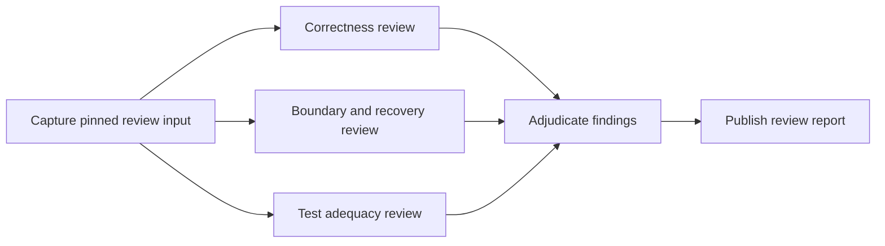

# Supervised agentic workflow scenarios

Status: proposed next-round scope, 2026-09-07. No live provider execution is
claimed. Baseline is unmerged commit `f6feae04` on `codex/workflow-explain`.
The current [implementation plan](plan.md) owns ordering. This document retains
the coding/review scenario contracts; [the candidate recovery draft](round-2-spec.md)
owns managed repository-writing semantics.

## Research workload extension

The [frontier research scenarios](frontier-research-scenarios.md) extend these
four scenarios into data analysis, architecture ablations, checkpointed training,
bounded campaigns, performance studies and evaluation. They use a proposed
self-contained Ferric-derived fixture. Patch review remains an inexpensive
infrastructure pilot; completion of research supervision requires a real training
and evaluation workflow. The [workload/environment matrix](workload-environment-matrix.md) defines the
delivery order and environment-lifecycle requirements.

## Outcome

A coding agent should turn a bounded user intent into an executable workflow,
submit it once, and supervise its progress. The Engine owns ordinary dispatch,
dependency handoff, retry, recovery and completion. A replacement supervisor
must be able to continue from a run reference without the original chat.
Humans retain intent, architecture, merge and release authority.

The observable test is simple: after launch, the main agent does not dispatch
healthy child tasks, copy outputs between prompts, count retries, or rebuild
progress from its conversation. It receives a decision request only when the
persisted policy cannot safely determine the next action.

## Choose scenarios before extending infrastructure

Three possible starting points:

- A patch review exercises real agent reasoning, fan-out, handoff and synthesis
  with a pinned read-only input. Start here.
- A verification incident exercises diagnosis and command execution, but needs
  durable command activities before it can rerun checks reliably. Follow next.
- A coding repair exercises mutation and verification together, but requires the
  larger workspace and candidate design. Keep it as the third milestone.

Existing `benchmarks/dynamic-workflow/` fixtures test execution shapes through a
fake runtime. They are useful regression tests, but are not evidence that an
agent can supervise a useful coding operation. The recorded schema fixture also
explicitly does not establish malformed-output rejection coverage.

## Scenario 1: review a Harp change

Concrete first target: the workflow inspection change, base `2e5d57da` and
candidate `f6feae04`. Resolve and capture full object identities at admission.
Capture the patch, relevant source and tests, applicable repository instructions,
and the claimed validation evidence. Label supplied test evidence separately
from checks this workflow actually executes. Reviewers work from captured bytes;
changes in the operator checkout cannot alter an admitted review.

The main agent supplies scope, review questions and budget. The workflow is:

Capture and publication are deterministic Engine operations. The four review
and adjudication boxes are agent activities. The supervisor submits the whole
plan; it does not invoke these boxes separately.

Each reviewer emits a validated findings artifact with schema version, scope,
coverage, and findings. Each finding includes a stable ID, severity, claim,
source artifact digest and line locator, evidence, proposed correction, and
uncertainty. An empty findings list is a valid reviewed outcome. Inability to
inspect the supplied scope must appear as incomplete coverage, never a clean
review. Agent output is untrusted until contract and reference validation pass.

The adjudicator receives the three accepted findings artifacts and pinned source
manifest through explicit bindings. It emits retained, rejected and unresolved
findings with rationale and original finding IDs. Conflicting findings remain
visible even if a majority disagrees. The final report includes coverage gaps,
all attempt failures, recovery history and the evidence behind its conclusions.
A completed review may find serious defects; execution success and review verdict
are separate fields. No automatic merge or code changes occur.

Suggested pilot limits: three concurrent reviewers, one adjudicator, one recovery
attempt per failed activity, and a declared run-wide wall-time and token ceiling.
Resolve numeric ceilings into the admitted plan, within the user's existing
provider authority. Recovery never resets these counters.

Failure exercise: interrupt the boundary reviewer after the other two outputs
have been accepted. Resume with a fresh supervisor. The Engine retains those
outputs, reconciles the interrupted activity, and runs adjudication only after
all required inputs are accepted. If recovery is exhausted, publish an incomplete
incident report and request a decision; do not present it as a completed review.

Done when a real provider run produces an evidence-linked review and the injected
interruption is recoverable without the supervisor resubmitting individual tasks.
A seeded defect fixture separately checks that the report can locate a known
problem; the real patch is not required to contain a defect.

## Scenario 2: diagnose a verification incident

Concrete target: a captured Harp verification attempt with fake-provider probe
timeouts. This occurred during the first increment, but a reproducible fixture
must capture its logs and environment explicitly. Do not infer causality from
the later successful low-concurrency rerun.

Input includes exact candidate, command argv, exit status, stdout/stderr artifacts,
timestamps, tool versions, relevant test definitions and concurrency settings.
The workflow groups failures by evidence, fans out bounded diagnosis tasks, and
produces a diagnosis packet distinguishing observations from hypotheses.

A predeclared command activity may rerun an allowlisted focused check against the
same candidate. Command receipts bind candidate, argv, environment and outputs.
Agents choose among admitted probes; unknown commands or larger budgets require
an explicit supervisor decision. The first version uses a fixed probe list.

A timeout is evidence, not permission to relax a test. Infrastructure failure,
product defect and inconclusive diagnosis are distinct outcomes. If a rerun
passes, preserve both outcomes and explain what changed. The supervisor receives
one incident packet with recommended action, not a stream of raw test output.

Done when a replacement supervisor can explain which checks failed, what was
actually retried, which hypotheses the evidence supports, and what remains
unknown. Killing a probe must not cause duplicate probes after resume.

## Scenario 3: implement one bounded repair

Concrete target: a selected, confirmed finding from scenario 1. The main agent
records a repair contract covering permitted paths, exact base, desired behavior,
regression requirement, checks and budget. The workflow creates a managed
workspace, runs a coding agent, captures a candidate, executes required checks,
and sends the candidate and receipts to an independent review agent.

This is the consumer of [the candidate recovery design](round-2-spec.md).
A checkpoint must name recoverable bytes. A valid final answer alone cannot
establish a valid repair. An interrupted writer must be reconciled before another
writer enters the workspace. Failed checks preserve the candidate and logs.

First version ends with an accepted candidate or a repair-needed report. A
follow-on repair is a new admitted run referencing that evidence. Automatic
semantic repair loops require a later bounded-loop contract; they are not hidden
in supervisor polling or worker retry policies.

Done when interruption after editing or after a check preserves the exact
candidate and does not repeat an uncertain mutation. The human can inspect the
patch, checks and independent review before deciding whether to merge.

## Scenario 4: audit a bounded collection of evidence claims

Concrete Harp use: select a fixed list of claims in a registered knowledge packet.
For each claim, an extractor records the exact cited evidence, a verifier checks
support against captured source bytes, and an adjudicator reports supported,
unsupported or uncertain. Independent claims advance through this pipeline
without waiting for all extractors to finish. A final report groups the outcomes
and links to source locations. Upstream evidence bytes remain unchanged.

This exercises per-item dataflow and partial progress at larger scale after the
first pilot. Retry only interrupted items. A main agent should not manufacture
one prompt per claim during execution. Runtime discovery of additional claims
is a proposed follow-on scope, not an implicit expansion of the admitted graph.

## Minimum platform work exposed by these scenarios

### Inputs and result handoff

Today the dynamic compiler emits task nodes with empty `inputs`; pipeline items
are injected as initial prompt text. The projection captures declared static
inputs. A dependency edge must not be mistaken for a result binding. Add explicit
static artifact and accepted-task-output bindings, validate them against the
admitted graph, and resolve them at dispatch. Consumers see only accepted outputs
from the pinned producer lineage. Persist the resolved input manifest before
launch and include its digest in the attempt receipt.

Preserve the ResultEnvelope transport contract while introducing validated
scenario result artifacts. The CLI currently normalizes authored output schemas
to the envelope schema. Do not silently promise arbitrary authored schemas.
Bound payload sizes, validate artifact references and expose truncation. Large
source content stays in artifacts, not unbounded prompts.

Replace the compiler's completion-confirmation reducer for this pilot with an
explicit authored adjudication task and report contract. The report must be an
actual accepted output, with its producer and input lineage recorded.

### Runner and supervisor lifecycle

The existing CLI awaits `execute_run` before returning its final summary. Add a
machine-readable admission receipt before worker execution containing run ID,
state location, plan digest and input digest. Submission requires an idempotency
key: repeating the same request returns the same run; different content under
the same key is rejected.

Separate the observer connection from the process driving Engine execution.
A supervisor may hold that process through its coding tool's job facility, but
correctness cannot depend on the observer remembering a shell session ID. If the
runner dies, a new owner can resume after lease/process reconciliation. Live
owners must not race to launch the same activity. A daemon is not required by
this design, and no persistent service setup is included.

Provide bounded waiting by durable event cursor, returning on completion,
required decision or timeout. Inspection remains read-only. Polling a status
report must never dispatch work. Runner ownership and observer identity are
separate. Enforce retry deadlines and backoff in persisted state.

### Decisions and review

A decision request records run/task identity, state revision, reason code,
evidence references and permitted actions. Decisions have idempotency keys and
must reject stale revisions. Initial actions are resume after reconciliation,
cancel, or stop for review. Changing intent, scope or authority produces a new
admitted plan, not an unrecorded prompt edit.

The supervisor's ordinary loop is submit, wait, explain an actionable incident,
record a permitted decision, and review the terminal report. Healthy task
completion requires no supervisor message. Distinguish observer disconnection,
runner death, provider failure, invalid output and domain findings in reports.
Cancellation must reconcile active processes and record partial results.

## Scenario coverage and acceptance

These are review-scenario requirements, scheduled by plan.md rather than a
separate release order.

1. Pin and capture the review fixture; define findings, adjudication and report
   contracts. Specify valid and invalid examples before provider integration.
2. Add input/output bindings and authored adjudication using the existing Engine.
   Test wrong producer, rejected output, missing artifact and stale lineage.
3. Add early admission receipt, idempotent submission and bounded event waiting.
   Verify observer replacement, runner replacement and competing resume attempts.
4. Run the review scenario with a fake provider and fault injection. Cover death
   before launch, after output publication and before acceptance; malformed
   output; exhausted budget; stale decisions; cancellation; and supervisor loss.
5. Run the same plan with a real configured provider and record a review bundle.
   Compare uninterrupted and recovered execution for completed-task reuse and
   provenance. Model wording need not be identical.
6. Build incident diagnosis with durable command activities, then bounded coding
   repair with the managed candidate contract. Add the claims pipeline afterward.

For each run record admitted inputs, task graph, accepted output digests, attempts,
wall time, token use, recovery events and supervisor interventions. The healthy
review pilot target is zero interventions between submission and final review.
The fault-injection target is at most one explicit recovery decision and zero
manually redispatched child tasks. The surviving supervisor receives only the run
reference and repository instructions; it must finish without the original chat.

Report synthetic tests and live scenario evidence separately. Runtime milestones
require focused behavior tests and the repository gate before landing. These
specification drafts are uncommitted and do not claim those milestones have run.
