# Workload and environment qualification matrix

Status: proposed design, 2026-09-07. This defines the qualification scope for [research scenarios](frontier-research-scenarios.md) and
[the earlier coding scenarios](supervised-workflow-scenarios.md). No environment
has been provisioned and no experiment has been launched in this design pass.

[plan.md](plan.md) owns task ordering and [execution-contracts.md](execution-contracts.md)
owns exact state, binding, identity and recovery semantics. The sequencing below
is a matrix progression, not a second implementation plan.

## Two independent axes

Grow workload complexity separately from execution-environment complexity.
Qualify a specific workload/profile/environment combination with evidence.
Passing one cell does not qualify another cell or an entire framework.

Workload families:

- W0: a limited self-contained Ferric subset, with generated data, a tiny model,
  an optimizer loop, checkpoints, evaluation and a bounded campaign.
- W1: the full Ferric repository snapshot, selecting explicit workload profiles
  across its Rust, Python and CUDA modules. Full repository scope does not imply
  executing every target or supplying a complete distributed trainer.
- Additional families: torchtitan, megatronlm, sglang, monarch, verl and miles.
  These are separate integration tracks, not successive levels in a total order.
  Each first needs a pinned source identity, selected operation, dependency/data
  manifest, resource profile, result contract and recovery contract. Those
  repositories have not been inspected in this pass; their support is unclaimed.

Environment profiles:

| Profile | Meaning | First qualification |
| --- | --- | --- |
| E0: local | Direct local execution with an explicit environment and owned job process | Tiny CPU research campaign; record that no sandbox was used |
| E1: local Xena | Same eligible local workload under Xena's enforced macOS policy | CPU setup, execution, recovery and artifact collection |
| E2: remote Vaso | SSH-reachable single host with a qualified Vaso environment; initially `devx_b200_dbg` | CPU control-flow qualification, then a separately qualified GPU workload |
| E3: remote distributed | Multiple allocated hosts and coordinated process groups | Future work requiring gang ownership and collective checkpoint recovery |

E0 and E1 do not promise CUDA execution on macOS. A CPU semantic profile can run
there while the corresponding GPU profile requires E2. Changing OS, device or
precision yields a new environment identity; compare scientific results only
under the declared compatibility/tolerance contract.

| Workload | E0 local | E1 local Xena | E2 remote Vaso | E3 distributed |
| --- | --- | --- | --- | --- |
| W0 limited Ferric | First baseline | Same CPU scenario | Same CPU scenario, then tiny GPU training | Deferred |
| W1 full Ferric | Selected CPU targets | Selected CPU targets | Selected CPU/CUDA studies | Deferred |
| torchtitan | Qualify a selected supported profile | Qualify if compatible | Separate integration track | Future |
| megatronlm | Qualify a selected supported profile | Qualify if compatible | Separate integration track | Future |
| sglang | Qualify a selected supported profile | Qualify if compatible | Separate integration track | Future |
| monarch | Qualify a selected supported profile | Qualify if compatible | Separate integration track | Future |
| verl | Qualify a selected supported profile | Qualify if compatible | Separate integration track | Future |
| miles | Qualify a selected supported profile | Qualify if compatible | Separate integration track | Future |

These cells are targets, not support claims. A cell may be unsupported, unavailable
on the current host, specified, or qualified. Record the exact reason instead of
forcing every workload to run in every environment. Qualification also records
which disconnect/crash/recovery cases passed, so a successful happy-path run does
not imply durable recovery support.

## Existing tools and ownership

Read-only inspection found:

- Xena at `7bd3d0bcfebfb0df601722cb983541e9ed5738d6` has a macOS Seatbelt backend,
  explicit filesystem/network policy and guest-owner machinery. Its documented
  Python command uses an attested Python Build Standalone distribution. Do not
  assume an arbitrary host venv meets that contract. Host interruption and
  observer-detachment behavior still need integration qualification.
- Vaso at `def472aa05adaf0e637a87d53f446c35c1f6002c` on `devx_b200_dbg` currently
  exposes `doctor` and tiered `validate` commands. The inspected CLI's tier 1
  writes a plan/report and returns failure; it does not provide a general durable
  workload-launch interface. Even `doctor` calls host-layout creation, so it is
  not a purely read-only probe. No Vaso command was executed here.
- Armada at `d88095e9ae59320395e156e2784b484d3c517fb6` exposes `exp` launch,
  status, tail, attach, stop, managed idempotent command/result, reconciliation
  and discovery operations. Its ADR-0004 explicitly assigns cross-run
  orchestration to the MTS's framework. These commands provide integration
  points, not proof that Harp already composes them correctly.

Harp owns the workflow graph, plan admission, retry policy, cumulative budgets,
result bindings and supervisor decisions. The workload framework owns model
semantics and its internal training/serving/distributed execution. Xena or Vaso
owns the sandbox/environment boundary. Armada supplies host resolution and the
selected low-level remote process lifecycle. One backend owns each actual job;
Harp retains a reference rather than starting a competing process supervisor.

Selecting an SSH endpoint through Armada is not evidence that GPUs are reserved.
Persist the actual reservation when available. Otherwise admit only an explicitly
authorized host/device set under an exclusive-use policy and record its limits.
Do not infer compute ownership from SSH reachability. No Armada campaign scheduler
is required, and host resolution must not silently rewrite SSH configuration.

Tool versions and receipts are declared external execution inputs. Harp must not
acquire source/build dependencies on their local checkouts. The standalone Ferric
fixture must likewise run from its own snapshot and dependencies.

## Environment setup is part of the workflow

The complete lifecycle is:

```mermaid
flowchart LR
  I[Admit work and resource limits] --> H[Resolve host and allocation]
  H --> P[Prepare pinned environment]
  P --> Q[Qualify required capabilities]
  Q --> M[Materialize immutable inputs]
  M --> L[Submit owned job]
  L --> O[Observe and reconcile]
  O --> C[Collect and verify artifacts]
  C --> F[Finalize report and release owned resources]
```

Each box records intent before effects and a typed receipt afterward. Environment
preparation is an ordinary recoverable task, not undocumented supervisor shell
setup. Its recipe pins source, interpreter/toolchain, dependency lock, rootfs
where applicable, mounts, allowed network, output locations and required devices.
Credentials are referenced through the backend's credential mechanism; secrets
never enter manifests or logs.

Separate acquisition from execution. Dependency downloads may use declared
network access in preparation, while training can use a frozen environment.
Xena policy enforcement does not itself install Python dependencies, and Vaso
validation does not itself provision a complete runnable GPU rootfs.

Prepare in a task-owned staging location. Publish the environment receipt only
when verification passes; partial preparation is not a reusable environment.
Reuse requires matching recipe, content and compatible host capabilities.
Concurrent consumers need an immutable prepared environment and separate writable
caches or explicit cache ownership. Do not modify a shared host environment to
repair one trial.

Qualification runs the cheapest required probes before expensive work: executable
identity, dependency imports, permitted writes and denied metadata writes for
sandboxed profiles, then actual device allocation and a small compute operation
for GPU profiles. A CUDA path or visible device file is insufficient. Capture
probe outputs and versions. No silent fallback to an unsandboxed command if an
Xena or Vaso profile fails.

A resolved host record binds alias, authenticated endpoint identity, allocation,
boot identity when available and environment receipt. Alias drift or host
replacement invalidates an old job observation. Job lookup always checks the
original identity before dispatching on a newly resolved host.

## Track actual execution across boundaries

The run reference must be sufficient for a new main agent to discover:

- campaign/task/trial/attempt and current owner generation;
- resolved host/allocation and prepared-environment identity;
- submission key, backend job identity and backend run-record location;
- exact argv/config and code/data input digests;
- last authoritative job state, last successful observation and last workload
  progress, with their different timestamps;
- log cursor, metric cursor, last committed checkpoint and output manifest;
- cumulative spend, remaining limits, pending cancellation or required decision.

Persist a submission intent before contacting the backend. If its response is
lost, lookup/reconcile that same key. Do not retry a non-idempotent launch. An
adapter that cannot reconcile ambiguous launch is not qualified for autonomous
remote execution. Armada's managed-command idempotency does not automatically
prove that its initial launch has this property; test the complete adapter.

Observer loss must not revoke a job's execution ownership. The remote owner keeps
logs, status and checkpoints without an SSH connection. Local job ownership must
similarly be independent of the observing coding-tool session for the claimed
survival cases. If Xena intentionally terminates a guest when its owner dies,
that is a worker interruption requiring checkpoint recovery, not transparent
reattachment. Integrate according to the actual backend contract.

The top-level Engine may be offline while a submitted job continues. On restart,
it reconciles external state before advancing the graph. The job owner enforces
its admitted runtime deadline even while Harp is absent. A lost host remains
unknown until its termination or allocation revocation can be established; lease
expiry alone is not sufficient to create a competing writer or GPU job.

Remote logs and metrics are durable at the owner. Collect with source identity,
sequence/cursor and integrity checks; reconnect must neither drop nor duplicate
records silently. Publication of a verified local artifact is atomic. Do not
mark a task fully collected while only a partial transfer exists. Preserve remote
outputs until required evidence is verified at its durable destination. Remote
host loss can destroy unreplicated checkpoints; replication policy determines
the actual recovery guarantee and must be stated per profile.

## Interruption semantics and required tests

| Event | Expected behavior | Evidence to inspect |
| --- | --- | --- |
| Observer connection closes or laptop sleeps | Job continues under its owner; observer later catches up | Same job ID, contiguous log cursor and increasing logical progress |
| SSH fails after launch request but before reply | Reconcile submission key; never blindly relaunch | One backend job and one accepted submission identity |
| Main agent loses its conversation or Engine restarts | Discover from run reference and reconcile before scheduling | No manually reconstructed graph or redispatched healthy child |
| Worker or environment owner dies | Confirm process death; restart within policy from committed checkpoint | Attempt lineage, checkpoint digest and charged lost work |
| Checkpoint write or result transfer is interrupted | Ignore incomplete publication and resume from committed artifacts | Manifest validation and no partial result acceptance |
| Host reboots, disappears or allocation expires | Distinguish unknown from dead; restore only when authority and durable bytes allow | Host identity, allocation evidence, checkpoint location and explicit loss report |
| User detaches observation | Stop observing without cancelling work | Recorded observer detach, no job cancellation request |
| User cancels work | Persist cancellation, signal owned process tree, reconcile termination | Cancel-requested until termination is confirmed; no replacement launch |
| Cancellation occurs while host is unreachable | Keep pending cancellation; local timeout is not completion | Outstanding remote effect and enforced backend deadline |
| Environment preparation is interrupted | Reconcile staging; publish only a verified complete environment | Recipe identity, preparation attempts and final receipt |
| Host allocation must be released | Release only resources owned by this workflow after stop/collection policy | Ownership and release receipt; unresolved resources remain visible |

Ctrl-C behavior must be explicit at each interface: detaching an observer and
cancelling a workflow are different commands. A generic "interrupted" status
cannot carry both meanings. Future distributed qualification must additionally
handle rank loss, collective hangs, group fencing and consistent distributed
checkpoints. None is implied by passing single-host tests.

## Reviewing failures

A terminal report links the full causal chain: environment preparation → sandbox
qualification → submission → job observations → workload progress → checkpoint →
evaluation → collection. Report the first failing boundary and downstream tasks
blocked by it. Preserve backend-native receipts alongside normalized Harp state.
A timeout should say whether the system was waiting for SSH, environment setup,
resource admission, job progress or artifact transfer.

Use distinct outcomes for workflow execution, workload correctness and research
conclusion. A failed setup says nothing about an architecture hypothesis. A
completed training job with poor validation loss can still be a valid experiment.
A checkpoint on an unreachable machine is not a locally recoverable artifact.

## Qualify cells by changing one axis at a time

1. W0/E0: execute the real tiny data → training → evaluation campaign and inject
   local runner/observer failures. Add typed command and training-checkpoint
   contracts alongside the existing agent activities.
2. W0/E1: hold the workload fixed and qualify Xena setup, policy, Python dependency
   execution and process-lifecycle behavior. Retain receipts from both cells.
3. W0/E2 CPU: qualify host resolution, Vaso preparation/execution support,
   Armada ownership integration, disconnect recovery and collection. Vaso's
   current CLI gap is implementation work in that tool, not a flag Harp can set.
4. W0/E2 GPU: qualify the device/runtime boundary, then execute actual short
   training with fault injection. Record host reservation and cumulative GPU use.
5. W1/E2 and supported W1/E1 profiles: expand Ferric coverage while retaining the
   qualified environment contracts. Select explicit targets and scientific tasks.
6. Add one pinned workload profile at a time for torchtitan, megatronlm, sglang,
   monarch, verl and miles. Choose order by the next research need and required
   capabilities, not by an assumed complexity ordering of project names.
7. E3 remains future work. Specify and qualify distributed ownership/recovery
   before admitting a real multi-host campaign.

Each qualified cell publishes an evidence bundle with exact revisions, inputs,
setup/launch receipts, fault cases, resource usage and remaining unsupported
behaviors. Synthetic fake-provider checks, real CPU executions and real GPU
executions are separate evidence classes. Zero manual child dispatch after
admission remains the operational-supervision target across all cells.
