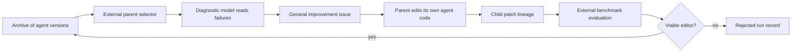

# DGM orientation

> This file is a learning projection. Canonical claims live under `content/`;
> primary-source captures and pinned implementation files live under
> `evidence/`.

## Learning outcomes

After this chapter, you should be able to:

- explain the difference between a theoretical Gödel Machine and DGM;
- name the object DGM changes;
- separate mutable agent code from the protected outer loop;
- describe why the archive matters; and
- state the strongest justified recursive-improvement claim.

## The problem DGM addresses

Most coding agents are designed once, then evaluated. Their prompts, tools,
context policy, retry logic, and patch workflow stay fixed until a human edits
them.

DGM automates part of that engineering loop. It asks whether a coding agent can
use its coding ability to edit the code that defines the coding agent itself.
The system then tests the resulting child agent on coding benchmarks and keeps
viable descendants in an archive.

The central loop is:

1. choose a parent agent;
2. inspect evidence about its failures;
3. formulate one general agent-improvement task;
4. let the parent edit its own implementation;
5. evaluate the child;
6. retain a viable child; and
7. allow retained children to become future parents.

Paper basis: DGM §§1-3. Canonical synthesis:
[DGM system article](../../content/systems/dgm.md).

## Gödel Machine versus Darwin Gödel Machine

### Theoretical Gödel Machine

Schmidhuber's Gödel Machine searches for a self-rewrite and a proof that the
rewrite will improve expected utility. The proof requirement gives a strong
correctness story, but useful changes to modern agent systems are rarely
provable under a realistic environment model.

### Darwin Gödel Machine

DGM replaces proof with empirical evaluation:

| Dimension | Gödel Machine | DGM |
|---|---|---|
| Rewrite target | General self-referential program | Coding-agent repository |
| Acceptance evidence | Formal proof | Benchmark result plus viability checks |
| Search organization | Proof-driven rewrite search | Branching archive search |
| Model weights | Conceptually mutable | Frozen in the reported experiments |
| Outer-loop policy | Part of the formal machine concept | Fixed external controller |

The name "Darwin" points to variation and selection. It should not be read as
a claim that the implementation reproduces biological evolution.

## What is being improved?

The mutable object is the coding-agent implementation. In the released
repository, that includes:

- `coding_agent.py`;
- model/tool adapters in `llm_withtools.py`;
- tool implementations under `tools/`;
- prompts and workflow code; and
- utility code visible to the self-modification planner.

The reported experiments keep the foundation models frozen. The system changes
how those models are prompted, equipped, sequenced, retried, and evaluated
inside the coding agent.

This is harness improvement, not model-weight improvement.

## What remains external?

The released system does not let the candidate rewrite every component.

| Protected component | Why it matters |
|---|---|
| Parent selection | Decides where compute is spent |
| Archive update | Decides which descendants remain eligible |
| Benchmark tasks | Defines measured progress |
| Test harness | Converts patches into scores |
| Docker runner | Controls execution |
| API model identity | Supplies the reasoning and coding capability |
| Time and task budgets | Bound the search |
| Promotion metadata | Defines lineage and later reuse |

This boundary matters because "self-modifying" can sound broader than the
actual implementation. DGM modifies agent code inside a fixed search and
evaluation process.

See [system architecture](04_system_architecture.md) for the full ownership
map.

## Why coding benchmarks?

The paper's key argument is:

1. self-modification is a coding task;
2. better coding-benchmark performance indicates better coding ability;
3. therefore, a better benchmark-solving agent should also be better able to
   edit its own code.

The first step is direct. The second is measured on SWE-bench and Polyglot.
The third is plausible but not directly tested by those benchmark scores.

A stronger experiment would compare parent and child on the quality of the
next children they produce. That experiment is developed in
[successor design](10_successor_design.md).

## Why an archive?

A single-incumbent optimizer can lose a useful capability after one bad edit.
DGM instead retains many viable descendants. Older or temporarily weaker
lineages remain available as future starting points.

The archive supports:

- rollback by choosing another lineage;
- delayed use of a stepping stone;
- parallel exploration of different implementations; and
- recovery after a locally bad modification.

The archive does not automatically provide behavioral diversity. The released
selection rule uses score and child count, not an explicit behavior descriptor.
See [open-endedness](07_open_endedness.md).

## Five-minute system model

The loop has two distinct uses of model capability:

- a diagnostic model frames an improvement problem;
- a coding model implements that problem in the agent repository.

The paper describes the selected parent as analyzing its own logs. The released
code makes the diagnostic stage explicit and separate.

## Claim ladder

| Level | Meaning | DGM status |
|---|---|---|
| Task improvement | A system solves more benchmark tasks | Supported by author-reported results |
| Persistent adaptation | A useful change survives into later runs | Supported by archived patch lineage |
| Harness improvement | The agent implementation improves | Supported in the reported setup |
| Successor improvement | A child produces better later children than its parent | Not directly measured |
| Recursive improvement demonstrated | Repeated accepted successors improve the improvement process under a matched protected envelope | Not established |

The honest summary is:

> DGM demonstrates automated, persistent harness search with self-referential
> code edits and a branching archive. It does not directly measure the
> improvement rate of the improvement process itself.

## Common misunderstandings

### "The agent rewrites the entire DGM"

No. The open-ended archive policy and parent selector remain fixed in the
reported implementation.

### "Every archived child is better"

No. The default code keeps every child that retains basic evaluable
code-editing functionality. Lower-performing nodes are intentional stepping
stones.

### "The model trains itself"

No. The reported experiments use frozen pretrained models. Agent code changes,
not model weights.

### "Benchmark gain proves self-acceleration"

No. It supports better task performance and a plausible self-editing proxy.
Self-acceleration would require direct next-cycle measurement.

### "Docker means the system is secure"

No. Docker is one containment mechanism. A security claim also needs network,
credential, filesystem, kernel, resource, and escape analysis.

## Checkpoint

You should now be able to answer:

1. Which files can a DGM child change?
2. Which decisions remain outside the child?
3. Why can a lower-scoring agent stay in the archive?
4. What result would demonstrate successor improvement rather than task
   improvement?

Continue with the [paper walkthrough](02_paper_walkthrough.md).

Back to the [DGM index](darwin_godel_machine_index.md).
