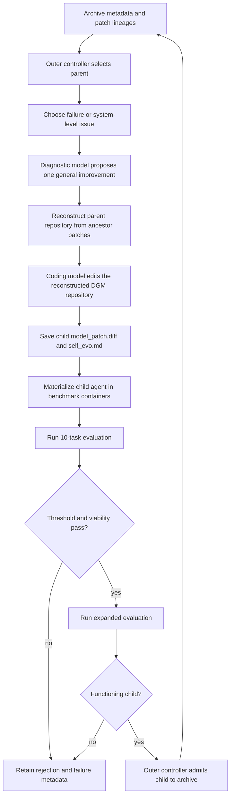
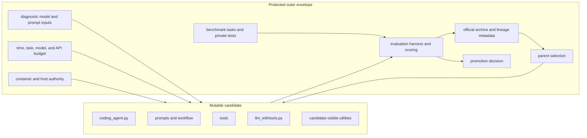

# DGM system architecture

> This file is a learning projection. Canonical claims live under `content/`;
> primary-source captures and pinned implementation files live under
> `evidence/`.

## Learning outcomes

After this chapter, you should be able to:

- trace one child from archived parent to evaluated descendant;
- separate candidate-controlled code from the protected search envelope;
- assign ownership for diagnosis, mutation, execution, evaluation, and archive
  update;
- explain how patch lineage reconstructs an agent version;
- identify state that must be immutable for a credible experiment; and
- locate the largest safety and attribution boundaries.

The architecture below reconciles the paper with the released implementation
at commit `a565fd2d1dca504ef5104a7cc0f3bdc4ab9b4fd2`.

**[INFERENCE - DGM-065](claim_evidence_crosswalk.md#dgm-065-dgm-is-evolutionary-search-over-agent-scaffolds).**
The system is a fixed evolutionary controller over mutable coding-agent
programs. Foundation-model weights, archive policy, evaluator, and live
orchestration remain outside the candidate.

## End-to-end flow



There are two container uses:

1. a self-improvement container where the selected parent modifies the DGM
   agent repository; and
2. benchmark task containers where the resulting agent version edits task
   repositories and receives a score.

The same patch lineage is applied in both contexts, but the edited target is
different: `/dgm` during self-modification and `/testbed` during task solving.

## Candidate versus protected envelope



The trust boundary is the central design fact. DGM is self-modifying only
inside the candidate box. It is not a system in which every search, evaluation,
and authority mechanism is candidate-owned.

**[EVIDENCE - DGM-013](claim_evidence_crosswalk.md#dgm-013-diagnosis-receives-privileged-evaluator-evidence).**
Evaluator independence is partial: the task-solving agent does not receive
private tests during ordinary evaluation, but the fixed diagnosis stage can use
private test patches and their results to shape the next scaffold change.

## Component matrix

| Component | Responsibility | Main state | Mutability | Evidence |
|---|---|---|---|---|
| `DGM_outer.py` | Select parents, launch attempts, filter children, update archive | archive, generation, child IDs | Protected in reported search | DGM-REPO |
| `prompts/self_improvement_prompt.py` | Convert failure evidence into diagnostic input | traces, issue, patch, private tests, eval logs | Fixed prompt code in envelope | DGM-REPO |
| Diagnostic model | Produce one general improvement issue | model response | External model identity | DGM and DGM-REPO |
| `self_improve_step.py` | Reconstruct parent, run self-edit, collect patch, invoke evaluation | run metadata, patch lineage, container | Protected orchestrator | DGM-REPO |
| `coding_agent.py` | Solve a repository task or self-improvement issue | prompt, tools, model history, target repo | Mutable candidate | DGM-REPO |
| `llm_withtools.py` | Adapt model APIs and dispatch tools | model messages and tool results | Mutable candidate | DGM-REPO |
| `tools/` | Expose shell and editing operations | shell process, files | Mutable candidate | DGM-REPO |
| `swe_bench/harness.py` | Run candidate on SWE-bench tasks | containers, predictions, logs | Protected evaluator | DGM-REPO |
| `polyglot/harness.py` | Run candidate on multi-language tasks | containers, solutions, test output | Protected evaluator | DGM-REPO |
| `utils/evo_utils.py` | Reconstruct lineage and validate child metadata | parent links, patch paths, performance | Mixed helper; admission use is protected | DGM-REPO |
| `dgm_metadata.jsonl` | Record generations and archive snapshots | append-oriented generation records | Controller-owned | DGM-REPO |

## State model

For one experiment, separate four kinds of state.

### Candidate definition

```text
Candidate(agent_id) =
  seed_repository
  + ordered ancestor patches
  + model identity used at execution
```

The patch chain is necessary but not sufficient to reproduce behavior. Model
snapshot, temperature, tool environment, dependencies, benchmark image, and
API behavior also matter.

### Search state

```text
SearchState_t =
  archive member IDs
  + parent/child counts
  + per-node scores and task scopes
  + generation counter
  + random decisions
  + configured search policy
```

The released `dgm_metadata.jsonl` records generation, selected entries,
attempted children, functioning children, and archive. A complete replay
receipt would also need random seeds, environment identities, and immutable
digests for every referenced file.

### Evaluation state

```text
Evaluation(node, stage) =
  task identities
  + candidate materialization
  + model and sampling configuration
  + predictions or task patches
  + raw execution logs
  + score report
```

Scores without task identities are not comparable because DGM uses adaptive
staging.

### Authority state

```text
AuthorityDecision =
  candidate identity
  + evaluator receipt
  + integrity checks
  + permitted use
  + archive admission or deployment decision
```

The released archive update is an experimental search decision. A production
promotion decision would need a separate authority record.

## Patch-lineage materialization

`get_model_patch_paths` starts at a selected `parent_commit`, reads each node's
`metadata.json`, follows `parent_commit` until `initial`, collects each
`model_patch.diff`, then reverses the list.

For lineage:

```text
initial -> A -> B -> C
```

candidate C is materialized as:

```text
seed + patch(A) + patch(B) + patch(C)
```

This design has useful properties:

- lineage is explicit;
- storage is proportional to deltas rather than full copies;
- a node can be reconstructed from immutable ancestors; and
- alternative branches do not overwrite one incumbent.

It also creates operational obligations:

- parent metadata and every ancestor patch must remain available;
- patch order must be deterministic;
- a failed or fuzzy patch application must invalidate materialization;
- the seed revision must be pinned; and
- mutation of an ancestor file after the run would corrupt descendants.

The checked-in evidence snapshot shows the mechanism, not the historical
experiment archive.

## State transition walkthrough

### 1. Parent selection

The controller reads archive metadata and computes a categorical distribution
from score and functioning-child count. It samples with replacement.

Owner: outer controller.

### 2. Improvement-entry selection

The controller selects an unresolved task or one of several system-level
failure classes. Selection includes random branches for empty patches,
stochasticity, and context-length failures.

Owner: outer controller.

### 3. Parent reconstruction

The self-improvement runner creates a DGM container, applies all ancestor
patches to `/dgm`, and commits the materialized repository to create a clean
diff base.

Owner: protected orchestrator.

### 4. Diagnosis

The diagnostic model receives candidate code plus failure evidence and returns
structured fields culminating in a problem description.

Owner: fixed external diagnostic stage.

The SWE-bench path can include official private test patches and their results.
That evidence is not shown to the task-solving agent during benchmark
evaluation, but it is visible to the self-improvement planner.

### 5. Self-modification

The coding agent receives the generalized improvement issue and edits `/dgm`.
The runner limits this command to 30 minutes, then copies out:

- `self_evo.md`; and
- `model_patch.diff`.

Owner: candidate, within the orchestrator's process boundary.

### 6. Benchmark evaluation

The benchmark harness reconstructs the candidate agent in task containers. The
agent edits `/testbed`, not `/dgm`, and produces a task patch. The evaluator
then runs official or language-specific tests.

Owner: protected evaluator.

### 7. Viability filter

The controller requires performance metadata, a non-empty submitted patch, and
enough evaluated tasks.

Owner: outer controller.

### 8. Archive update

With default `keep_all`, every functioning child is added. The generation
record stores attempted and accepted child IDs.

Owner: outer controller.

## Execution and timeout boundaries

The snapshot contains several timeout layers:

- 30 minutes for one self-modification command;
- 1.5 hours when the outer thread waits for a complete self-improvement
  attempt;
- 10 minutes for a Polyglot task-solving run;
- 2 minutes for a Polyglot language test command; and
- 2 minutes for a seed-agent shell command.

Timeouts bound duration. They do not ensure:

- clean cancellation of remote model calls;
- cleanup after host or process failure;
- exactly-once archive update;
- exactly-once external API spend;
- complete child-process termination; or
- reconciliation after an unknown outcome.

The runner catches many exceptions and records partial metadata. A durable
production design would assign action IDs and reconcile container, API, and
filesystem effects after restart.

## Model roles

### Diagnostic model

The captured runner names `o1-2024-12-17`. It turns a selected failure into a
general coding-agent issue.

### Coding model during self-modification

The paper reports Claude 3.5 Sonnet (New) for both benchmark searches.

### Coding model during task evaluation

The paper reports:

- Claude 3.5 Sonnet (New) for SWE-bench; and
- `o3-mini` for Polyglot.

This separation matters. Search quality, candidate behavior, and evaluation
cost depend on more than the mutable repository.

## Benchmark boundary

For SWE-bench, the harness:

1. creates a task container;
2. copies the DGM agent code into it;
3. applies candidate lineage patches to that agent code;
4. runs the agent against the task repository;
5. collects the proposed task patch and trace;
6. filters test-file edits before official evaluation; and
7. produces report JSON.

For Polyglot, the harness:

1. installs the Polyglot agent variant;
2. applies candidate patches after filtering Polyglot-specific hunks;
3. runs the agent on a task repository;
4. preserves solution files while resetting to the test commit;
5. runs the language-specific tests; and
6. classifies the task as resolved, unresolved, empty, incomplete, or error.

These paths are related but not identical evaluators.

## Trust-boundary findings

### Candidate writes powerful code

The candidate can change prompts, tools, model interaction, and workflow. That
is the point of the experiment and the source of both capability and risk.

### Evaluator independence is partial

The benchmark harness is outside the candidate repository in the reported
design. However, self-improvement diagnosis can consume private tests and
evaluation logs. This weakens any claim that the search is blind to the
evaluation channel.

### Container use is not a sandbox proof

**[INFERENCE - DGM-042](claim_evidence_crosswalk.md#dgm-042-released-docker-use-is-not-a-hardened-sandbox-proof).**
The source starts ordinary Docker containers and injects API credentials into
the self-improvement process. The captured implementation does not by itself
establish network isolation, a read-only host boundary, a non-root user,
seccomp policy, capability dropping, memory limits, or credential scoping.

### Archive is not promotion

The archive is an experimental search population. Production authority should
be represented separately and should require evaluator integrity, security,
maintainability, and declared-use review.

## Invariants for a stronger implementation

1. Candidate code cannot write benchmark definitions, hidden tests, official
   scores, archive history, or promotion records.
2. Every node has an immutable seed revision and ordered patch digest list.
3. Every score names exact tasks, model identity, sampling configuration, and
   resource budget.
4. Every attempted side effect has a durable action identity.
5. Archive admission and deployment promotion are distinct operations.
6. Candidate-visible diagnostic evidence excludes protected test answers.
7. The root-tree budget includes diagnostic, self-edit, child, evaluation, and
   retry costs.
8. A child cannot certify its own containment or evaluator integrity.

Continue with the
[repository walkthrough](05_repository_walkthrough.md), inspect
[safety and failure](08_safety_and_failure.md).

Back to the [DGM index](darwin_godel_machine_index.md).
