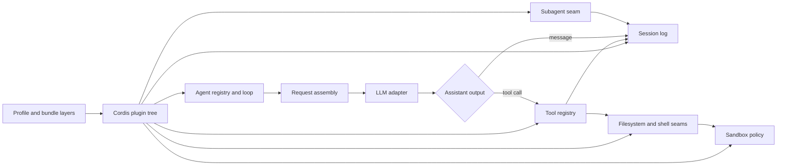

# DeepSeek Harness: plugin composition as the harness boundary

Mode: `TECHNICAL DEEP DIVE`.

**EVIDENCE - snapshot.** This profile inspects [DEEPSEEK-HARNESS] at commit
`47f943859bef60e4160492346772ded9b24f765a` in
[[evidence/implementations/deepseek_harness/snapshot/README.md|the local snapshot README]]
([manifest](../../evidence/implementations/manifest.tsv#L20)). The snapshot is
a narrow source study, not a full mirror of the upstream monorepo.

**INFERENCE - claim ceiling.** DeepSeek Harness is relevant to RSI as a
composition-centric harness substrate: plugins own model adapters, sessions,
tools, filesystem, shell, sandbox policy, subagents, presets, and UI surfaces.
The inspected source supports claims about present-day architecture and control
boundaries. It does not show a held-out evaluator that promotes harness changes
because they improve later harness-improvement work.

**INFERENCE - DeepSWE boundary.** Harp already has a separate [DEEPSWE]
benchmark receipt under [[evidence/benchmarks/deep-swe/README.md|DeepSWE evidence]]
([README locator](../../evidence/benchmarks/deep-swe/README.md#L1)). That
receipt covers an original-task benchmark contract. This profile covers
`deepseek-ai/deepseek-harness`, a TypeScript agent-harness runtime. Do not merge
the two identities or treat this runtime snapshot as a DeepSWE score receipt.

## Architecture at a glance

**EVIDENCE - [DEEPSEEK-HARNESS], `docs/architecture.md`.** The upstream
architecture guide says every part of `dsh` is a Cordis plugin, including model
adapters, tool registry, session log, and agent loop; it further says there is
no privileged core to patch, and extension work should mount a plugin beside
existing services
([[evidence/implementations/deepseek_harness/snapshot/docs/architecture.md|architecture]]
([exact lines 10-18](../../evidence/implementations/deepseek_harness/snapshot/docs/architecture.md#L10))).

**INFERENCE - architectural reading.** DeepSeek Harness makes the harness
boundary unusually explicit: most behavior lives in replaceable service
definitions and providers, while the default loop coordinates them through
typed events and durable session state. That is a good substrate for
candidate-harness experiments, but the experiment still needs an external
evaluator and promotion controller.

## Component map

| Label | Component | Observed responsibility | Control boundary | RSI tuple role |
|---|---|---|---|---|
| EVIDENCE | Profiles and bundles | Compose ordered Cordis config layers; user and overlay patches can replace rows. | Profile, bundle, and patch ownership. | Candidate `H_t` package surface. |
| EVIDENCE | `agent-loop` | Opens turns, claims inbox batches, assembles prompts, streams model output, executes tool calls, and closes turns. | Session event log plus live `agent/*` events. | Core execution in `H_t`. |
| EVIDENCE | `session` | Validates, freezes, appends, and projects model-visible and log-only events. | Lossless JSON and surface metadata boundary. | Durable `A_t` and active `D_t` projection. |
| EVIDENCE | `tools` | Holds tool definitions, schemas, policy waterfalls, monotonic guards, presentation modes, and ordered result materialization. | Tool registry and execution pipeline. | Capability surface inside `H_t`. |
| EVIDENCE | Sandbox policy | Resolves per-call file policy from deployment defaults, session overrides, and workspace roots. | Session state plus policy service, not tool-local guessing. | External permission envelope. |
| EVIDENCE | Filesystem and shell sandboxes | Enforce policy for in-process file mutations and shell argv wrapping through separate providers. | Filesystem seam and subprocess sandbox seam. | Containment around actions. |
| EVIDENCE | Subagents | Registers multiple providers, validates requested capabilities, and manages one-shot plus continuable children. | Named provider registry and child session lineage. | Parallel search/orchestration substrate. |
| EVIDENCE | Agent spine demo | Mounts the default executor-less, UI-less agent service set; deployments still choose model adapter and executors. | Bundle-level service composition. | Reusable baseline harness. |

## The runtime is a turn machine over a durable log

**EVIDENCE - [DEEPSEEK-HARNESS], agent loop source.** `ReactLoopAgent` stores an
explicit phase union for idle, maintenance, and running states and exposes one
agent-scoped `Context` created from a scope boundary
([[evidence/implementations/deepseek_harness/snapshot/packages/core/agent-loop/src/agent.ts|agent.ts]]
([exact lines 38-97](../../evidence/implementations/deepseek_harness/snapshot/packages/core/agent-loop/src/agent.ts#L38))).
Input enters through `followup`, `steer`, and `inject`, which all route through
the inbox with different target and wakeup semantics
([exact lines 113-132](../../evidence/implementations/deepseek_harness/snapshot/packages/core/agent-loop/src/agent.ts#L113)).

**EVIDENCE - [DEEPSEEK-HARNESS], turn execution.** A turn appends
`turn/start`, proposes a step through `agent/pre-step`, appends entered
`user/message` events, starts a step, builds a request from the session-derived
history, streams assistant chunks, appends the assembled assistant message, and
dispatches tool calls before writing `step/end` and `turn/end`
([exact lines 245-330](../../evidence/implementations/deepseek_harness/snapshot/packages/core/agent-loop/src/agent.ts#L245),
[step lines 332-400](../../evidence/implementations/deepseek_harness/snapshot/packages/core/agent-loop/src/agent.ts#L332)).

**EVIDENCE - [DEEPSEEK-HARNESS], runtime context.** Dynamic runtime context is
projected as a plugin-sourced user message only when the retained snapshot
changes; cleared context is represented explicitly rather than silently
forgetting the prior snapshot
([[evidence/implementations/deepseek_harness/snapshot/packages/core/agent-loop/src/runtime-context.ts|runtime-context.ts]]
([exact lines 24-75](../../evidence/implementations/deepseek_harness/snapshot/packages/core/agent-loop/src/runtime-context.ts#L24))).

**INFERENCE - archive consequence.** The loop gives an evaluator a structured
record of turn admission, prompt assembly, model output, tool calls, and
context snapshots. That is stronger than final-answer-only logging, but it
does not by itself define candidate fitness.

## Session events are the replayable state boundary

**EVIDENCE - [DEEPSEEK-HARNESS], session types.** `SessionId` is a branded
string. `SessionHeader` keeps format version, absolute working directory,
parent session, seed boundary, subagent origin, delegation depth, and agent
preset metadata outside the event log
([[evidence/implementations/deepseek_harness/snapshot/packages/core/session/src/types.ts|session types]]
([exact lines 21-99](../../evidence/implementations/deepseek_harness/snapshot/packages/core/session/src/types.ts#L21))).

**EVIDENCE - [DEEPSEEK-HARNESS], turn/event vocabulary.** The session event map
records turn and step boundaries, user messages, raw assistant chunks,
assembled assistant messages, tool calls, tool results, todos, request
headers, request context, and seed boundaries as lossless JSON events
([exact lines 230-320](../../evidence/implementations/deepseek_harness/snapshot/packages/core/session/src/types.ts#L230)).

**EVIDENCE - [DEEPSEEK-HARNESS], validation and append.** Session construction
validates seed event envelopes, request-header vocabulary, sequence
contiguity, and surface transitions before accepting replay/fork history
([[evidence/implementations/deepseek_harness/snapshot/packages/core/session/src/index.ts|session index]]
([exact lines 499-547](../../evidence/implementations/deepseek_harness/snapshot/packages/core/session/src/index.ts#L499)).
Appending an event snapshots the payload as lossless JSON, validates surface
metadata, assigns sequence/time, and rejects bad data at the append site rather
than during a later backend flush
([exact lines 569-620](../../evidence/implementations/deepseek_harness/snapshot/packages/core/session/src/index.ts#L569)).

**INFERENCE - experiment value.** For RSI experiments, this means candidate
history, runtime context, and tool results can be sealed as durable lineage.
The missing piece is an evaluator-owned archive that records candidate score,
budget, rejection reason, and promotion decision next to the session log.

## Tool visibility and tool authority are separate

**EVIDENCE - [DEEPSEEK-HARNESS], tool definition.** A registered tool carries
model-facing schema fields plus a mandatory canonical output declaration,
execution function, optional content finalizer, host-only timeout and
concurrency metadata, and replayable UI presentation callbacks
([[evidence/implementations/deepseek_harness/snapshot/packages/core/tools/src/index.ts|tools index]]
([exact lines 211-288](../../evidence/implementations/deepseek_harness/snapshot/packages/core/tools/src/index.ts#L211)).
The docs state that `schemas()` builds the model-facing projection by
allowlist, so execution callbacks and host-only metadata do not leak to the
model
([[evidence/implementations/deepseek_harness/snapshot/docs/subsystems/tools.md|tools docs]]
([exact lines 9-12](../../evidence/implementations/deepseek_harness/snapshot/docs/subsystems/tools.md#L9))).

**EVIDENCE - [DEEPSEEK-HARNESS], schema discipline.** The author-facing schema
DSL uses a closed value-spec union, typed literal constraints, mandatory
object openness, exact-one unions, and bounded inference that falls back to
`JsonValue` after 16 container levels while runtime validation still walks the
complete schema
([[evidence/implementations/deepseek_harness/snapshot/packages/core/tools/src/schema.ts|schema.ts]]
([exact lines 23-95](../../evidence/implementations/deepseek_harness/snapshot/packages/core/tools/src/schema.ts#L23),
[inference lines 124-175](../../evidence/implementations/deepseek_harness/snapshot/packages/core/tools/src/schema.ts#L124))).

**EVIDENCE - [DEEPSEEK-HARNESS], execution pipeline.** Tool calls become
identity-protected `ToolExecution` objects with readonly parsed arguments,
caller signal, root call ID, and registry-assigned token. The pipeline exposes
pre-execute allow/deny/ask decisions, monotonic guards, around-dispatch
wrappers, post-dispatch decisions, content finalization, and an immutable
`tools/result` event
([tool execution lines 372-460](../../evidence/implementations/deepseek_harness/snapshot/packages/core/tools/src/index.ts#L372),
[decision lines 579-600](../../evidence/implementations/deepseek_harness/snapshot/packages/core/tools/src/index.ts#L579),
[guard lines 703-711](../../evidence/implementations/deepseek_harness/snapshot/packages/core/tools/src/index.ts#L703)).

**EVIDENCE - [DEEPSEEK-HARNESS], scheduler.** The agent-loop scheduler commits
tool calls and results in model order, lets only calls classified as parallel
overlap, treats exclusive calls as barriers, reclassifies later calls before
starting them, and records synthetic results for skipped calls after abort
([[evidence/implementations/deepseek_harness/snapshot/packages/core/agent-loop/src/tool-calls.ts|tool-calls.ts]]
([exact lines 40-100](../../evidence/implementations/deepseek_harness/snapshot/packages/core/agent-loop/src/tool-calls.ts#L40),
[group lines 112-245](../../evidence/implementations/deepseek_harness/snapshot/packages/core/agent-loop/src/tool-calls.ts#L112))).

**INFERENCE - evaluator-integrity reading.** A candidate can be shown a tool
schema without owning the runtime implementation or the final policy decision.
That separation is the same boundary an RSI controller needs for evaluator and
promotion tools.

## Sandbox policy is shared by file and process actions

**EVIDENCE - [DEEPSEEK-HARNESS], policy service.** `SandboxPolicyService`
defaults to `read-only`, resolves a per-call mode and workspace root from an
approved override, session override, or deployment default, and contributes a
model-visible policy context before requests
([[evidence/implementations/deepseek_harness/snapshot/packages/sandbox/sandbox-policy/src/index.ts|sandbox policy]]
([exact lines 60-83](../../evidence/implementations/deepseek_harness/snapshot/packages/sandbox/sandbox-policy/src/index.ts#L60),
[resolve lines 126-151](../../evidence/implementations/deepseek_harness/snapshot/packages/sandbox/sandbox-policy/src/index.ts#L126))).

**EVIDENCE - [DEEPSEEK-HARNESS], filesystem sandbox.** `SandboxedFileSystem`
extends the local filesystem provider but fences writes and edits. It states
that reads pass through, `read-only` denies mutations, `workspace-write`
allows only fresh canonical targets under writable roots, and
`danger-full-access` delegates unfenced
([[evidence/implementations/deepseek_harness/snapshot/packages/fs/fs-sandbox/src/index.ts|filesystem sandbox]]
([exact lines 1-30](../../evidence/implementations/deepseek_harness/snapshot/packages/fs/fs-sandbox/src/index.ts#L1),
[checked-target lines 115-148](../../evidence/implementations/deepseek_harness/snapshot/packages/fs/fs-sandbox/src/index.ts#L115))).

**EVIDENCE - [DEEPSEEK-HARNESS], shell sandbox.** `SandboxBashExecutor` wraps
the local bash argv through `ctx.sandbox`, reports mode/enforcement/denial
facts, and treats runner launch failure as proof the command did not run
([[evidence/implementations/deepseek_harness/snapshot/packages/shell/bash-sandbox/src/index.ts|bash sandbox]]
([exact lines 37-45](../../evidence/implementations/deepseek_harness/snapshot/packages/shell/bash-sandbox/src/index.ts#L37),
[run lines 88-114](../../evidence/implementations/deepseek_harness/snapshot/packages/shell/bash-sandbox/src/index.ts#L88),
[process facts lines 116-179](../../evidence/implementations/deepseek_harness/snapshot/packages/shell/bash-sandbox/src/index.ts#L116))).

**INFERENCE - containment boundary.** The filesystem fence is trusted
same-process policy over model-controlled paths, while shell execution relies
on an external sandbox provider. The two surfaces share policy resolution but
do not have identical threat models. A serious RSI experiment should treat
both as external envelope controls, not candidate-owned code.

## Subagents are a capability seam, not the loop itself

**EVIDENCE - [DEEPSEEK-HARNESS], subagent docs.** The subagent subsystem is an
optional capability outside the agent loop; multiple providers coexist in one
context, while the model-facing tools consume the same `ctx.subagents` service
([[evidence/implementations/deepseek_harness/snapshot/docs/subsystems/subagent.md|subagent docs]]
([exact lines 1-9](../../evidence/implementations/deepseek_harness/snapshot/docs/subsystems/subagent.md#L1))).

**EVIDENCE - [DEEPSEEK-HARNESS], service definition.** `SubagentRuntime` is a
named provider registry with one-shot runs, continuable-child operations,
durable discovery, lifecycle events, and child/descendant listing
([[evidence/implementations/deepseek_harness/snapshot/packages/subagent/subagent/src/index.ts|subagent index]]
([exact lines 1-31](../../evidence/implementations/deepseek_harness/snapshot/packages/subagent/subagent/src/index.ts#L1),
[runtime lines 170-201](../../evidence/implementations/deepseek_harness/snapshot/packages/subagent/subagent/src/index.ts#L170))).

**EVIDENCE - [DEEPSEEK-HARNESS], capability checks.** Providers advertise
start-time support for output schemas, depth limits, tool filters, and personas;
requests needing unsupported capabilities are rejected rather than silently
accepted
([[evidence/implementations/deepseek_harness/snapshot/packages/subagent/subagent/src/types.ts|subagent types]]
([exact lines 75-91](../../evidence/implementations/deepseek_harness/snapshot/packages/subagent/subagent/src/types.ts#L75),
[request lines 100-149](../../evidence/implementations/deepseek_harness/snapshot/packages/subagent/subagent/src/types.ts#L100))).

**EVIDENCE - [DEEPSEEK-HARNESS], continuable children.** Continuable children
use one durable child session with at most one live activation; the child
inbox is the only turn FIFO, and follow-up authority is checked against the
durable direct-parent relationship
([docs lines 114-144](../../evidence/implementations/deepseek_harness/snapshot/docs/subsystems/subagent.md#L114)).

**INFERENCE - search value.** The subagent seam can support parallel candidate
generation or review, especially because provider capability checks are
explicit. It still does not define diversity, fitness, or promotion.

## Presets and the default spine define candidate package seams

**EVIDENCE - [DEEPSEEK-HARNESS], architecture docs.** Profiles stack bundles,
profile patch, home-level patch, and `--patch` overlays; any printed config row
can be replaced by a patch
([architecture lines 20-44](../../evidence/implementations/deepseek_harness/snapshot/docs/architecture.md#L20)).

**EVIDENCE - [DEEPSEEK-HARNESS], default spine.** The `agent-spine-demo`
bundle mounts LLM runtime, session store, title service, system prompt, tool
runtime, skill registry/filesystem, agent registry, retry policy, optional
goal stack, local jobs, invariants, agent loop, bash tooling, workspace
context, skills, and job tools
([[evidence/implementations/deepseek_harness/snapshot/packages/examples/agent-spine-demo/src/index.ts|agent spine]]
([exact lines 1-9](../../evidence/implementations/deepseek_harness/snapshot/packages/examples/agent-spine-demo/src/index.ts#L1),
[config lines 69-129](../../evidence/implementations/deepseek_harness/snapshot/packages/examples/agent-spine-demo/src/index.ts#L69),
[mount lines 202-260](../../evidence/implementations/deepseek_harness/snapshot/packages/examples/agent-spine-demo/src/index.ts#L202))).

**INFERENCE - candidate boundary.** A practical experiment could treat a profile
or bundle patch as the candidate harness package, while freezing the engine,
providers, sandbox, evaluator, and source-verification logic outside the
candidate's authority.

## Mapping onto the candidate/envelope split

**INFERENCE - notation.** [[system_state_and_notation]] owns the canonical
candidate/envelope split. DeepSeek Harness supplies candidate surfaces and
containment seams; the evaluator `E`, matched budget `B`, protected archive
`A_t`, and promotion authority must be added externally.

| Label | State | DeepSeek Harness surface | Present in inspected source? | Missing for an RSI experiment |
|---|---|---|---|---|
| EVIDENCE | `W_t` | Provider/model route and adapter-selected request defaults. | Yes as runtime selection. | Weight-update provenance and training control. |
| EVIDENCE | `H_t` | Profile/bundle patches, agent loop, prompt assembly, tool registry, sandbox policy, filesystem/shell providers, subagents, presets. | Yes, strongly modular. | Versioned candidate schema and mutation allowlist owned by an experiment controller. |
| EVIDENCE | `D_t` | Session events, runtime context snapshots, tool results, workspace context, skills, and child-session lineage. | Yes, event-sourced. | Controlled experience selection and contamination accounting. |
| MISSING | `E` | Tool guards, sandbox policy, invariants, and tests enforce local constraints but are not one held-out improvement evaluator. | No complete evaluator/selector loop. | Fixed tasks, scores, evaluator isolation, budget parity, and promotion thresholds. |
| EVIDENCE | `A_t` | Session logs, parent/child session metadata, subagent lifecycle events, persisted profile/preset state. | Yes as lineage substrate. | Candidate fitness, rejection rationale, artifact digests, and promotion receipts. |

## Smallest credible DeepSeek Harness experiment

**INFERENCE - proposed boundary.** Freeze the upstream `dsh` revision, provider
adapter, sandbox provider, evaluator, task split, budget, and source verifier.
Permit candidate edits only to a declared profile/bundle patch and optional
agent-preset content. Keep evaluator and promotion tools outside the candidate
tool registry.

**INFERENCE - proposed loop.** Start every candidate from the same profile
base, run matched development tasks under the same sandbox policy, seal the
session logs and candidate patch digests, evaluate through an external
controller, and promote only after held-out improvement. Then test whether the
promoted profile produces better next-generation profile edits than its parent
under the same budget.

**MISSING.** The inspected DeepSeek Harness revision does not report this
multi-generation experiment, does not reproduce a DeepSWE leaderboard score,
and does not contain an autonomous evaluator-owned promotion loop.
